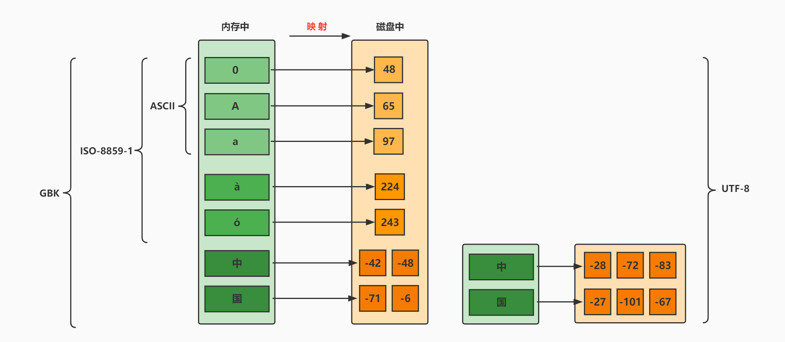

## 1.java.io.File

* 关于相对路径：在Test方法中和main()中不同，Test中为当前Module，main()中为当前Project
* 关于renameTo():

```java
public boolean renameTo(File dest)//把文件重命名为指定的文件路径
file1.renameTo(file2)
/*
	重命名（移动文件）成功要求：
	1.file1必须存在
	2.file2必须不存在
	3.file2的父目录必须存在
*/
```

* 关于删除`delete()`：① Java中的删除不走回收站。② 要删除一个文件目录，请注意该文件目录内不能包含文件或者文件目录。
* 筛选文件`FilenameFilter`：

```java
@Test
public void test3(){
    File srcFile = new File("d:\\code");

    File[] subFiles = srcFile.listFiles(new FilenameFilter() {

        @Override
        public boolean accept(File dir, String name) {
            return name.endsWith(".jpg");
        }
    });

    for(File file : subFiles){
        System.out.println(file.getAbsolutePath());
    }
}
```

## 2.IO流分类和常见API

按数据的流向不同分为：输入流和输出流。（相对于程序（内存）来说）

* 输入input：读取外部数据（磁盘、光盘等存储设备的数据）到程序（内存）中。
* 输出output：将程序（内存）数据输出到磁盘、光盘等存储设备中。

按操作数据单位的不同分为：字节流（8bit）和字符流（16bit）

* 字节流 ：以字节为单位，读写数据的流。
  以InputStream、OutputStream结尾
* 字符流 ：以字符为单位，读写数据的流。
  以Reader、Writer结尾
  根据

IO流的角色不同分为：节点流和处理流

* 节点流：直接从数据源或目的地读写数据

* 处理流：不直接连接到数据源或目的地，而是“连接”在已存在的流（节点流或处理流）之上，通过对数据的处理为程序提供更为强大的读写功能。


Java的IO流共涉及40多个类，实际上非常规则，都是从如下4个抽象基类派生的。

| （抽象基类） | 输入流      | 输出流       |
| ------------ | ----------- | ------------ |
| 字节流       | InputStream | OutputStream |
| 字符流       | Reader      | Writer       |

由这四个类派生出来的子类名称都是以其父类名作为子类名后缀。


常用的节点流：

* 文件流： FileInputStream、FileOutputStrean、FileReader、FileWriter
* 字节/字符数组流： ByteArrayInputStream、ByteArrayOutputStream、CharArrayReader、CharArrayWriter
  对数组进行处理的节点流（对应的不再是文件，而是内存中的一个数组）。

常用处理流：

* 缓冲流：BufferedInputStream、BufferedOutputStream、BufferedReader、BufferedWriter
  * 作用：增加缓冲功能，避免频繁读写硬盘，进而提升读写效率。
* 转换流：InputStreamReader、OutputStreamReader
  * 作用：实现字节流和字符流之间的转换。

* 对象流：ObjectInputStream、ObjectOutputStream
  * 作用：提供直接读写Java对象功能

### 节点流：

#### FileReader/FileWriter字符流使用：

（处理文本文件）

1. 创建读取或写出的File类的对象
   * 注意：输入流的File对象对应的物理磁盘上的文件必须存在，否则会报FileNotFoundException
     * 输出流当不存在时会自动创建，存在时可以选择覆盖文件（默认）/追加
2. 创建输入流或输出流
3. 具体的读入或写出的过程
   * 读入：`read(char[] cbuffer)`
   * 写出：`write(String str)`/`write(char[] cbuffer, 0, len)`  // 注意len
4. 关闭流资源，避免内存泄漏 
   * 注意使用finally关闭


#### FileInputStream/FileOutputStream字节流使用：

（通常处理非文本文件，处理中文文本文件时可能乱码，可以只复制，如果是英文都可以处理，因为英文都是用一个字节存储的）

1. 创建读取或写出的File类的对象
   * 注意：输入流的File对象对应的物理磁盘上的文件必须存在，否则会报FileNotFoundException
     * 输出流当不存在时会自动创建，存在时可以选择覆盖文件（默认）/追加
2. 创建输入流或输出流
3. 具体的读入或写出的过程
   * 读入：`read(byte[] buffer)`
   * 写出：`write(byte[] buffer, 0, len)`  // 注意len
4. 关闭流资源，避免内存泄漏 
   * 注意使用finally关闭

### 处理流：

#### 1.缓冲流

提升文件读写的效率

缓冲流对应的就是文件流，要“套接”在相应的文件流之上

| 抽象基类     | 4个节点流（文件流） | 4个缓冲流（处理流的一种） |
| ------------ | ------------------- | ------------------------- |
| InputStream  | FileInputStream     | BufferedInputStream       |
| OutputStream | FileOutputStream    | BufferedOutputStream      |
| Reader       | FileReader          | BufferedReader            |
| Writer       | FileWriter          | BufferedWriter            |

使用方法：

处理非文本文件的字节流：

BufferedInputStream：`read(byte[] buffer)`

BufferedOutputStream：`write(byte[] buffer, 0, len)`

处理文本文件的字符流：

BufferedReader：`read(char[] cbuffer)`  / `readLine()`

BufferedWriter：`write(char[] cbuffer, 0, len)`  / `write(String str)` /+ `newLine()`（换行符）


关闭资源顺序：从外到内关闭，由于外层流的关闭也会自动的对内层的流进行关闭，所以可以省略内层流的关闭

#### 2.转换流

作用：转换流是字节与字符间的桥梁！

使用情况：

使用FileReader 读取项目中的文本文件。由于IDEA设置中针对项目设置了UTF-8编码，当读取Windows系统中创建的文本文件时，如果Windows系统默认的是GBK编码，则读入内存中会出现乱码。

针对文本文件，现在使用一个字节流进行数据的读入，希望将数据显示在控制台上。此时针对包含中文的文本数据，可能会出现乱码。


InputStreamReader：将一个输入型的**字节流**转换为输入型的**字符流**

OutputStreamWriter：将一个输出型的**字符流**转换为输出型的**字节流**

从构造器制定编码规则



#### 3.数据流、对象流

作用：可以读写基本数据类型的变量、引用数据类型的变量

数据流：DataOutputStream、DataInputStream

* DataOutputStream：允许应用程序将基本数据类型、String类型的变量写入输出流中
* DataInputStream：允许应用程序以与机器无关的方式从底层输入流中读取基本数据类型、String类型的变量。

数据流DataInputStream中的方法：

```java
  byte readByte()                short readShort()
  int readInt()                  long readLong()
  float readFloat()              double readDouble()
  char readChar()				 boolean readBoolean()					
  String readUTF()               void readFully(byte[] b)
```

数据流DataOutputStream中的方法：将上述的方法的read改为相应的write即可。

数据流的弊端：只支持Java基本数据类型和字符串的读写，而不支持其它Java对象的类型。而ObjectOutputStream和ObjectInputStream既支持Java基本数据类型的数据读写，又支持Java对象的读写，所以主要使用对象流ObjectOutputStream和ObjectInputStream。

对象流：ObjectOutputStream、ObjectInputStream

* ObjectOutputStream：将 Java 基本数据类型和对象写入字节输出流中。通过在流中使用文件可以实现Java各种基本数据类型的数据以及对象的持久存储。
* ObjectInputStream：ObjectInputStream 对以前使用 ObjectOutputStream 写出的基本数据类型的数据和对象进行读入操作，保存在内存中。

##### 1.对象的序列化机制

对象的序列化机制允许把内存中的Java对象转换成平台无关的二进制流，从而允许把这种二进制流持久地保存在磁盘上，或通过网络将这种二进制流传输到另一个网络节点。//当其他程序获取了着这种二进制流，就可以恢复成原来的Java对象。

* 序列化过程：用一个字节序列可以表示一个对象，该字节序列包含该`对象的类型`和`对象中存储的属性`等信息。字节序列写出到文件之后，相当于文件中`持久保存`了一个对象的信息。

* 反序列化过程：该字节序列还可以从文件中读取回来，重构对象，对它进行`反序列化`。`对象的数据`、`对象的类型`和`对象中存储的数据`信息，都可以用来在内存中创建对象。


##### 2.序列化机制的重要性

序列化是 RMI（Remote Method Invoke、远程方法调用）过程的参数和返回值都必须实现的机制，而 RMI 是 JavaEE 的基础。因此序列化机制是 JavaEE 平台的基础。

序列化的好处，在于可将任何实现了Serializable接口的对象转化为**字节数据**，使其在保存和传输时可被还原。

##### 3.序列化实现原理

* 序列化：用ObjectOutputStream类保存基本类型数据或对象的机制。方法为：
  * `public final void writeObject (Object obj) `: 将指定的对象写出。
* 反序列化：用ObjectInputStream类读取基本类型数据或对象的机制。方法为：
  * `public final Object readObject () `: 读取一个对象。


##### 4.实现序列化机制

如果需要让某个对象支持序列化机制，则必须让对象所属的类及其属性是可序列化的，为了让某个类是可序列化的，该类必须实现`java.io.Serializable `接口。`Serializable` 是一个`标记接口`(内部为空)，不实现此接口的类将不会使任何状态序列化或反序列化，会抛出`NotSerializableException` 。

* 如果对象的某个属性也是引用数据类型，那么如果该属性也要序列化的话，也要实现Serializable 接口，该类的所有属性必须是可序列化的。
  * 对于基本数据类型的属性：默认就是可以序列化的
  * 对于引用数据类型的属性：要求实现Serializable
* 如果有一个属性不需要可序列化的，则该属性必须注明是**瞬态的**，使用`transient `关键字修饰。
* **静态（static）变量的值**不会序列化。因为静态变量的值不属于某个对象。

> 注意：
>
> * serialVersionUID用来表明类的不同版本间的兼容性。简单来说，Java的序列化机制是通过在运行时判断类的serialVersionUID来验证版本一致性的。在进行反序列化时，JVM会把传来的字节流中的serialVersionUID与本地相应实体类的serialVersionUID进行比较，如果相同就认为是一致的，可以进行反序列化，否则就会出现序列化版本不一致的异常(InvalidCastException)。
> * 如果类没有显示定义这个静态常量，它的值是Java运行时环境根据类的内部细节自动生成的。若类的实例变量做了修改，serialVersionUID `可能发生变化`。因此，建议显式声明。
> * 如果声明了serialVersionUID，即使在序列化完成之后修改了类导致类重新编译，则原来的数据也能正常反序列化，只是新增的字段值是默认值而已。


> 谈谈你对java.io.Serializable接口的理解，我们知道它用于序列化，是空方法接口，还有其它认识吗？
>
> 答：实现了Serializable接口的对象，可将它们转换成一系列字节，并可在以后完全恢复回原来的样子。这一过程亦可通过网络进行。这意味着序列化机制能`自动补偿操作系统间的差异`。换句话说，可以先在Windows机器上创建一个对象，对其序列化，然后通过网络发给一台Unix机器，然后在那里准确无误地重新“装配”。不必关心数据在不同机器上如何表示，也不必关心字节的顺序或者其他任何细节。
>     
> 由于大部分作为参数的类如String、Integer等都实现了java.io.Serializable的接口，也可以利用多态的性质，作为参数使接口更灵活。


##### 5.其他流的使用

###### 标准输入、输出流

* System.in和System.out分别代表了系统标准的输入和输出设备
* 默认输入设备是：键盘，输出设备是：显示器
* System.in的类型是InputStream
* System.out的类型是PrintStream，其是OutputStream的子类FilterOutputStream 的子类
* 重定向：通过System类的setIn，setOut方法对默认设备进行改变。
  * `public static void setIn(InputStream in)`：内部由`native`修饰的方法实现。调用底层C/C++实现重定向
  * `public static void setOut(PrintStream out)`：内部由`native`修饰的方法实现

System类中有三个常量对象：System.out、System.in、System.err，在源码中的声明如下：

```java
public final static InputStream in = null;
public final static PrintStream out = null;
public final static PrintStream err = null;
```

final声明的常量，表示在Java的语法体系中它们的值是不能修改的，而这三个常量对象的值是由C/C++等系统函数进行初始化和修改值的，所以它们故意没有用大写，也有set方法。

###### 打印流

* PrintStream和PrintWriter的输出不会抛出IOException异常
* PrintStream和PrintWriter有自动flush功能
* PrintStream 打印的所有字符都使用平台的默认字符编码转换为字节。在需要写入字符而不是写入字节的情况下，应该使用 PrintWriter 类
* System.out返回的是PrintStream的实例

###### Scanner类


### 关于flush（刷新）

因为内置缓冲区的原因，如果FileWriter不关闭输出流，无法写出字符到文件中。但是关闭的流对象，是无法继续写出数据的。如果我们既想写出数据，又想继续使用流，就需要flush() 方法了。

flush() ：刷新缓冲区，流对象可以继续使用。

close()：先刷新缓冲区，然后通知系统释放资源。流对象不可以再被使用了。
注意：即便是flush()方法写出了数据，操作的最后还是要调用close方法，释放系统资源。