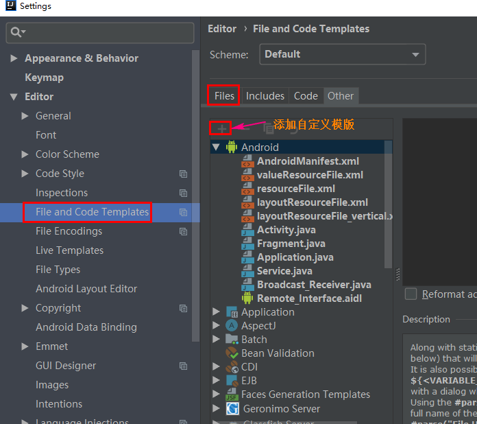
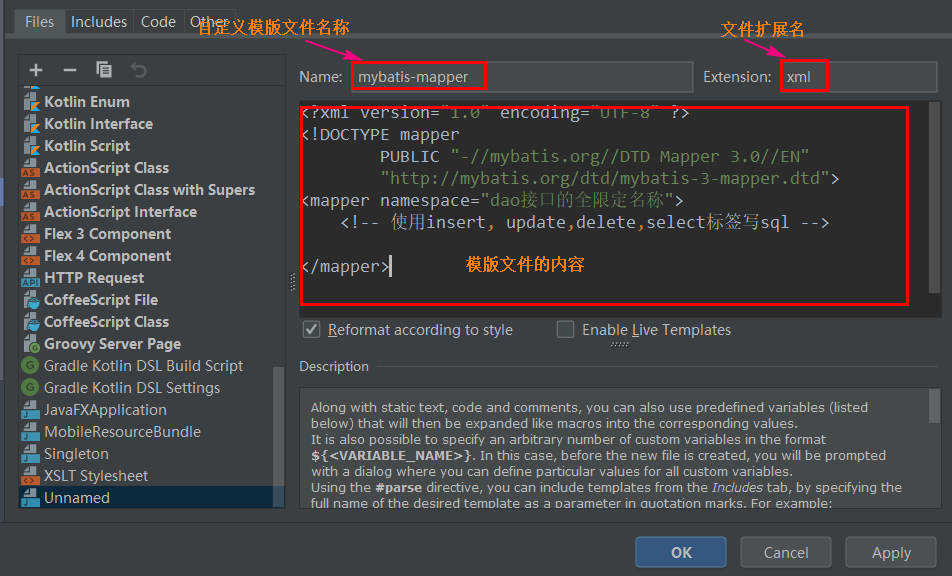
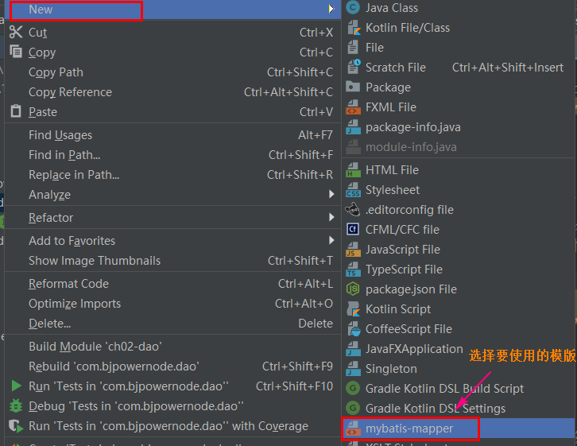
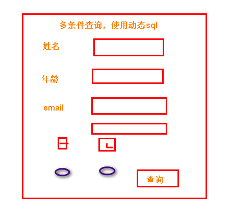

# MyBatis 框架

# 第一章 框架的概述

## 1.三层架构

mvc：web开发中，使用mvc架构模式。  m：数据， v：视图， c：控制器。

​          c控制器： 接收请求，调用service对象，显示请求的处理结果。 当前使用servlet作为控制器

​          v视图： 现在使用jsp， html，css，js。 显示请求的处理结果，把m中数据显示出来。

​          m数据： 来自数据库mysql， 来自文件，来自网络

mvc作用：

​     1）实现解耦合。 

​     2）让mvc 各负其职。  

​     3）使的系统扩展更好。更容易维护。 


三层架构：

1.界面层（视图层）：接收用户的请求，调用service， 显示请求的处理结果的。 包含了jsp，html，servlet等对象。 对应的包controller，

2.业务逻辑层：处理业务逻辑， 使用算法处理数据的。 把数据返回给界面层。 对应的是service包，和包中的很多的XXXService类。 例如：  StudentService ， OrderService, ShopService 

3.持久层（数据库访问层）：访问数据库，或者读取文件，访问网络。获取数据。 对应的包是dao。 dao包中很多的StudentDao,  OrderDao,  ShopDao等等。


## 2. 三层架构请求的处理流程


用户发起请求---->界面层----->业务逻辑层---->持久层---->数据库（mysql）


## 3. 为什么要使用三层？

1，结构清晰、耦合度低, 各层分工明确
2，可维护性高，可扩展性高
3，有利于标准化
4，开发人员可以只关注整个结构中的其中某一层的功能实现
5，有利于各层逻辑的复用


## 4. 三层架构模式和框架

每一层对应着一个框架

1）界面层---SpringMVC框架

2）业务层---Spring框架

3）持久层---MyBatis框架


## 5 .框架

1) 什么是框架（framework）

框架：就是一个软件， 完成了部分的功能。  软件中的类和类之间的方法调用都已经规定好了。 通过这些可以完成某些功能。  框架看做是模版。   

框架是可以升级的，改造的。 框架是安全的。


框架是对某一个方面有用的，不是全能的。 


## 6. 框架解决的问题

1）框架能实现技术的整合。 

2）提供开发的效率。 降低难度。


## 7. jdbc访问数据库的优缺点

优点：

1. 直观，好理解

缺点：

1. 创建很多对象 Connection ,Statement, ResultSet
2. 注册驱动
3. 执行sql语句
4. 把ResultSet转为 Student ， List集合。
5. 关闭资源
6. sql语句和业务逻辑代码混在一起


## 8 MyBatis框架

什么 mybatis： 是一个持久层框架， 原名是ibatis， 2013改名为 MyBatis.   MyBatis可以操作数据库，对数据执行增删改查。  看做是高级的jdbc。  解决jdbc的缺点。


mybatis能做什么？

 1） 注册驱动 。

  2） 创建jdbc中使用的Connection， Statement，ResultSet

  3)   执行sql语句， 得到ResultSet

  4)   处理ResultSet， 把记录集中的数据转为java对象，  同时还能把java对象放入到List集合。

  5）关闭资源

  6）实现sql语句和java代码的解耦合。


mybatis的文档： https://mybatis.org/mybatis-3/zh/index.html


# 第二章  MyBatis入门

## 2.1 第一个例子

实现步骤：

0.创建student表（id，name，email，age）

1.新建maven项目

2.修改pom.xml 

   1）加入依赖 mybatis依赖， mysql驱动， junit

   2）在<build>加入资源插件

3.创建实体类Student。定义属性， 属性名和列名保持一致

4.创建Dao接口， 定义操作数据库的方法。

5.创建xml文件（mapper文件）， 写sql语句。 

   mybatis框架推荐是把sql语句和java代码分开

   mapper文件：定义和dao接口在同一目录， 一个表一个mapper文件。

6.创建mybatis的主配置文件（xml文件）：有一个， 放在resources目录下

   1）定义创建连接实例的数据源（DataSource）对象

   2)   指定其他mapper文件的位置

7.创建测试的内容。

   使用main方法，测试mybatis访问数据库

   也可以使用junit 访问数据库


## 2.2 概念

1.自动提交：当你的 sql语句执行完毕后， 提交事务。 数据库更新操作之间保存到数据

2.手动（手工）提交事务：在你需要提交事务的位置， 执行方法，提交事务或者回顾事务。


## 2.3 MyBatis的一些重要对象

1） Resources ： mybatis框架中的对象， 一个作用读取 主配置信息。

```java
InputStream inputStream = Resources.getResourceAsStream("mybatis.xml");
```


2）SqlSessionFactoryBuilder：负责创建SqlSessionFactory对象

```java
SqlSessionFactory factory = new SqlSessionFactoryBuilder().build(inputStream);
```


3）SqlSessionFactory: 重要对象

SqlSessionFactory是重量级对象：创建此对象需要使用更多的资源和时间。  在项目中有一个就可以了。

SqlSessionFactory接口：作用是SqlSession的工厂， 就是创建SqlSession对象。

DefaultSqlSessionFactory实现类

```java
public class DefaultSqlSessionFactory implements SqlSessionFactory { } 
```


SqlSessionFactory接口中的方法

openSession(): 获取一个默认的SqlSession对象， 默认是需要手工提交事务的。

openSession(boolean): boolean参数表示是否自动提交事务。 

​                   true： 创建一个自动提交事务的SqlSession

​                  false:   等同于没有参数的openSession


4) SqlSession对象

SqlSession对象是通过SqlSessionFactory获取的。 SqlSession本身是接口

DefaultSqlSession: 实现类

```java
public class DefaultSqlSession implements SqlSession { }
```

SqlSession作用是提供了大量的执行sql语句的方法：

```:
selectOne：执行sql语句，最多得到一行记录，多余1行是错误。
selectList：执行sql语句，返回多行数据
selectMap：执行sql语句的，得到一个Map结果
insert：执行insert语句
update：执行update语句
delete：执行delete语句
commit：提交事务
rollback：回顾事务
```


注意SqlSession对象不是线程安全的， 使用的步骤：

①：在方法的内部，执行sql语句之前，先获取SqlSession对象

②：调用SqlSession的方法，执行sql语句

③：关闭SqlSession对象，执行SqlSession.close()


## 2.4 使用工具类和模版

1）创建模版，mapper文件模版和mybatis主配置文件模版

创建模版的步骤：

	


创建模版文件：

	

创建文件选择使用的模版：

	


# 第三章  MyBatis的Dao代理


## 3.1  dao代理

###  3.1.1 mybatis提供代理： 

 mybatis创建Dao接口的实现类对象， 完成对sql语句的执行。  mybatis创建一个对象代替你的 dao实现类功能。

### 3.1.2 使用mybatis代理要求

1）mapper文件中的namespace 一定dao接口的全限定名称

2）mapper文件中 标签的id是dao接口方法名称


### 3.1.3 mybatis代理实现方式

使用SqlSession对象的方法 getMapper(dao.class)

例如： 现在有 StudentDao接口。 

```java
SqlSession session  = MyBatisUtils.getSqlSession();
StudentDao dao  = session.getMapper(StudentDao.class);
Student student = dao.selectById(1001);


//上面代码中
StudentDao dao  = session.getMapper(StudentDao.class);
等同于
StudentDao dao  = new StudentDaoImpl();

```


## 3.2 理解参数

理解参数是： 通过java程序把数据传入到mapper文件中的sql语句。 参数主要是指dao接口方法的形参

### 3.2.1 parameterType

parameterType:表示参数的类型， 指定dao方法的形参数据类型。 这个形参的数据类型是给mybatis使用。 mybatis在给sql语句的参数赋值时使用。 PreparedStatement.setXXX( 位置， 值) 


```xml
第一个用法： java类型的全限定类型名称   parameterType="java.lang.Integer"
第二个用法： mybatis定义的java类型的别名  parameterType="int"

parameterType：mybatis通过反射机制可以获取 dao接口方法参数的类型， 可以不写

<select id="selectById"  parameterType="integer"
                 resultType="com.bjpowernode.domain.Student">
   select id,name,email,age from student where id=#{studentId}
</select>
```

### 3.2.2 dao接口方法是一个简单类型的参数

```java
//dao接口的方法形参是一个简单类型的
//简单类型： java基本数据类型和String
Student selectByEmail(String email);
```

```xml
<!--
   dao接口是一个简单类型的参数
   mapper文件，获取这个参数值，使用#{任意字符}
-->
<select id="selectByEmail" resultType="com.bjpowernode.domain.Student">
    select id,name,email,age from student where email=#{studentEmail}
</select>
```


### 3.2.3 dao接口方法有多个简单类型的参数

@Param: 命名参数， 在方法的形参前面使用的， 定义参数名。  这个名称可以用在mapper文件中。

dao接口，方法的定义

```java
/*
  多个简单类型的参数
  使用@Param命名参数， 注解是mybatis提供的
  位置：在形参定义的前面
  属性：value 自定义的参数名称
 */
List<Student> selectByNameOrAge(@Param("myname") String name,
                                @Param("myage") Integer age);
```


mapper文件

```xml
<!--
   多个简单类型的参数.
   当使用了@Param命名后，例如@Param("myname").
   在mapper中，使用#{命名的参数}， 例如 #{myname}
-->
<select id="selectByNameOrAge" resultType="com.bjpowernode.domain.Student">
    select id,name,email,age from student where name=#{myname} or age=#{myage}
</select>
```


### 3.2.4 dao接口方法使用一个对象作为参数

方法的形参是一个java对象。这个java对象表示多个参数。使用对象的属性值作为参数使用

java对象

```java
public class Student {
    private Integer id;
    private String name;
    private String email;
    private Integer age;
    //set|get方法
}

public class QueryParam {
    private Object p1;
    private Object p2;
    //set|get方法
}
```


dao接口中的方法定义

```java
/*
 * 一个java对象作为参数( 对象由属性， 每个属性有set，get方法)
 */
List<Student> selectByObject(Student student);

List<Student> selectByQueryParam(QueryParam param);
```


mapper文件

```xml
<!--
   一个java对象作为方法的参数，使用对象的属性作为参数值使用
   简单的语法： #{属性名} ， mybatis调用此属性的getXXX()方法获取属性值
-->
<select id="selectByObject" resultType="com.bjpowernode.domain.Student">
    select id,name,email,age from student where name=#{name} or age=#{age}
</select>

<select id="selectByQueryParam" resultType="com.bjpowernode.domain.Student">
     select id,name,email,age from student where name=#{p1} or age=#{p2}
</select>

<!--负责的语法格式： #{属性名,javaType=java类型的全限定名称,jdbcType=mybatis中定义列的数据类型}-->
<select id="selectByObject" resultType="com.bjpowernode.domain.Student">
        select id,name,email,age from student where
        name=#{name,javaType=java.lang.String,jdbcType=VARCHAR}
        or
        age=#{age,javaType=java.lang.Integer,jdbcType=INTEGER}
</select>
```


### 3.2.5 dao接口中多个简单类型的参数，使用位置

参数位置： dao接口中方法的形参列表，从左往右，参数位置是 0 ， 1， 2......

语法格式：#{arg0} ,#{arg1}

dao接口的方法

```java
/*
   使用位置，获取参数
 */
List<Student> selectByPosition(String name,Integer age);
```


```xml
<!--
   mybatis版本是 3.5.1
   使用位置获取参数值， dao接口方法是多个简单类型的参数
   语法： #{arg0}, #{arg1}....
-->
<select id="selectByPosition" resultType="com.bjpowernode.domain.Student">
    select id,name,email,age from student where name=#{arg0} or age=#{arg1}
</select>
```


### 3.2.6 dao接口参数是一个Map

map作为dao接口的参数， 使用 key 获取参数值，mapper文件中，语法格式 #{key}

```java
/*
   使用Map作为参数
 */
List<Student> selectStudentByMap(Map<String,Object> map);
```


mapper文件

```xml
<!--
   使用Map传递参数，
   在mapper文件中，获取map的值，是通过key获取的，语法：#{key}
-->
<select id="selectStudentByMap" resultType="com.bjpowernode.domain.Student">
     select id,name,email,age from student where name=#{myname} or age=#{myage}
</select>
```


测试，调用方法的位置

```java
@Test
public void testSelectByMap(){
    SqlSession sqlSession = MyBatisUtil.getSqlSession();
    StudentDao dao  = sqlSession.getMapper(StudentDao.class);

    //使用map传递参数
    Map<String,Object> data = new HashMap<>();
    data.put("myname", "李思思");
    data.put("myage", 20);
    List<Student> students = dao.selectStudentByMap(data);

    students.forEach( stu-> System.out.println("stu="+stu));
    sqlSession.close();

}
```


## 3.3 #和$的区别

### 3.3.1 # 占位符

语法： #{字符}


mybatis处理#{} 使用jdbc对象是 PrepareStatment对象

```xml
<select id="selectById"  parameterType="integer"
             resultType="com.bjpowernode.domain.Student">
    select id,name,email,age from student where id=#{studentId}
</select>

mybatis出创建PrepareStatement对象，执行sql语句
String sql=" select id,name,email,age from student where id=?";
PrepareStatement pst = conn.prepareStatement(sql);
pst.setInt(1,1001);  //传递参数
ResultSet rs  = pst.executeQuery(); //执行sql语句
```


#{}特点：

1）使用的PrepareStatement对象，执行sql语句，效率高。

2）使用的PrepareStatement对象，能避免sql语句， sql语句执行更安全。

3） #{} 常常作为 列值使用的， 位于等号的右侧，  #{}位置的值和数据类型有关的。


### 3.3.2 $ 占位符

语法 :  ${字符}

mybatis执行${}占位符的sql语句

```xml
<select id="selectById"  parameterType="integer"
             resultType="com.bjpowernode.domain.Student">
    select id,name,email,age from student where id=${studentId}
</select>	

${} 表示字符串连接， 把sql语句的其他内容和 ${}内容使用 字符串（+） 连接的方式连在一起
String sql="select id,name,email,age from student where id=" + "1001";

mybatis创建Statement对象， 执行sql语句。
Statement stmt  = conn.createStatement(sql);
ResultSet rs  = stmt.executeQuery();

```


${} 的特点

1）使用Statement对象，执行sql语句，效率低

2）${}占位符的值，使用的字符串连接方式， 有sql注入的风险。 有代码安全的问题

3)  ${} 数据是原样使用的， 不会区分数据类型。

4）${} 常用作 表名或者列名， 在能保证数据安全的情况下使用 ${}


## 3.4 封装MyBatis输出结果

封装输出结果： MyBatis执行sql语句，得到ResultSet, 转为java对象。 

讲两个 resultType, resultMap

### 3.4.1 resultType

resultType属性： 在执行select时使用， 作为<select>标签的属性出现的。

resultType:表示结果类型 ，  mysql执行sql语句，得到java对象的类型。  它的值有两种

​		     1） java类型的全限定名称  。 2）使用别名


1） resultType:表示java自定义对象

```xml
Student selectById(Integer id);

<select id="selectById"  parameterType="integer"
             resultType="com.bjpowernode.domain.Student">
    select id,name,email,age from student where id=#{studentId}
</select>

resultType:现在使用java类型的全限定名称。 表示的意思 mybatis执行sql，把ResultSet中的数据转为Student类型的对象。  mybatis会做以下操作：
1. 调用com.bjpowernode.domain.Student的无参数构造方法，创建对象。
    Student student = new Student(); //使用反射创建对象
2. 同名的列赋值给同名的属性。
    student.setId( rs.getInt("id"));
    student.setName(rs.getString("name"));
3. 得到java对象， 如果dao接口返回值是List集合， mybatis把student对象放入到List集合。


所以执行 Student mystudent = dao.selectById(1001); 得到 数据库中 id=1001这行数据， 
这行数据的列值， 付给了mystudent对象的属性。 你能得到mystudent对象。 就相当于是 id=1001这行数据。


```


2）resultType表示简单类型

dao方法

```java
long countStudent();
```


mapper文件

```xml
<!--
  执行sql语句，得到是一个值（一行一列）
-->
<select id="countStudent" resultType="java.lang.Long">
    select count(*) from student
</select>
```


3） resultType:表示一个map结构

```java
//查询结果返回是一个Map
Map<Object,Object> selectMap(@Param("stuid") Integer id);
```


```xml
<!--
   执行sql得到一个Map结构数据， mybatis执行sql，把ResultSet转为map
   sql执行结果， 列名做map的key ， 列值作为value
   sql执行得到是一行记录，转为map结构是正确的。

   dao接口返回是一个map， sql语句最多能获取一行记录，多余一行是错误

-->
<select id="selectMap" resultType="java.util.HashMap">
    select id,name,email from student where id != #{stuid}
</select>
```


练习题：

 输入一个省份id ，得到 省份id ，省份name， 城市id，城市名称

例如输入 省份id=1

1 河北  1 石家庄

1 河北   2 秦皇岛


### 3.4.2 resultMap

resultMap: 结果映射。 自定义列名和java对象属性的对应关系。 常用在列名和属性名不同的情况。

用法：

1.先定义 resultMap标签， 指定列名和属性名称对应关系

2.在select标签使用resultMap属性，指定上面定义的resultMap的id值


```xml
<!--使用resultMap定义列和属性的关系-->
<!--定义resultMap
    id:给resultMap的映射关系起个名称，唯一值
    type:java类型的全限定名称
-->
<resultMap id="customMap" type="com.bjpowernode.vo.CustomObject">

    <!--定义列名和属性名的对应-->
    <!--主键类型使用id标签-->
    <id column="id" property="cid" />
    <!--非主键类型使用result标签-->
    <result column="name" property="cname" />
    <!--列名和属性名相同不用定义-->
    <result column="email" property="email" />
    <result column="age" property="age" />
</resultMap>

<!--使用resultMap属性，指定映射关系的id
    resultMap和resultType 不能同时使用， 二选一。
-->
<select id="selectById2" resultMap="customMap">
  select id,name,email,age from student where id=#{stuid}
</select>
```


## 3.5 自定义别名

mybatis提供的对java类型定义简短，好记名称。

自定义别名的步骤：

1）在mybatis主配置文件，使用 typeAliases标签声明别名

2）在mapper文件中， resultType="别名"


声明别名（mybatis主配置文件）

```xml
<typeAliases>
    <!--第一种语法格式
        type:java类型的全限定名称（自定义类型）
        alias:自定义别名
    -->
    <typeAlias type="com.bjpowernode.domain.Student" alias="stu" />

</typeAliases>
```


mapper文件中使用

```xml
resultType="别名"
<select id="selectById"  parameterType="integer" resultType="stu">
    select id,name,email,age from student where id=#{studentId}
</select>
```


## 3.6 列名和java对象属性名称不一样解决方式

1） 使用resultMap： 自定义列名和属性名称对应关系

```xml
/* 接口 */
List<MyStudent> selectMyStudent();

/* mapper文件 */
<!-- 定义resultMap -->
MyStudent为新定义的java类，它的属性名跟数据库中的字段名是不一样的
<resultMap id="myStudentMap" type="com.apps.bean.MyStudent" >
    <!-- 列名和java属性的关属 -->
    <!-- 主键列，使用id标签 -->
    <id column="id" property="myId" />
    <!-- 非主键列，使用result标签 -->
    <result column="name" property="myName" />
    <result column="email" property="myEmail" />
    <result column="age" property="myAge" />
</resultMap>

<select id="selectMyStudent" resultMap="myStudentMap">
    select * from stu;
</select>
```

2）使用resultType:  使用列别名，让别名和java对象属性名称一样

```xml
<select id="selectDiffColProperty" resultType="com.apps.bean.MyStudent">
    select id as myId,name as myName,email as myEmail,age as myAge from stu;
</select>
```


## 3.7 like

第一种方式： 在java程序中，把like的内容组装好。 把这个内容传入到sql语句


```java
//like第一种方式
List<Student> selectLikeOne(@Param("name") String name);
```


mapper

```xml
<!--like第一种方式-->
<select id="selectLikeOne" resultType="com.bjpowernode.domain.Student">
    select * from student where name like #{name}
</select>
```


执行like

```java
@Test
public void testLikeOne(){
    SqlSession sqlSession = MyBatisUtil.getSqlSession();
    StudentDao dao  = sqlSession.getMapper(StudentDao.class);

    String name="%李%";
    List<Student> students = dao.selectLikeOne(name);

    sqlSession.close();

    students.forEach( stu-> System.out.println(stu));
}
```


第二种方式： 在sql语句，组织like的内容。 

sql语句like的格式：  where name like "%"空格#{name}空格"%"


```java
//like第二种方式
List<Student> selectLikeTwo(@Param("name") String name);
```


```xml
<!--like第二种方式-->
<select id="selectLikeTwo" resultType="com.bjpowernode.domain.Student">
    select * from student where name like "%" #{name} "%"
</select>
```


```java
@Test
public void testLikeTwo(){
    SqlSession sqlSession = MyBatisUtil.getSqlSession();
    StudentDao dao  = sqlSession.getMapper(StudentDao.class);

    String name="李";
    List<Student> students = dao.selectLikeTwo(name);

    sqlSession.close();

    students.forEach( stu-> System.out.println(stu));
}
```


# 第四章 动态sql

什么是动态sql： 同一个dao的方法， 根据不同的条件可以表示不同的sql语句， 主要是where部分有变化

使用mybatis提供的标签，实现动态sql的能力，  主要讲 if ，where ，foreach， sql。


使用动态sql的时候， dao方法的形参使用java对象。 


什么时候使用动态sql：

	


## 4.1  if 标签

语法：

```xml

<if test="boolean判断结果">
   sql 代码
</if>


在mapper文件中
<select id="selectStudent" resultType="com.bjpwoernode.domain.Student">
      select *from student
      <if test="条件">
          sql语句
      </if>
      <if test="条件">
          sql语句
      </if>
</select>
```


例子：

```java
List<Student> selectIf(Student student);
```


```xml
<!--if
    test: 使用对象的属性值作为条件
-->
<select id="selectIf" resultType="com.bjpowernode.domain.Student">
    select * from student
    where id=-1
    <if test="name !=null and name!=''">
       or  name = #{name}
    </if>

    <if test="age >0">
        or age &lt; #{age}
    </if>
</select>
```


## 4.2 where 标签

使用if标签时，容易引起sql语句语法错误。  使用where标签解决if产生的语法问题。

使用时 where ,里面是一个或多个if 标签， 当有一个if标签 判断条件为true，  where标签会转为 WHERE 关键字附加到sql语句的后面。  如果 if 没有一个条件为true ， 忽略where和里面的if。

where标签删除 和他最近的or 或者 and。（注，但是不能把`AND`写在语句后面,eg:`name = #{name} OR`）

```xml
语法：
<where>
    <if test="条件1">sql语句1</if>
    <if test="条件2">sql语句2</if>
</where>
```


例子：

```java
//where
List<Student> selectWhere(Student student);
```


```xml
<!--where-->
<select id="selectWhere" resultType="com.bjpowernode.domain.Student">
    select * from student
    <where>
        <if test="name !=null and name!=''">
            or  name = #{name}
        </if>

        <if test="age >0">
            or age &lt; #{age}
        </if>
    </where>

</select>
```


## 4.3 foreach 循环

使用foreach可以循环数组，list集合， 一般使用在in语句中。

语法：

```xml
< foreach collection="集合类型" open="开始的字符" close="结束的字符"
          item="集合中的成员" separator="集合成员之间的分隔符">
              #{item 的值}
</ foreach>

标签属性：
collection： 表示，循环的对象是 数组， 还是list集合。  如果dao接口方法的形参是 数组， 
             collection="array" ,如果dao接口形参是List， collection="list"

open:循环开始时的字符。  sql.append("(");
close：循环结束时字符。  sql.append(")");
item：集合成员， 自定义的变量。   Integer item  = idlist.get(i);// item是集合成员
separator：集合成员之间的分隔符。  sql.append(","); //集合成员之间的分隔符
#{item 的值}：获取集合成员的值。
```


第一种方式：

```java
//foreach-1
List<Student> selectForeachOne(List<Integer> idlist);


<!--foreach第一种方式， 循环简单类型的List-->
<select id="selectForeachOne" resultType="com.bjpowernode.domain.Student">
      select * from student
        <if test="list !=null and list.size>0">
            where id in
            <foreach collection="list" open="(" close=")" separator="," item="myid">
                  #{myid}
            </foreach>
        </if>
</select>

@Test
public void testSelectForeachOne(){
        //1.获取SqlSession
        SqlSession session = MyBatisUtil.getSqlSession();
        //2.获取dao的代理
        StudentDao dao = session.getMapper(StudentDao.class);


        List<Integer> idlist = new ArrayList<>();
        idlist.add(1001);
        idlist.add(1002);
        idlist.add(1003);


        List<Student> students  = dao.selectForeachOne(idlist);

        students.forEach( stu-> System.out.println("stu=="+stu));
        //3.关闭SqlSession对象
        session.close();
    }

```


第二种方式：

```java
//foreach-2
List<Student> selectForeachTwo(List<Student> studentList);

<!--foreach第二种方式， 循环的List<Student>-->
<select id="selectForeachTwo" resultType="com.bjpowernode.domain.Student">
        select * from student
        <if test="list != null and list.size>0">
            where id in
            <foreach collection="list" open="(" close=")" separator="," item="stu">
                  #{stu.id}
            </foreach>
        </if>
</select>
            
 @Test
 public void testSelectForeachTwo(){
        //1.获取SqlSession
        SqlSession session = MyBatisUtil.getSqlSession();
        //2.获取dao的代理
        StudentDao dao = session.getMapper(StudentDao.class);


        List<Student> list  = new ArrayList<>();
        Student s1 = new Student();
        s1.setId(1001);

        Student s2 = new Student();
        s2.setId(1002);

        list.add(s1);
        list.add(s2);


        List<Student> students  = dao.selectForeachTwo(list);

        students.forEach( stu-> System.out.println("stu=="+stu));
        //3.关闭SqlSession对象
        session.close();
    }
            
```

## 4.4 sql标签

sql标签标示 一段sql代码， 可以是表名，几个字段， where条件都可以， 可以在其他地方复用sql标签的内容。

使用方式：

```xml
1) 在mapper文件中定义 sql代码片段 <sql id="唯一字符串">  部分sql语句  </sql>
2）在其他的位置，使用include标签引用某个代码片段
```


例如：

```xml
<!--定义代码片段-->
<sql id="selectStudent">
    select * from student
</sql>

<sql id="studentFieldList">
    id,name,email
</sql>

<select id="selectIf" resultType="com.bjpowernode.domain.Student">

        <include refid="selectStudent" />

        where id=-1
        <if test="name !=null and name!=''">
           or  name = #{name}
        </if>

        <if test="age >0">
            or age &lt; #{age}
        </if>
    </select>

    <!--where-->
    <select id="selectWhere" resultType="com.bjpowernode.domain.Student">
        select <include refid="studentFieldList"/> from student
        <where>
            <if test="name !=null and name!=''">
                or  name = #{name}
            </if>

            <if test="age >0">
                or age &lt; #{age}
            </if>
        </where>

    </select>

```


# 第五章 MyBatis配置文件

mybatis配置文件两大类： 1 mybatis主配置文件； 2 mybatis的mapper文件

1. mybatis主配置文件，提供mybatis全局设置的。包含的内容 日志， 数据源，mapper文件位置
2. mapper文件： 写sql语句的。 一个表一个mapper文件


## 5.1 settings部分

settings是mybatis的全局设置，影响整个mybatis的运行。 这个设置一般使用默认值就可以了。

```xml
<settings>
  <setting name="cacheEnabled" value="true"/>
  <setting name="lazyLoadingEnabled" value="true"/>
  <setting name="multipleResultSetsEnabled" value="true"/>
  <setting name="useColumnLabel" value="true"/>
  <setting name="useGeneratedKeys" value="false"/>
  <setting name="autoMappingBehavior" value="PARTIAL"/>
  <setting name="autoMappingUnknownColumnBehavior" value="WARNING"/>
  <setting name="defaultExecutorType" value="SIMPLE"/>
  <setting name="defaultStatementTimeout" value="25"/>
  <setting name="defaultFetchSize" value="100"/>
  <setting name="safeRowBoundsEnabled" value="false"/>
  <setting name="mapUnderscoreToCamelCase" value="false"/>
  <setting name="localCacheScope" value="SESSION"/>
  <setting name="jdbcTypeForNull" value="OTHER"/>
  <setting name="lazyLoadTriggerMethods" value="equals,clone,hashCode,toString"/>
</settings>
```

## 5.2 typeAliase 别名

设置别名

```xml
	<typeAliases>
        <!--第一种语法格式
            type:java类型的全限定名称（自定义类型）
            alias:自定义别名

            优点： 别名可以自定义
            缺点： 每个类型必须单独定义
        -->
        <typeAlias type="com.bjpowernode.domain.Student" alias="stu" />
        <typeAlias type="com.bjpowernode.vo.QueryParam" alias="qp" />

        <!--第二种方式
            name:包名， mybatis会把这个包中所有类名作为别名（不用区分大小写）
            优点：使用方便，一次给多个类定义别名
            缺点: 别名不能自定义，必须是类名。
        -->
        <package name="com.bjpowernode.domain" />
        <package name="com.bjpowernode.vo" />

    </typeAliases>
```

上面两种可以同时作用在一个类上

**使用注解@Alias在类的声明部分取别名的时候，使用指定包下取别名就无效了，但是可以和第一种语法格式同时使用**

## 5.3 配置环境


```xml
environments: 环境标签， 在他里面可以配置多个environment
       属性： default ，必须是某个environment的id属性值。 表示mybatis默认连接的数据库
environment： 表示一个数据库的连接信息。
       属性： id 自定义的环境的标识。 唯一值。
transactionManager：事务管理器
       属性：  type 表示事务管理器的类型。
       属性值：1）JDBC: 使用Connection对象， 由mybatis自己完成事务的处理。
             2） MANAGED: 管理，表示把事务的处理交给容器实现（由其他软件完成事务的提交，回滚）
dataSource： 数据源，创建的Connection对象，连接数据库。
       属性：  type 数据源的类型
       属性值：1） POOLED， mybatis会在内存中创建PooledDataSource类，管理多个Connection连接对象，使用的连接池
             2） UNPOOLED ，不使用连接池， mybatis创建一个UnPooledDataSource这个类， 每次执行sql语句先创建Connection对象，再执行sql语句，最后关闭Connection
             3) JNDI : java的命名和目录服务。

<environments default="online">
        <environment id="development">
            <transactionManager type="JDBC"/>
            <!--配置数据源： 创建Connection对象。-->
            <dataSource type="POOLED">
                <!--driver:驱动的内容-->
                <property name="driver" value="com.mysql.jdbc.Driver"/>
                <!--连接数据库的url-->
                <property name="url"
                          value="jdbc:mysql://localhost:3306/springdb"/>
                <!--用户名-->
                <property name="username" value="root"/>
                <!--密码-->
                <property name="password" value="123"/>
            </dataSource>
        </environment>
        <!-- 项目上线后使用的数据库 -->
        <environment id="online">
            <transactionManager type="JDBC"/>
            <!--配置数据源： 创建Connection对象。-->
            <dataSource type="POOLED">
                <!--driver:驱动的内容-->
                <property name="driver" value="com.mysql.jdbc.Driver"/>
                <!--连接数据库的url-->
                <property name="url"
                          value="jdbc:mysql://localhost:3306/springdb"/>
                <!--用户名-->
                <property name="username" value="admin"/>
                <!--密码-->
                <property name="password" value="123456"/>
            </dataSource>
        </environment>
    </environments>
```


## 5.4 使用数据库属性配置文件（*）

需要把数据库的配置信息放到一个单独文件中， 独立管理。 这个文件扩展名是 properties. 在这个文件中，使用自定义的key=value的格式表示数据


使用步骤：

1.在resources目录中，创建xxxx.properties

2.在文件中，使用 key=value的格式定义数据。

   例如 jdbc.url=jdbc:mysq://localhost:3306/springdb

3.在mybatis主配置文件， 使用properties标签引用外部的属性配置文件

4.在使用值的位置， 使用${key}获取key对应的value（等号右侧的值）


例子：

jdbc.properties

```xml
jdbc.driver=com.mysql.jdbc.Driver
jdbc.url=jdbc:mysql://localhost:3306/springdb?useUnicode=true&amp;characterEncoding=utf-8
jdbc.username=root
jdbc.password=123
```


mybatis主配置文件

```xml
<!--使用外部属性配置文件
    resource:指定类路径下的某个属性配置文件
-->
<properties resource="jdbc.properties" />

<environments default="development">
        <environment id="development">
            <transactionManager type="JDBC"/>
            <!--配置数据源： 创建Connection对象。-->
            <dataSource type="POOLED">
                <!--driver:驱动的内容-->
                <property name="driver" value="${jdbc.driver}"/>
                <!--连接数据库的url-->
                <property name="url" value="${jdbc.url}"/>
                <!--用户名-->
                <property name="username" value="${jdbc.username}"/>
                <!--密码-->
                <property name="password" value="${jdbc.password}"/>
            </dataSource>
         </environment>
</environments>
```

## 5.5 mapper 标签(*)

使用mapper指定其他mapper文件的位置， 

mapper标签使用的格式有两个常用的方式：


```xml
<mappers>
    <!--第一种方式， resources="mapper文件的路径"
        优点：文件清晰。 加载的文件是明确的。
              文件的位置比较灵活。
        缺点：文件比较多， 代码量会比较大， 管理难度大
    -->
    <mapper resource="com/bjpowernode/dao/StudentDao.xml"/>
    <mapper resource="com/bjpowernode/dao/OrderDao.xml"/>
    <!--
       第二种方式，使用<package>
       name:包名， mapper文件所在的包名。
       特点： 把这个包中的所有mapper文件，一次加载。

       使用要求：
        1. mapper文件和dao接口在同一目录
        2. mapper文件和dao接口名称完全一样。
    -->
    <package name="com.bjpowernode.dao" />
    <package name="com.bjpowernode.dao1" />
</mappers>
```


# 第六章 PageHelper

PageHelper做数据分页。 在你的select语句后面加入 分页的 sql 内容， 如果你使用的mysql数据库， 它就是在select * from student 后面加入 limit 语句。

使用步骤：

1.加入依赖pagehelper依赖

```xml
<dependency>
<groupId>com.github.pagehelper</groupId>
<artifactId>pagehelper</artifactId>
<version>5.1.10</version>
</dependency>
```


2.在mybatis主配置文件， 加入plugin声明

```xml
在<environments> 之前加入
<plugins>
   <plugin interceptor ="com.github.pagehelper.PageInterceptor" />
</plugins>    
```


3.在select语句之前，调用PageHelper.startPage(页码， 每页大小)


对比：

没有使用PageHelper

select * from student order by id


使用PageHelper

SELECT count(0) FROM student 

select * from student order by id LIMIT ? 


[来源教程](https://www.bilibili.com/video/BV1Tv411b7Dp/)
