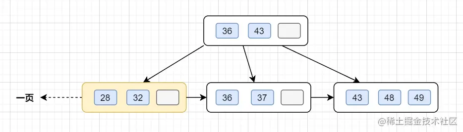
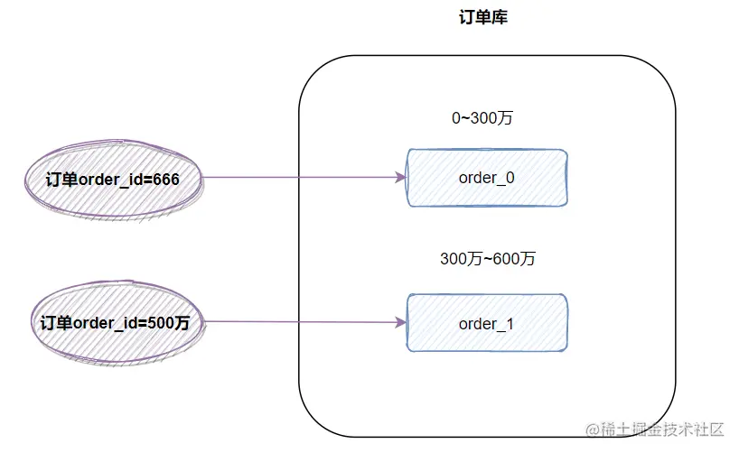
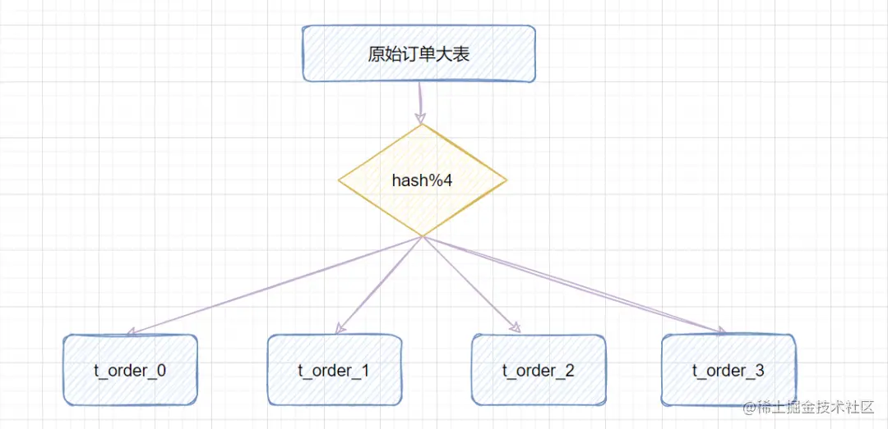
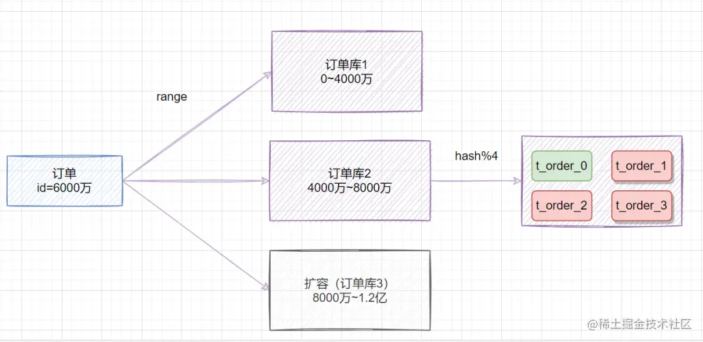
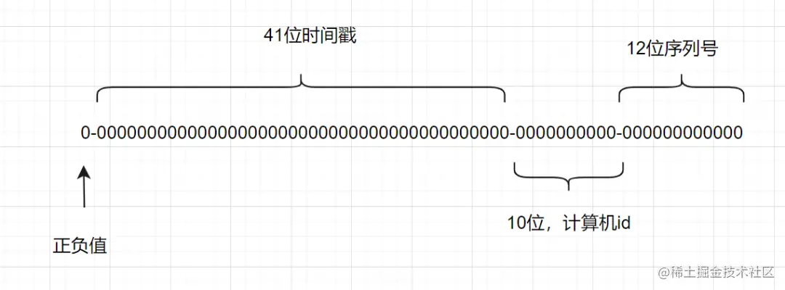
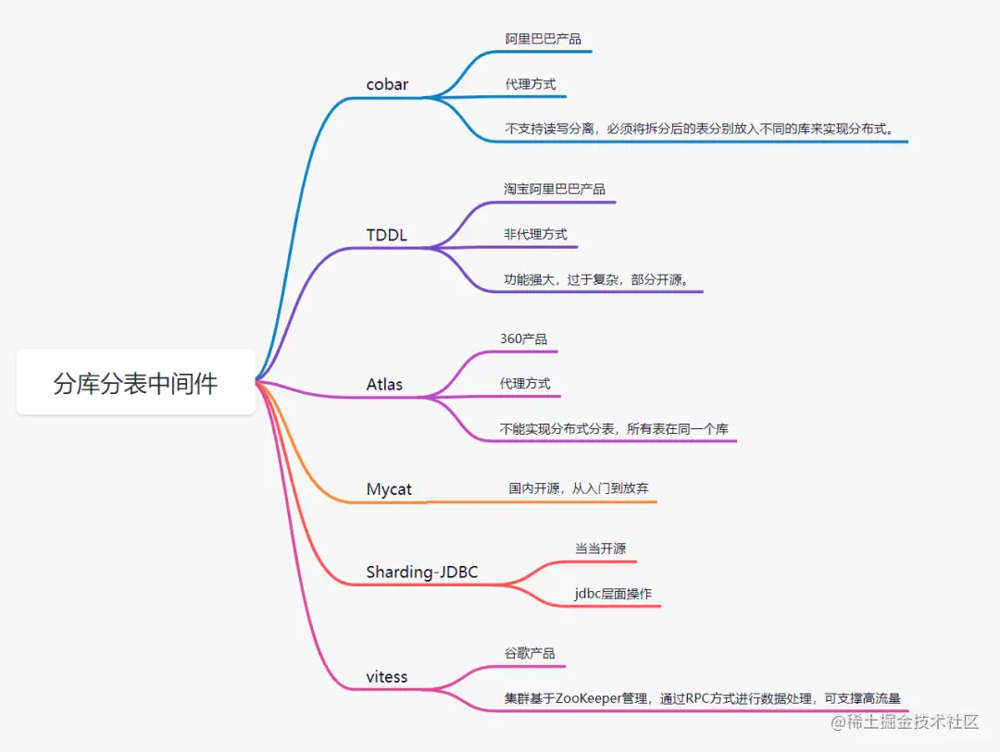

## 1.为什么分库分表

### 1.1为什么分库

- 磁盘存储

业务量剧增，MySQL单机磁盘容量会撑爆，拆成多个数据库，磁盘使用率大大降低。

- 并发连接支撑

我们知道数据库连接数是有限的。在**高并发的场景下**，大量请求访问数据库，MySQL单机是扛不住的！高并发场景下，会出现`too many connections`报错。

当前非常火的微服务架构出现，就是为了应对高并发。它把订单、用户、商品等不同模块，拆分成多个应用，并且把单个数据库也拆分成多个不同功能模块的数据库（订单库、用户库、商品库），以分担读写压力。

### 1.2为什么分表

**假如你的单表数据量非常大，存储和查询的性能就会遇到瓶颈了，如果你做了很多优化之后还是无法提升效率的时候，就需要考虑做分表了。一般千万级别数据量，就需要分表。**

这是因为即使`SQL`命中了索引，如果表的数据量超过一千万的话，查询也是会明显变慢的。这是因为索引一般是`B+`树结构，数据千万级别的话，B+树的高度会增高，查询就变慢啦。MySQL的B+树的高度怎么计算的呢？跟大家复习一下：

InnoDB存储引擎最小储存单元是页，一页大小就是16k。B+树叶子存的是数据，内部节点存的是键值+指针。索引组织表通过非叶子节点的二分查找法以及指针确定数据在哪个页中，进而再去数据页中找到需要的数据，B+树结构图如下(页之间应该为双向链表，加个箭头~)：



> 假设B+树的高度为2的话，即有一个根结点和若干个叶子结点。这棵B+树的存放总记录数为=根结点指针数*单个叶子节点记录行数。
>
> 如果一行记录的数据大小为1k，那么单个叶子节点可以存的记录数  =16k/1k =16. 非叶子节点内存放多少指针呢？我们假设主键ID为bigint类型，长度为8字节(面试官问你int类型，一个int就是32位，4字节)，而指针大小在InnoDB源码中设置为6字节，所以就是 8+6=14 字节，16k/14B =16*1024B/14B = 1170
>
> 因此，一棵高度为2的B+树，能存放1170 * 16=18720条这样的数据记录。同理一棵高度为3的B+树，能存放1170 *1170 *16 =21902400，大概可以存放**两千万左右**的记录。B+树高度一般为1-3层，如果B+到了4层，查询的时候会多查磁盘的次数，SQL就会变慢。

因此单表数据量太大，SQL查询会变慢，所以就需要考虑分表啦。

## 2.什么时候考虑分库分表

对于`MySQL`，`InnoDB`存储引擎的话，单表最多可以存储`10亿`级数据。但是的话，如果真的存储这么多，性能就会非常差。一般数据量千万级别（上面推导过哩），`B+`树索引高度就会到`3`层以上了，查询的时候会多查磁盘的次数，`SQL`就会变慢。

阿里巴巴的`《Java开发手册》`提出：

> 单表行数超过`500万`行或者单表容量超过`2GB`，才推荐进行分库分表。

**那我们是不是等到数据量到达五百万，才开始分库分表呢？**

> 不是这样的，我们应该**提前规划分库分表**，如果估算`3`年后，你的表都不会到达这个五百万，则不需要分库分表。

**MySQL服务器如果配置更好，是不是可以超过这个500万这个量级，才考虑分库分表？**

> 虽然配置更好，可能数据量大之后，性能还是不错，但是如果持续发展的话，还是要考虑分库分表

**一般什么类型业务表需要才分库分表？**

> 通用是一些**流水表、用户表**等才考虑分库分表，如果是一些配置类的表，则完全不用考虑，因为不太可能到达这个量级。

## 3. 如何选择分表键

分表键，即用来**分库/分表**的字段，换种说法就是，你以哪个维度来分库分表的。比如你**按用户ID分表、按时间分表、按地区分表**，这些**用户ID、时间、地区**就是分表键。

一般数据库表拆分的原则，需要先找到**业务的主题**。比如你的数据库表是一张企业客户信息表，就可以考虑用了**客户号**做为分表键。

**为什么考虑用客户号做分表键呢？**

> 这是因为表是基于客户信息的，所以，需要将同一个客户信息的数据，落到一个表中，**避免触发全表路由**。

## 4.非分表键如何查询

分库分表后，有时候无法避免一些业务场景，**需要通过非分表键来查询**。

假设一张用户表，根据`userId`做分表键，来分库分表。但是用户登录时，需要根据**用户手机号**来登陆。这时候，就需要通过手机号查询用户信息。而**手机号是非分表键**。

非分表键查询，一般有这几种方案：

- **遍历**：最粗暴的方法，就是遍历所有的表，找出符合条件的手机号记录（**不建议**）
- **将用户信息冗余同步到ES**，同步发送到ES，然后通过ES来查询（**推荐**）

其实还有**基因法**：比如非分表键可以解析出分表键出来，比如常见的，订单号生成时，可以包含客户号进去，通过订单号查询，就可以解析出客户号。但是这个场景除外，**手机号似乎不适合冗余userId**。

## 5. 分表策略如何选择

### 5.1 range范围

`range`，即范围策略划分表。比如我们可以将表的主键`order_id`，按照从`0~300万`的划分为一个表，`300万~600万`划分到另外一个表。如下图：



有时候我们也可以按时间范围来划分，如不同年月的订单放到不同的表，它也是一种`range`的划分策略。

- 优点： Range范围分表，有利于扩容。
- 缺点： 可能会有热点问题。因为`订单id`是一直在增大的，也就是说最近一段时间都是汇聚在一张表里面的。比如最近一个月的订单都在`300万~600万`之间，平时用户一般都查最近一个月的订单比较多，请求都打到`order_1`表啦。

### 5.2 hash取模

**hash取模策略：**

> 指定的路由key（一般是`user_id、order_id、customer_no`作为key）对分表总数进行取模，把数据分散到各个表中。

比如原始订单表信息，我们把它分成4张分表：



- 比如id=1，对4取模，就会得到1，就把它放到t_order_1;
- id=3，对4取模，就会得到3，就把它放到t_order_3;

一般，我们会取**哈希值，再做取余**：

```matlab
Math.abs(orderId.hashCode()) % table_number
```

- 优点：hash取模的方式，**不会存在明显的热点问题**。
- 缺点：如果未来某个时候，表数据量又到瓶颈了，需要扩容，就比较麻烦。所以一般建议提前规划好，一次性分够。（可以考虑**一致性哈希**）

### 5.3 一致性Hash

如果**用hash方式**分表，前期规划不好，需要**扩容二次分表，表的数量需要增加，所以hash值需要重新计算**，这时候需要迁移数据了。

> 比如我们开始分了`10`张表，之后业务扩展需要，增加到`20`张表。那问题就来了，之前根据`orderId`取模`10`后的数据分散在了各个表中，现在需要重新对所有数据重新取模`20`来分配数据

为了解决这个**扩容迁移**问题，可以使用**一致性hash思想**来解决。

> **一致性哈希**：在移除或者添加一个服务器时，能够尽可能小地改变已存在的服务请求与处理请求服务器之间的映射关系。一致性哈希解决了简单哈希算法在分布式哈希表存在的**动态伸缩**等问题

## 6. 如何避免热点问题数据倾斜（热点数据）

如果我们根据**时间范围**分片，某电商公司11月搞营销活动，那么大部分的数据都落在11月份的表里面了，其他分片表可能很少被查询，即**数据倾斜**了，有热点数据问题了。

我们可以使用`range范围+ hash哈希取模`结合的分表策略，简单的做法就是：

> 在拆分库的时候，我们可以先用range范围方案，比如订单id在`0~4000万`的区间，划分为订单库1;id在`4000万~8000万`的数据，划分到`订单库2`,将来要扩容时，id在`8000万~1.2亿`的数据，划分到订单库3。然后订单库内，再用`hash取模`的策略，把不同订单划分到不同的表。



## 7.分库后，事务问题如何解决

分库分表后，假设两个表在不同的数据库，那么**本地事务已经无效**啦，需要使用**分布式事务**了。

常用的分布式事务解决方案有：

- 两阶段提交
- 三阶段提交
- TCC
- 本地消息表
- 最大努力通知
- saga

大家可以看下这几篇文章：

- [后端程序员必备：分布式事务基础篇](https://mp.weixin.qq.com/s?__biz=Mzg3NzU5NTIwNg==&mid=2247487969&idx=1&sn=1a7c255439810aa12d0417a69c709bce&chksm=cf21cec8f85647dee38af93bb6747fc4e597c9918ad83f5ad30fe726f2918e017e390b2b7413&token=162724582&lang=zh_CN&scene=21#wechat_redirect)
- [看一遍就理解：分布式事务详解](https://mp.weixin.qq.com/s?__biz=Mzg3NzU5NTIwNg==&mid=2247498358&idx=1&sn=aa6c7ceb61b73267d68d1b4fb7ccc2ed&chksm=cf22255ff855ac495861d57df276517e89779006267fa8413fe925cc15b0c3e0b0f1b1a5675e&token=810040944&lang=zh_CN#rd)
- [框架篇：分布式一致性解决方案](https://mp.weixin.qq.com/s?__biz=Mzg3NzU5NTIwNg==&mid=2247490468&idx=2&sn=91b8e5dd2ce3db218708b5c736fce700&chksm=cf21c48df8564d9b30164e1dbf9b5ebcc1847a9450d08ee146c98eb53107af475149ad12a748&token=810040944&lang=zh_CN#rd)

## 8. 跨节点Join关联问题

在单库未拆分表之前，我们如果要使用`join`关联多张表操作的话，简直`so easy`啦。但是分库分表之后，两张表可能都不在同一个数据库中了，那么如何跨库`join`操作呢？

跨库Join的几种解决思路：

- **字段冗余**：把需要关联的字段放入主表中，避免关联操作；比如订单表保存了卖家ID（`sellerId`），你把卖家名字`sellerName`也保存到订单表，这就不用去关联卖家表了。这是一种空间换时间的思想。
- **全局表**：比如系统中所有模块都可能会依赖到的一些基础表（即全局表），在每个数据库中均保存一份。
- **数据抽象同步**：比如A库中的a表和B库中的b表有关联，可以定时将指定的表做同步，将数据汇合聚集，生成新的表。一般可以借助`ETL`工具。
- **应用层代码组装**：分开多次查询，调用不同模块服务，获取到数据后，代码层进行字段计算拼装。

## 9. order by,group by等聚合函数问题

跨节点的`count,order by,group by`以及聚合函数等问题，都是一类的问题，它们一般都需要基于全部数据集合进行计算。可以分别在各个节点上得到结果后，再在应用程序端进行合并。

## 10. 分库分表后的分页问题

- 方案1（**全局视野法**）：在各个数据库节点查到对应结果后，在代码端汇聚再分页。这样优点是业务无损，精准返回所需数据；缺点则是会**返回过多数据，增大网络传输**，也会造成空查，

> 比如分库分表前，你是根据**创建时间排序**，然后**获取第2页数据**。如果你是分了**两个库**，那你就可以每个库都根据时间排序，然后都返回**2页**数据，然后把两个数据库查询回来的数据**汇总**，再根据创建时间进行**内存排序**，最后再取第**2**页的数据。

- 方案2（**业务折衷法-禁止跳页查询**）：这种方案需要业务妥协一下，只有上一页和下一页，不允许跳页查询了。

> 这种方案，查询第一页时，是跟全局视野法一样的。但是下一页时，需要把当前最大的创建时间传过来，然后每个节点，都查询大于创建时间的一页数据，接着汇总，内存排序返回。

## 11. 分布式ID

数据库被切分后，不能再依赖数据库自身的主键生成机制啦，最简单可以考虑`UUID`，或者使用**雪花算法**生成`分布式ID`。

> 雪花算法是一种生成分布式全局唯一ID的算法，生成的ID称为Snowflake IDs。这种算法由Twitter创建，并用于推文的ID。

一个`Snowflake ID`有`64`位。

- 第`1`位：Java中long的最高位是符号位代表正负，正数是0，负数是1，一般生成ID都为正数，所以默认为0。
- 接下来前`41`位是时间戳，表示了自选定的时期以来的毫秒数。
- 接下来的`10`位代表计算机ID，防止冲突。
- 其余`12`位代表每台机器上生成ID的序列号，这允许在同一毫秒内创建多个Snowflake ID。



## 12. 分库分表选择哪种中间件

目前流行的分库分表中间件比较多：

- Sharding-JDBC
- cobar
- Mycat
- Atlas
- TDDL（淘宝）
- vitess



我们项目当前就是使用`Sharding-JDBC`实现的分库分表。

## 13.如何评估分库数量

- 对于MySQL来说的话，一般单库超过`5千万`记录，`DB`的压力就非常大了。所以分库数量多少，需要看单库处理记录能力有关。
- 如果分库数量少，达不到分散存储和减轻`DB`性能压力的目的；如果分库的数量多，对于跨多个库的访问，应用程序需要访问多个库。
- 一般是建议分`4~10`个库，我们公司的企业客户信息，就分了`10`个库。

## 14.垂直分库、水平分库、垂直分表、水平分表的区别

- **水平分库**：以字段为依据，按照一定策略（hash、range等），将一个库中的数据拆分到多个库中。
- **水平分表**：以字段为依据，按照一定策略（hash、range等），将一个表中的数据拆分到多个表中。
- **垂直分库**：以表为依据，按照业务归属不同，将不同的表拆分到不同的库中。
- **垂直分表**：以字段为依据，按照字段的活跃性，将表中字段拆到不同的表（主表和扩展表）中。

## 15.分表要停服嘛？不停服怎么做？

不用停服。不停服的时候，应该怎么做呢，主要分五个步骤：

1. 编写代理层，加个开关（控制访问新的`DAO`还是老的`DAO`，或者是都访问），灰度期间，还是访问老的`DAO`。
2. 发版全量后，开启双写，既在旧表新增和修改，也在新表新增和修改。日志或者临时表记下新表ID起始值，旧表中小于这个值的数据就是存量数据，这批数据就是要迁移的。
3. 通过脚本把旧表的存量数据写入新表。
4. 停读旧表改读新表，此时新表已经承载了所有读写业务，但是这时候不要立刻停写旧表，需要保持双写一段时间。
5. 当读写新表一段时间之后，如果没有业务问题，就可以停写旧表啦


完整来源：[作者：捡田螺的小男孩](https://juejin.cn/post/7176424241531715621)


