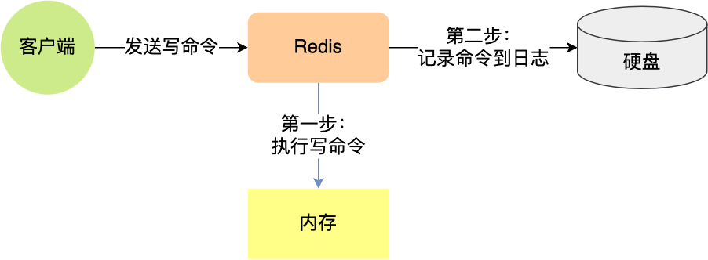
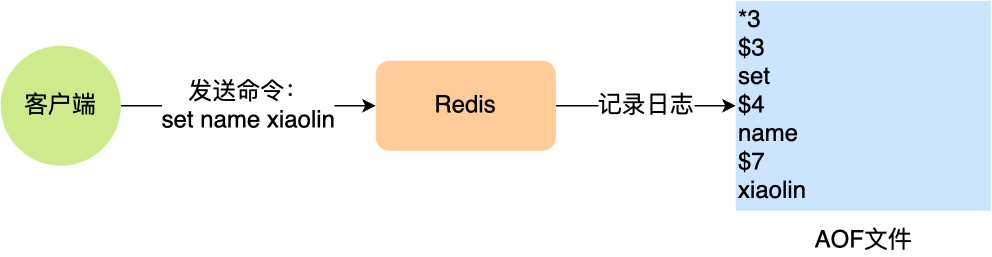
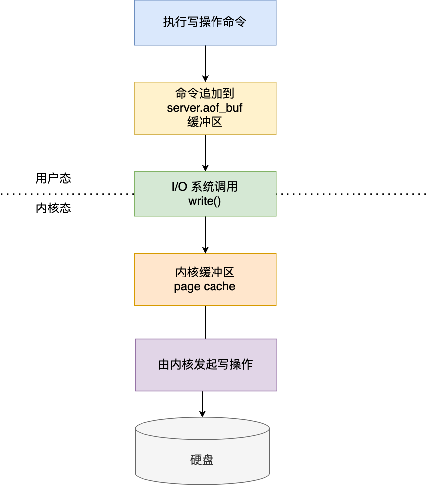
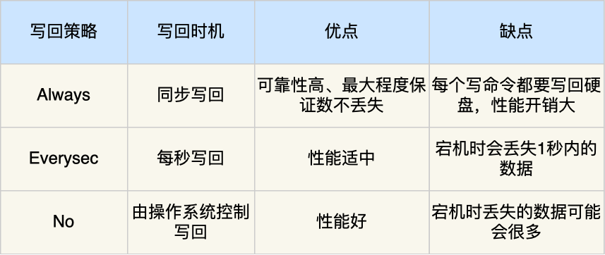
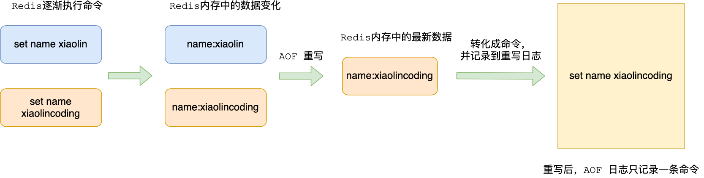
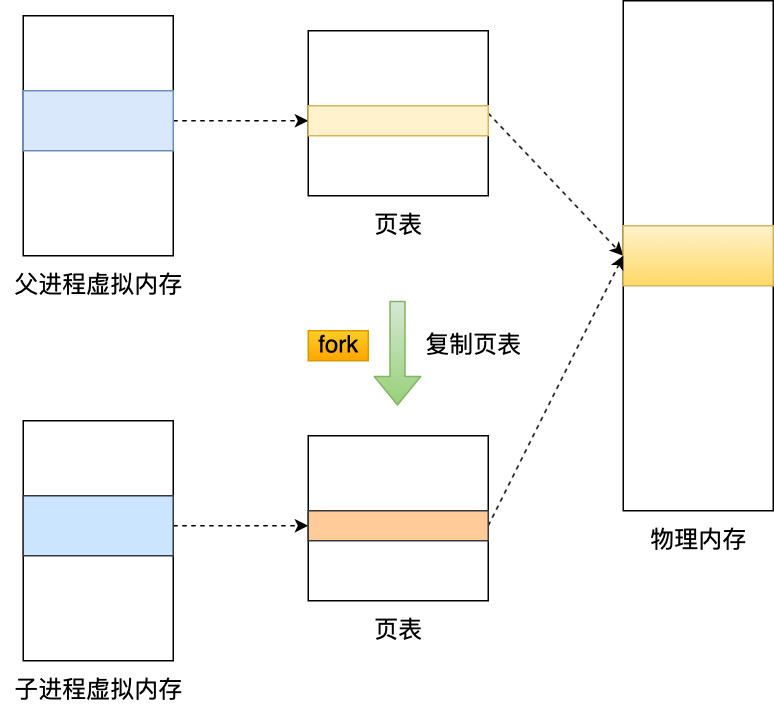
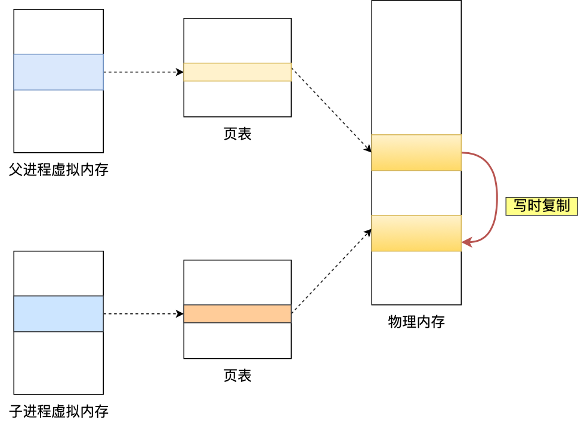
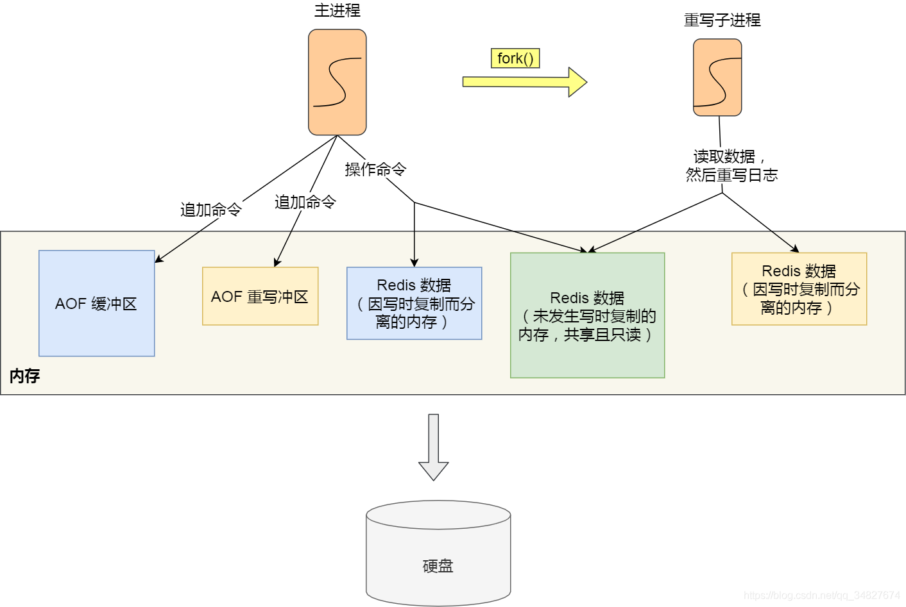

AOF持久化就是保存写操作命令到日志的持久化方式，**只会记录写操作命令，读操作命令是不会被记录的**

先执行写操作再进行持久化

- 优点：
  - 避免额外的检查开销（能写入到日志的内容一定可执行，恢复时一定无错）
  - 不会阻塞当前写操作的执行
- 缺点：
  - 有丢失风险
  - 可能会给「下一个」命令带来阻塞风险

### 三种写回策略

1. Redis 执行完写操作命令后，会将命令追加到 `server.aof_buf` 缓冲区；
2. 然后通过 write() 系统调用，将 aof_buf 缓冲区的数据写入到 AOF 文件，此时数据并没有写入到硬盘，而是拷贝到了内核缓冲区 page cache，等待内核将数据写入硬盘；
3. 具体内核缓冲区的数据什么时候写入到硬盘，由内核决定。

Redis 提供了 3 种写回硬盘的策略，控制的就是上面说的第三步的过程。

在 `redis.conf` 配置文件中的 `appendfsync` 配置项可以有以下 3 种参数可填：

三种策略只是在控制 `fsync()` 函数的调用时机

### AOF重写机制

Redis 为了避免 AOF 文件越写越大，提供了 **AOF 重写机制**，当 AOF 文件的大小超过所设定的阈值后，Redis 就会启用 AOF 重写机制，来压缩 AOF 文件。

（他真的，真的很喜欢用图表达，我哭鼠，一整个爱住）

注意重写时，是先写到新的AOF文件再覆盖过去，否则重写过程失败会造成污染。

### AOF后台重写

写入 AOF 日志的操作虽然是在主进程完成的，因为它写入的内容不多，所以一般不太影响命令的操作。

但是在触发 AOF 重写时，需要读取所有缓存的键值对数据，并为每个键值对生成一条命令，然后将其写入到新的 AOF 文件，重写完后，就把现在的 AOF 文件替换掉。

这个过程其实是很耗时的，所以重写的操作不能放在主进程里。

所以，Redis 的**重写 AOF 过程是由后台子进程 *bgrewriteaof* 来完成的**，这么做可以达到两个好处：

- 子进程进行 AOF 重写期间，主进程可以继续处理命令请求，从而避免阻塞主进程；
- 子进程带有主进程的数据副本，这里使用子进程而不是线程，因为如果是使用线程，多线程之间会共享内存，那么在修改共享内存数据的时候，需要通过加锁来保证数据的安全，而这样就会降低性能。而使用子进程，创建子进程时，父子进程是共享内存数据的，不过这个共享的内存只能以只读的方式，而当父子进程任意一方修改了该共享内存，就会发生「写时复制」，于是父子进程就有了独立的数据副本，就不用加锁来保证数据安全。

#### 父子进程之间的副本问题

子进程是怎么拥有主进程一样的数据副本的呢？

主进程在通过 `fork` 系统调用生成 bgrewriteaof 子进程时，操作系统会把主进程的「**页表**」复制一份给子进程，这个页表记录着虚拟地址和物理地址映射关系，而不会复制物理内存，也就是说，两者的虚拟空间不同，但其对应的物理空间是同一个。

这样一来，子进程就共享了父进程的物理内存数据了，这样能够**节约物理内存资源**，页表对应的页表项的属性会标记该物理内存的权限为**只读**。

不过，当父进程或者子进程在向这个内存发起写操作时，CPU 就会触发**写保护中断**，这个写保护中断是由于违反权限导致的，然后操作系统会在「写保护中断处理函数」里进行**物理内存的复制**，并重新设置其内存映射关系，将父子进程的内存读写权限设置为**可读写**，最后才会对内存进行写操作，这个过程被称为「**写时复制(*Copy On Write*)**」。

写时复制就是**在发生写操作的时候，操作系统才会去复制物理内存**，这样是为了防止 fork 创建子进程时，由于物理内存数据的复制时间过长而导致父进程长时间阻塞的问题。

当然，操作系统复制父进程页表的时候，父进程也是阻塞中的，不过页表的大小相比实际的物理内存小很多，所以通常复制页表的过程是比较快的。

不过，如果父进程的内存数据非常大，那自然页表也会很大，这时父进程在通过 fork 创建子进程的时候，阻塞的时间也越久。

所以，以下阶段会导致阻塞父进程：

- 创建子进程的途中，由于要复制父进程的页表等数据结构，阻塞的时间跟页表的大小有关，页表越大，阻塞的时间也越长；
- 创建完子进程后，如果子进程或者父进程修改了共享数据，就会发生写时复制，这期间会拷贝物理内存，如果内存越大，自然阻塞的时间也越长；
- 子进程完成 AOF 重写工作（*扫描数据库中所有数据，逐一把内存数据的键值对转换成一条命令，再将命令记录到重写日志*）后向主进程发送一条信号（异步），主进程收到该信号后，会调用一个信号处理函数，信号处理函数执行时，函数的主要功能如下：
  - 将 AOF 重写缓冲区中的所有内容追加到新的 AOF 的文件中，使得新旧两个 AOF 文件所保存的数据库状态一致；
  - 新的 AOF 的文件进行改名，覆盖现有的 AOF 文件。

#### 具体的重写过程：

触发重写机制后，主进程就会创建重写 AOF 的子进程，此时父子进程共享物理内存，重写子进程只会对这个内存进行只读，重写 AOF 子进程会读取数据库里的所有数据，并逐一把内存数据的键值对转换成一条命令，再将命令记录到重写日志（新的 AOF 文件）。

但是子进程重写过程中，主进程依然可以正常处理命令。

如果此时**主进程修改了已经存在 key-value，就会发生写时复制，注意这里只会复制主进程修改的物理内存数据，没修改物理内存还是与子进程共享的**。

所以如果这个阶段修改的是一个 bigkey，也就是数据量比较大的 key-value 的时候，这时复制的物理内存数据的过程就会比较耗时，有阻塞主进程的风险。

#### AOF 重写缓冲区

新的问题：重写 AOF 日志过程中，如果主进程修改了已经存在 key-value，此时这个 key-value 数据在子进程的内存数据就跟主进程的内存数据不一致了，这时要怎么办呢？

为了解决这种数据不一致问题，Redis 设置了一个 **AOF 重写缓冲区**，这个缓冲区在创建 bgrewriteaof 子进程之后开始使用。

在重写 AOF 期间，当 Redis 执行完一个写命令之后，它会**同时将这个写命令写入到 「AOF 缓冲区」和 「AOF 重写缓冲区」**。

也就是说，在 bgrewriteaof 子进程执行 AOF 重写期间，主进程需要执行以下三个工作:

- 执行客户端发来的命令；
- 将执行后的写命令追加到 「AOF 缓冲区」；
- 将执行后的写命令追加到 「AOF 重写缓冲区」；

以上只是整理一些笔记方便日后查阅，完整来源如下：

[小林coding——图解Redis系列（持久化篇）](https://xiaolincoding.com/redis/storage/aof.html)
