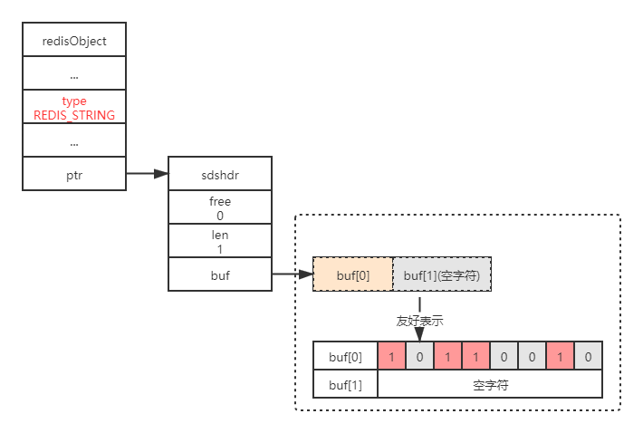
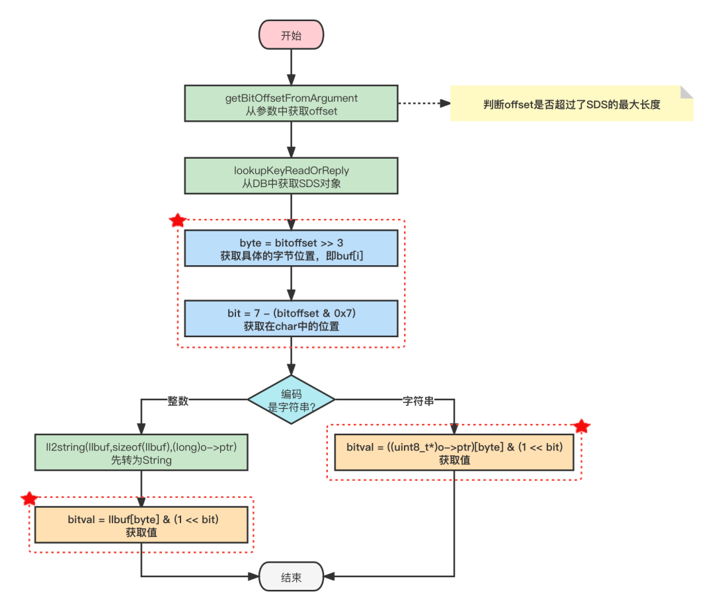
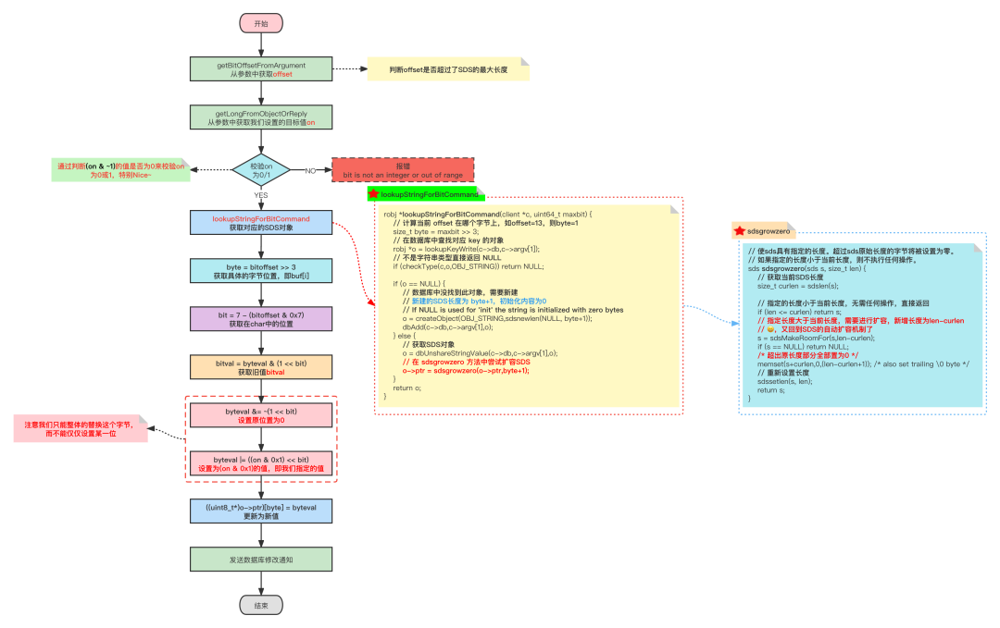

### 1 基本命令

Redis提供了`SETBIT`、`GETBIT`、`BITCOUNT`、`BITOP`四个常用命令用于处理二进制位数组。

> - `SETBIT`：为位数组指定偏移量上的二进制位设置值，偏移量从0开始计数，二进制位的值只能为0或1。返回原位置值。
> - `GETBIT`：获取指定偏移量上二进制位的值。
> - ` BITCOUNT`：统计位数组中值为1的二进制位数量。
> - `BITOP`：对多个位数组进行按位与、或、异或运算。


### 2 源码分析

#### 2.1 数据结构

> **扩展：Redis 中的每个对象都是有一个 redisObject 结构表示的。**
>
> ```c
> typedef struct redisObject {
>      // 类型
>      unsigned type:4;
>      // 编码
>      unsigned encoding:4;
>      unsigned lru:REDIS_LRU_BITS; /* lru time (relative to server.lruclock) */
>      // 引用计数
>      int refcount;
>      // 执行底层实现的数据结构的指针
>      void *ptr;
> } robj;
> ```
>
> 



- `type` 的值为 `REDIS_STRING`表示这是一个字符串对象
- `sdshdr.len` 的值为1表示这个SDS保存了一个1字节大小的位数组
- buf数组中的`buf[0]`实际保存了位数组
- buf数组中的`buf[1]`为自动追加的`\0`字符

#### 3.2 GETBIT

`GETBIT`用于返回位数组在偏移量上的二进制位的值。**`GETBIT`的时间复杂度是`O(1)`。**

`GETBIT`命令的执行过程如下：

1. 计算byte=⌊offset÷8⌋ (即`>>3`)，byte 值表示指定的 *offset* 位于位数组的哪个字节(计算在第几行)；
2. 指定 buf[i]中的i了，接下来就要计算在8个字节中的第几位：使用 `bit=(offset % 8)+1`（取模运算用位运算取最低三位代替）计算可得；
3. 根据 byte 和 bit在位数组中定位到目标值返回即可。

源码:

```c
void getbitCommand(client *c) {
    robj *o;
    char llbuf[32];
    uint64_t bitoffset;
    size_t byte, bit;
    size_t bitval = 0;
    // 获取offset
    if (getBitOffsetFromArgument(c,c->argv[2],&bitoffset,0,0) != C_OK)
        return;
    // 查找对应的位图对象
    if ((o = lookupKeyReadOrReply(c,c->argv[1],shared.czero)) == NULL ||
        checkType(c,o,OBJ_STRING)) return;
		// 计算offset位于位数组的哪一行
    byte = bitoffset >> 3;
    // 计算offset在一行中的第几位，等同于取模，取最后几位
    bit = 7 - (bitoffset & 0x7);
    // #define sdsEncodedObject(objptr) (objptr->encoding == OBJ_ENCODING_RAW || objptr->encoding == OBJ_ENCODING_EMBSTR)
    if (sdsEncodedObject(o)) {
        // SDS 是RAW 或者 EMBSTR类型
        if (byte < sdslen(o->ptr))
            // 获取指定位置的值
            // 注意它不是真正的一个二维数组不能用((uint8_t*)o->ptr)[byte][bit]去获取呀~
            bitval = ((uint8_t*)o->ptr)[byte] & (1 << bit);
    } else {
        //  SDS 是 REDIS_ENCODING_INT 类型的整数，先转为String
        if (byte < (size_t)ll2string(llbuf,sizeof(llbuf),(long)o->ptr))
            bitval = llbuf[byte] & (1 << bit);
    }

    addReply(c, bitval ? shared.cone : shared.czero);
}
```



#### 3.3 SETBIT

`SETBIT`用于将位数组在偏移量的二进制位的值设为value，并向客户端返回旧值。

`SITBIT`命令的执行过程如下：

1. 计算len=⌊offset÷8⌋+1，len值记录了保存offset偏移量指定的二进制位至少需要多少字节
2. 检查位数组的长度是否小于len，如果是的话，将SDS的长度扩展为len字节,并将所有新扩展空间的二进制位设置为0
3. 计算byte=⌊offset÷8⌋，byte值表示指定的offset位于位数组的那个字节(就是计算在那个buf[i]中的iii)
4. 使用bit=(offset mod 8)+1计算可得目标buf[i]的具体第几位
5. 根据byte和bit的值，首先保存oldValue，然后将新值value设置到目标位上
6. 返回旧值

> **因为SETBIT命令执行的所有操作都可以在常数时间内完成，所以该命令的算法复杂度为O(1)。**

`SETBIT`命令源码如下所示：

```c
void setbitCommand(client *c) {
    robj *o;
    char *err = "bit is not an integer or out of range";
    uint64_t bitoffset;
    ssize_t byte, bit;
    int byteval, bitval;
    long on;
    // 获取offset
    if (getBitOffsetFromArgument(c,c->argv[2],&bitoffset,0,0) != C_OK)
        return;
    // 获取我们需要设置的值
    if (getLongFromObjectOrReply(c,c->argv[3],&on,err) != C_OK)
        return;

    /* 判断指定值是否为0或1 */
    if (on & ~1) {
        // 设置了0和1之外的值，直接报错
        addReplyError(c,err);
        return;
    }
    // 根据key查询SDS对象（会自动扩容）
    if ((o = lookupStringForBitCommand(c,bitoffset)) == NULL) return;

    /* 获得当前值 */
    byte = bitoffset >> 3;
    byteval = ((uint8_t*)o->ptr)[byte];
    bit = 7 - (bitoffset & 0x7);
    bitval = byteval & (1 << bit);

    /* 更新值并返回旧值 */
    byteval &= ~(1 << bit);
    byteval |= ((on & 0x1) << bit);
    ((uint8_t*)o->ptr)[byte] = byteval;
    // 发送数据修改通知
    signalModifiedKey(c,c->db,c->argv[1]);
    notifyKeyspaceEvent(NOTIFY_STRING,"setbit",c->argv[1],c->db->id);
    server.dirty++;
    addReply(c, bitval ? shared.cone : shared.czero);
}
```

（这个图我真的，我哭鼠，他是真的想让我学会的😭）



#### 2.4 BITCOUNT

`BITCOUNT`命令用于统计给定位数组中值为1的二进制位的数量。功能似乎不复杂，但实际上要高效地实现这个命令并不容易，需要用到一些精巧的算法。

> **统计一个位数组中非0二进制位的数量在数学上被称为"计算汉明重量"。**

##### 二进制位统计算法:variable-precision SWAR

目前已知效率最好的通用算法为`variable-precision SWAR`算法，该算法通过一系列位移和位运算操作，可以在常数时间内计算多个字节的汉明重量，并且不需要使用任何额外的内存

算法代码：

```c
uint32_t swar(uint32_t i) {
    // 5的二进制：0101
    i = (i & 0x55555555) + ((i >> 1) & 0x55555555);
    // 3的二进制：0011
    i = (i & 0x33333333) + ((i >> 2) & 0x33333333);
    i = (i & 0x0F0F0F0F) + ((i >> 4) & 0x0F0F0F0F);
    i = (i*(0x01010101) >> 24);
    return i;
    //——————————上面为展开版，下面为更简洁版——————————————
    i = i - ((i >> 1) & 0x55555555);
    i = (i & 0x33333333) + ((i >> 2) & 0x33333333);
    return (((i + (i >> 4)) & 0x0F0F0F0F) * 0x01010101) >> 24;
}
```

1. 步骤一计算出的值i的二进制表示可以按**每两个二进制位为一组进行分组**，各组的十进制表示就是该组的1的数量；
2. 步骤二计算出的值i的二进制表示可以按**每四个二进制位为一组进行分组**，各组的十进制表示就是该组的1的数量；
3. 步骤三计算出的值i的二进制表示可以按**每八个二进制位为一组进行分组**，各组的十进制表示就是该组的1的数量；
4. 步骤四的`i*0x01010101`语句计算出bitarray中1的数量并记录在二进制位的最高八位，而`>>24`语句则通过右移运算，将bitarray的汉明重量移动到最低八位，得出的结果就是bitarray的汉明重量。

>  **Integer.bitCount方法，也是基于SWAR算法的思想**

##### 2.4.4 源码分析

Redis 中通过调用`redisPopcount`方法统计汉明重量，源码如下所示：

```c
long long redisPopcount(void *s, long count) {
    long long bits = 0;
    unsigned char *p = s;
    uint32_t *p4;
    // 为查表法准备的表
    static const unsigned char bitsinbyte[256] = {0,1,1,2,1,2,2,3,1,2,2,3,2,3,3,4,1,2,2,3,2,3,3,4,2,3,3,4,3,4,4,5,1,2,2,3,2,3,3,4,2,3,3,4,3,4,4,5,2,3,3,4,3,4,4,5,3,4,4,5,4,5,5,6,1,2,2,3,2,3,3,4,2,3,3,4,3,4,4,5,2,3,3,4,3,4,4,5,3,4,4,5,4,5,5,6,2,3,3,4,3,4,4,5,3,4,4,5,4,5,5,6,3,4,4,5,4,5,5,6,4,5,5,6,5,6,6,7,1,2,2,3,2,3,3,4,2,3,3,4,3,4,4,5,2,3,3,4,3,4,4,5,3,4,4,5,4,5,5,6,2,3,3,4,3,4,4,5,3,4,4,5,4,5,5,6,3,4,4,5,4,5,5,6,4,5,5,6,5,6,6,7,2,3,3,4,3,4,4,5,3,4,4,5,4,5,5,6,3,4,4,5,4,5,5,6,4,5,5,6,5,6,6,7,3,4,4,5,4,5,5,6,4,5,5,6,5,6,6,7,4,5,5,6,5,6,6,7,5,6,6,7,6,7,7,8};
    // CPU一次性读取8个字节，如果4字节跨了两个8字节，需要读取两次才行
    // 所以考虑4字节对齐，只需读取一次就可以读取完毕
    while((unsigned long)p & 3 && count) {
        bits += bitsinbyte[*p++];
        count--;
    }

    // 一次性处理28字节，单独看一个aux就容易理解了，其实就是SWAR算法
    // uint32_t：4字节
    p4 = (uint32_t*)p;
    while(count>=28) {
        uint32_t aux1, aux2, aux3, aux4, aux5, aux6, aux7;

        aux1 = *p4++;// 一次性读取4字节
        aux2 = *p4++;
        aux3 = *p4++;
        aux4 = *p4++;
        aux5 = *p4++;
        aux6 = *p4++;
        aux7 = *p4++;
        count -= 28;// 共处理了4*7=28个字节，所以count需要减去28

        aux1 = aux1 - ((aux1 >> 1) & 0x55555555);
        aux1 = (aux1 & 0x33333333) + ((aux1 >> 2) & 0x33333333);
        aux2 = aux2 - ((aux2 >> 1) & 0x55555555);
        aux2 = (aux2 & 0x33333333) + ((aux2 >> 2) & 0x33333333);
        aux3 = aux3 - ((aux3 >> 1) & 0x55555555);
        aux3 = (aux3 & 0x33333333) + ((aux3 >> 2) & 0x33333333);
        aux4 = aux4 - ((aux4 >> 1) & 0x55555555);
        aux4 = (aux4 & 0x33333333) + ((aux4 >> 2) & 0x33333333);
        aux5 = aux5 - ((aux5 >> 1) & 0x55555555);
        aux5 = (aux5 & 0x33333333) + ((aux5 >> 2) & 0x33333333);
        aux6 = aux6 - ((aux6 >> 1) & 0x55555555);
        aux6 = (aux6 & 0x33333333) + ((aux6 >> 2) & 0x33333333);
        aux7 = aux7 - ((aux7 >> 1) & 0x55555555);
        aux7 = (aux7 & 0x33333333) + ((aux7 >> 2) & 0x33333333);
        bits += ((((aux1 + (aux1 >> 4)) & 0x0F0F0F0F) +
                    ((aux2 + (aux2 >> 4)) & 0x0F0F0F0F) +
                    ((aux3 + (aux3 >> 4)) & 0x0F0F0F0F) +
                    ((aux4 + (aux4 >> 4)) & 0x0F0F0F0F) +
                    ((aux5 + (aux5 >> 4)) & 0x0F0F0F0F) +
                    ((aux6 + (aux6 >> 4)) & 0x0F0F0F0F) +
                    ((aux7 + (aux7 >> 4)) & 0x0F0F0F0F))* 0x01010101) >> 24;
    }
    /* 剩余的不足28字节，使用查表法统计 */
    p = (unsigned char*)p4;
    while(count--) bits += bitsinbyte[*p++];
    return bits;
}
```

Redis 中同时运用了**查表法**和**SWAR算法**完成`BITCOUNT`功能。

### 3 应用

大量数据去重、排序、用户签到、统计活跃用户、实现布隆过滤器，下面详细介绍布隆过滤器

#### 布隆过滤器简介和算法流程

> **主要特征**
>
> 一种紧凑型的、比较巧妙的概率型数据结构，它由一个很长的二进制向量( 位向量)和一系列随机均匀分布的散列( 哈希)函数组成 此种方式不仅可以提升查询效率，也可以节省大量的内存空间。
>
> 存在假阳性（将不在集合中的元素误判为在集合中），不存在假阴性（将在集合中的元素误判为不在集合中）。过滤器中的元素个数越多，假阳性的可能性越大，总的来说，当不考虑集合中元素个数的情况下，每个元素由10个以下的bit来表示就可以保证1%以内的假阳性概率。
>
> 元素可以被加入过滤器，但不可从过滤器中删除（因为删除的时候有可能会影响到其他元素，之后会细说）。
>
> **空间和时间优势**
>
> 布隆过滤器不需要存储数据项，但是同时它需要在其他地方单独存储真正的数据项。对于一个拥有最优k值且误判率在1%的布隆过滤器，每个元素只需要9.6bits（与元素的大小无关）。这个优点一部分继承自数组的紧凑性，另一方面由它本身的概率性决定。若给每个元素增加4.8bits左右，误判率将会减少十倍。
>
> 布隆过滤器在添加和查找元素时，所需要的时间是一个常数，O(k)，完全与集合中元素个数无关。没有其他固定空间的集合数据结构有这样的效率，但是对于稀疏散列表来说，平均访问时长在实际使用中比一些布隆过滤器要短。在硬件实现方式中，布隆过滤器的优势在于他的k个查询之间不相关，因此**可以并行处理**。
> 

布隆过滤器（Bloom Filter）的核心实现是一个超大的位数组和几个哈希函数。假设位数组的长度为m，哈希函数的个数为k


以上图为例，具体的操作流程：

假设集合里面有3个元素{x, y, z}，哈希函数的个数为3。

1. 首先将位数组进行初始化，将里面每个位都设置位0。

2. 对于集合里面的每一个元素，将元素依次通过3个哈希函数进行映射，每次映射都会产生一个哈希值，这个值对应位数组上面的一个点，然后将位数组对应的位置标记为1。

3. 查询W元素是否存在集合中的时候，同样的方法将W通过哈希映射到位数组上的3个点。

   * 如果3个点的其中有一个点不为1，则可以判断该元素一定不存在集合中。

   * 反之，如果3个点都为1，则该元素可能存在集合中。

     > 注意：此处不能判断该元素是否一定存在集合中，可能存在一定的误判率。可以从图中可以看到：假设某个元素通过映射对应下标为4，5，6这3个点。虽然这3个点都为1，但是很明显这3个点是不同元素经过哈希得到的位置，因此这种情况说明元素虽然不在集合中，也可能对应的都是1，这是误判率存在的原因。

#### Redis实现

谷歌公司提供的Guava 工具提供了布隆过滤器的实现，先不分析源码了吧，有机会补上【【flag】】

#### 布隆过滤器应用（反正过滤就对了）

- 字处理软件中，需要检查一个英语单词是否拼写正确
- 在 FBI，一个嫌疑人的名字是否已经在嫌疑名单上
- 在网络爬虫里，一个网址是否被访问过
- yahoo, gmail等邮箱垃圾邮件过滤功能


联想一下：分布式数据库TiDB的TiKV使用的底层RocksDB查询就利用了bloom filter不存在假阴性加快查找速度。


[完整含详细解释来源1](https://juejin.cn/post/7074747080492711943)

（布隆过滤器的内容也来源网络，看了好几个都大差不差，所以就省略哩）
