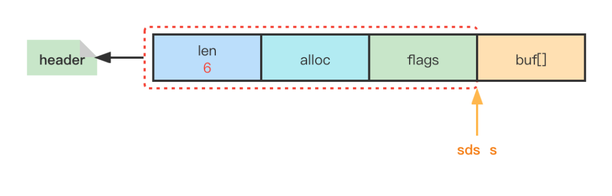
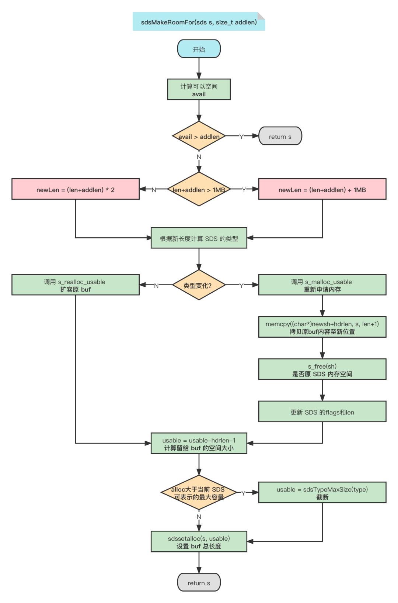

## 1.数据结构

 SDS（Simple Dynamic String，简单动态字符串）,源码底层就是`typedef char *sds;`

Redis3.x  SDS的数据结构定义

```c
struct sdshdr {
    //记录buf数组中已使用字节的数量
    //等于SDS所保存字符串的长度
    unsigned int len;

    //记录buf数组中未使用字节的数量
    unsigned int free;

    //char数组，用于保存字符串
    char buf[];
};
```

> buf 尾部自动追加一个'\0'字符并不会计算在 SDS 的len中，这是为了遵循 C 字符串以空字符串结尾的惯例，使得 SDS 可以直接使用一部分string.h库中的函数，如strlen

## 2 数据优化

### 2.1 数据结构优化

在 Redis3.x 版本中**不同长度的字符串占用的头部是相同的**，如果某一字符串很短但是头部却占用了更多的空间造成空间浪费。所以SDS 分为三种级别的字符串：**共有五种类型的SDS（长度小于1字节、1字节、2字节、4字节、8字节）**

- 短字符串(长度小于32)，len和free的长度用1字节即可；
- 长字符串，用2字节或者4字节；
- 超长字符串，用8字节。

> 低三位存储类型，高5位存储长度，最多能标识的长度为32，所以短字符串的长度必定小于32。
>
> **无需free字段了，32-len即为free**

#### **Redis6.x**实现

注意其中flags标识字段为char类型

```c
// 注意：sdshdr5从未被使用，Redis中只是访问flags。
struct __attribute__ ((__packed__)) sdshdr5 {
    unsigned char flags; /* 低3位存储类型, 高5位存储长度 */
    char buf[];
};
struct __attribute__ ((__packed__)) sdshdr8 {
    uint8_t len; /* 已使用 */
    uint8_t alloc; /* 总长度，用1字节存储 */
    unsigned char flags; /* 低3位存储类型, 高5位预留 */
    char buf[];
};
struct __attribute__ ((__packed__)) sdshdr16 {
    uint16_t len; /* 已使用 */
    uint16_t alloc; /* 总长度，用2字节存储 */
    unsigned char flags; /* 低3位存储类型, 高5位预留 */
    char buf[];
};
struct __attribute__ ((__packed__)) sdshdr32 {
    uint32_t len; /* 已使用 */
    uint32_t alloc; /* 总长度，用4字节存储 */
    unsigned char flags; /* 低3位存储类型, 高5位预留 */
    char buf[];
};
struct __attribute__ ((__packed__)) sdshdr64 {
    uint64_t len; /* 已使用 */
    uint64_t alloc; /* 总长度，用8字节存储 */
    unsigned char flags; /* 低3位存储类型, 高5位预留 */
    char buf[];
};
```

### 2.2 uintX_t

Redis6.x 中 int 类型也多出了几种：`uint8_t / uint16_t / uint32_t /uint64_t`。

定义如下：

```c
typedef unsigned char uint8_t;
typedef unsigned short uint16_t;
typedef unsigned int uint32_t;
typedef unsigned long long uint64_t;
```

### 2.3 对齐填充

现代计算机中，内存空间按照字节划分，理论上可以从任何起始地址访问任意类型的变量。

但实际中在访问特定类型变量时经常在特定的内存地址访问，这就**需要各种类型数据按照一定的规则在空间上排列，而不是顺序一个接一个地存放，这就是对齐。**

对齐的原因：由于各个硬件平台对存储空间的处理上有很大的不同。一些平台对某些特定类型的数据只能从某些特定地址开始存取。最常见的是如果不按照适合其平台的要求对数据存放进行对齐，会在存取效率上带来损失。

> 注：我们写程序的时候，不需要考虑对齐问题。编译器会替我们选择适合目标平台的对齐策略。

##### Redis为什么不对齐呢？

综上所述我们知道了对齐填充可以提高 CPU 的数据读取效率，作为 IO 频繁的 **Redis 为什么选择不对齐呢？**

Redis6.x 中的 SDS 结构：



> 细节：SDS 的指针并不是指向 SDS 的起始位置（len位置），而是直接指向buf[]，使得 SDS 可以直接使用 C 语言string.h库中的某些函数，做到了兼容

如果不进行对齐填充，那么在获取当前 SDS 的类型时则只需要后退一步即可`flagsPointer = ((unsigned char*)s)-1`；相反，若进行对齐填充，由于 Padding 的存在，我们在不同的系统中不知道退多少才能获得flags，并且我们也不能将 sds 的指针指向flags，这样就无法兼容 C 语言的函数了，也不知道前进多少才能得到 buf[]。

## 3 SDS 优势

### 3.1 O(1)时间复杂度获取字符串长度

由于C字符串不记录自身的长度，所以为了获取一个字符串的长度程序必须遍历这个字符串，直至遇到'＼0'为止，整个操作的时间复杂度为O(N)。而我们使用SDS封装字符串则直接获取`len`属性值即可，时间复杂度为O(1)。

### 3.2 二进制安全

通俗地讲，C语言中，用'\0'表示字符串的结束，如果字符串本身就有'\0'字符，字符串就会被截断，即非二进制安全；若通过某种机制，保证读写字符串时不损害其内容，则是二进制安全。

C字符串中的字符除了末尾字符为'\0'外其他字符不能为空字符，否则会被认为是字符串结尾(即使实际上不是)。

这限制了C字符串只能保存文本数据，而不能保存二进制数据。而SDS使用`len`属性的值判断字符串是否结束，所以不会受'\0'的影响。

### 3.3 杜绝缓冲区溢出

字符串的拼接操作是使用十分频繁的，在C语言开发中使用`char *strcat(char *dest,const char *src)`方法将`src`字符串中的内容拼接到`dest`字符串的末尾。由于C字符串不记录自身的长度，所有`strcat`方法已经认为用户在执行此函数时已经为`dest`分配了足够多的内存，足以容纳`src`字符串中的所有内容，而一旦这个条件不成立就会产生缓冲区溢出，会把其他数据覆盖掉。

```c
// strcat 源码
char * __cdecl strcat (char * dst, const char * src)
{
    char * cp = dst;
 
    while( *cp )
        cp++; /* 找到 dst 的结尾 */
 
    while( *cp++ = *src++ ) ; /* 无脑将 src 复制到 dst 中 */
 
    return( dst ); /* 返回 dst */
}    
```

与C字符串不同，SDS 的**自动扩容机制**完全杜绝了发生缓冲区溢出的可能性：

**当SDS API需要对SDS进行修改时，API会先检查 SDS 的空间是否满足修改所需的要求，如果不满足，API会自动将SDS的空间扩展至执行修改所需的大小，然后才执行实际的修改操作，所以使用 SDS 既不需要手动修改SDS的空间大小，也不会出现缓冲区溢出问题。** 

SDS 的`sds sdscat(sds s, const char *t)`方法在字符串拼接时会进行扩容相关操作。

```c
sds sdscatsds(sds s, const sds t) {
    return sdscatlen(s, t, sdslen(t));
}

/* s: 源字符串
 * t: 待拼接字符串
 * len: 待拼接字符串长度
 */
sds sdscatlen(sds s, const void *t, size_t len) {
    // 获取源字符串长度
    size_t curlen = sdslen(s);
  	// SDS 分配空间（自动扩容机制）
    s = sdsMakeRoomFor(s,len);
    if (s == NULL) return NULL;
    // 将目标字符串拷贝至源字符串末尾
    memcpy(s+curlen, t, len);
    // 更新 SDS 长度
    sdssetlen(s, curlen+len);
    // 追加结束符
    s[curlen+len] = '\0';
    return s;
}
```

##### 自动扩容机制——sdsMakeRoomFor方法

`strcatlen`中调用`sdsMakeRoomFor`完成字符串的容量检查及扩容操作，重点分析此方法：

```c
/* s: 源字符串
 * addlen: 新增长度
 */
sds sdsMakeRoomFor(sds s, size_t addlen) {
    void *sh, *newsh;
    // sdsavail: s->alloc - s->len, 获取 SDS 的剩余长度
    size_t avail = sdsavail(s);
    size_t len, newlen, reqlen;
    // 根据 flags 获取 SDS 的类型 oldtype
    char type, oldtype = s[-1] & SDS_TYPE_MASK;
    int hdrlen;
    size_t usable;

    /* Return ASAP if there is enough space left. */
    // 剩余空间大于等于新增空间，无需扩容，直接返回源字符串
    if (avail >= addlen) return s;
    // 获取当前长度
    len = sdslen(s);
    // 
    sh = (char*)s-sdsHdrSize(oldtype);
    // 新长度
    reqlen = newlen = (len+addlen);
    // 断言新长度比原长度长，否则终止执行
    assert(newlen > len);   /* 防止数据溢出 */
    // SDS_MAX_PREALLOC = 1024*1024, 即1MB
    if (newlen < SDS_MAX_PREALLOC)
        // 新增后长度小于 1MB ，则按新长度的两倍扩容
        newlen *= 2;
    else
        // 新增后长度大于 1MB ，则按新长度加上 1MB 扩容
        newlen += SDS_MAX_PREALLOC;
    // 重新计算 SDS 的类型
    type = sdsReqType(newlen);

    /* Don't use type 5: the user is appending to the string and type 5 is
     * not able to remember empty space, so sdsMakeRoomFor() must be called
     * at every appending operation. */
    // 不使用 sdshdr5 
    if (type == SDS_TYPE_5) type = SDS_TYPE_8;
    // 获取新的 header 大小
    hdrlen = sdsHdrSize(type);
    assert(hdrlen + newlen + 1 > reqlen);  /* Catch size_t overflow */
    if (oldtype==type) {
        // 类型没变
        // 调用 s_realloc_usable 重新分配可用内存，返回新 SDS 的头部指针
        // usable 会被设置为当前分配的大小
        newsh = s_realloc_usable(sh, hdrlen+newlen+1, &usable);
        if (newsh == NULL) return NULL; // 分配失败直接返回NULL
        // 获取指向 buf 的指针
        s = (char*)newsh+hdrlen;
    } else {
        // 类型变化导致 header 的大小也变化，需要向前移动字符串，不能使用 realloc
        newsh = s_malloc_usable(hdrlen+newlen+1, &usable);
        if (newsh == NULL) return NULL;
        // 将原字符串copy至新空间中
        memcpy((char*)newsh+hdrlen, s, len+1);
        // 释放原字符串内存
        s_free(sh);
        s = (char*)newsh+hdrlen;
        // 更新 SDS 类型
        s[-1] = type;
        // 设置长度
        sdssetlen(s, len);
    }
    // 获取 buf 总长度(待定)
    usable = usable-hdrlen-1;
    if (usable > sdsTypeMaxSize(type))
        // 若可用空间大于当前类型支持的最大长度则截断
        usable = sdsTypeMaxSize(type);
    // 设置 buf 总长度
    sdssetalloc(s, usable);
    return s;
}
```

##### **自动扩容机制总结：**

**扩容阶段：**

- 若 SDS 中剩余空闲空间 avail 大于新增内容的长度 addlen，则无需扩容；

- 若 SDS 中剩余空闲空间 avail 小于或等于新增内容的长度 addlen：

- - 若新增后总长度 len+addlen < 1MB，则按新长度的两倍扩容；
  - 若新增后总长度 len+addlen > 1MB，则按新长度加上 1MB 扩容。

**内存分配阶段：**

- 根据扩容后的长度选择对应的 SDS 类型：

- - 若类型不变，则只需通过 `s_realloc_usable`扩大 buf 数组即可；
  - 若类型变化，则需要为整个 SDS 重新分配内存，并将原来的 SDS 内容拷贝至新位置。

**自动扩容流程图：**



> 扩容后的 SDS 不会恰好容纳下新增的字符，而是多分配了一些空间(预分配策略)，这减少了修改字符串时带来的内存重分配次数

### 3.4 内存重分配次数优化

##### (1) 空间预分配策略

因为 SDS 的空间预分配策略， SDS 字符串在增长过程中不会频繁的进行空间分配。

通过这种分配策略，SDS 将连续增长N次字符串所需的内存重分配次数从必定N次降低为最多N次。

##### (2) 惰性空间释放机制

空间预分配策略用于优化 SDS 增长时频繁进行空间分配，而惰性空间释放机制则用于优化 SDS 字符串缩短时并不立即使用内存重分配来回收缩短后多出来的空间，而仅仅更新 SDS 的len属性，多出来的空间供将来使用。

```c
/* sdstrim 方法删除字符串cset中出现的所有字符
 */
sds sdstrim(sds s, const char *cset) {
    char *start, *end, *sp, *ep;
    size_t len;

    sp = start = s;
    ep = end = s+sdslen(s)-1;
    // strchr()函数用于查找给定字符串中某一个特定字符
    while(sp <= end && strchr(cset, *sp)) sp++;
    while(ep > sp && strchr(cset, *ep)) ep--;
    len = (sp > ep) ? 0 : ((ep-sp)+1);
    if (s != sp) memmove(s, sp, len);
    s[len] = '\0';
    // 仅仅更新了len
    sdssetlen(s,len);
    return s;
}
```

> 在《Redis的设计与实现》一书中针对 sdstrim方法的讲解为：**删除字符串中 cset 出现的所有字符**，而不是首尾。
>
> 比如：调用sdstrim("XYXaYYbcXyY","XY")，后移除了所有的'X'和'Y'。这是错误❌的~

SDS 并没有释放多出来的5字节空间，仅仅将 len 设置成了7，剩余空间为5。如果后续字符串增长时则可以派上用场（可能不需要再分配内存）。

也许各位又会有疑问了，**这没真正释放空间，是否会导致内存泄漏呢**？

放心，SDS为我们提供了真正释放SDS未使用空间的方法`sdsRemoveFreeSpace`。

```c
sds sdsRemoveFreeSpace(sds s) {
    void *sh, *newsh;
    // 获取类型
    char type, oldtype = s[-1] & SDS_TYPE_MASK;
    // 获取 header 大小
    int hdrlen, oldhdrlen = sdsHdrSize(oldtype);
    // 获取原字符串长度
    size_t len = sdslen(s);
    // 获取可用长度
    size_t avail = sdsavail(s);
    // 获取指向头部的指针
    sh = (char*)s-oldhdrlen;

    /* Return ASAP if there is no space left. */
    if (avail == 0) return s;

    // 查找适合这个字符串长度的最优 SDS 类型
    type = sdsReqType(len);
    hdrlen = sdsHdrSize(type);

    /* 如果类型相同，或者至少仍然需要一个足够大的类型，我们只需 realloc buf即可；
     * 否则，说明变化很大，则手动重新分配字符串以使用不同的头文件类型。
     */
    if (oldtype==type || type > SDS_TYPE_8) {
        newsh = s_realloc(sh, oldhdrlen+len+1);
        if (newsh == NULL) return NULL;
        s = (char*)newsh+oldhdrlen;
    } else {
        newsh = s_malloc(hdrlen+len+1);
        if (newsh == NULL) return NULL;
        memcpy((char*)newsh+hdrlen, s, len+1);
        // 释放内存
        s_free(sh);
        s = (char*)newsh+hdrlen;
        s[-1] = type;
        sdssetlen(s, len);
    }
    // 重新设置总长度为len
    sdssetalloc(s, len);
    return s;
}
```

## 4 SDS 最长多少？

**在 Reids3.x 版本中`len`是使用int修饰的，这就会导致 buf 最长就是`2147483647`，无形中限制了字符串的最大长度为512MB。**

在`_sdsnewlen`方法创建 SDS 中都会调用`sdsTypeMaxSize`方法获取每种类型所能创建的最大buf长度，不难发现此方法最大的返回值为`2147483647`，即512MB。

```c
//Redis3.0.0中不存在
static inline size_t sdsTypeMaxSize(char type) {
    if (type == SDS_TYPE_5)
        return (1<<5) - 1;
    if (type == SDS_TYPE_8)
        return (1<<8) - 1;
    if (type == SDS_TYPE_16)
        return (1<<16) - 1;
#if (LONG_MAX == LLONG_MAX)
    if (type == SDS_TYPE_32)
        return (1ll<<32) - 1; // 不管方法啥意思，最大返回2147483647。OVER~
#endif
    return -1; /* this is equivalent to the max SDS_TYPE_64 or SDS_TYPE_32 */
}
```

## 5 部分 API 源码解读

#### 创建SDS

Redis 通过`sdsnewlen`方法创建 SDS。在方法中会根据字符串初始化长度选择合适的类型。

```c
sds _sdsnewlen(const void *init, size_t initlen, int trymalloc) {
    void *sh;
    sds s;
    // 根据初始化长度判断 SDS 的类型
    char type = sdsReqType(initlen);
    // SDS_TYPE_5 强制转换为 SDS_TYPE_8
    // 这样侧面验证了 sdshdr5 从未被使用
    if (type == SDS_TYPE_5 && initlen == 0) type = SDS_TYPE_8;
    // 获取头部大小
    int hdrlen = sdsHdrSize(type);
    // 指向 flags 的指针
    unsigned char *fp; /* flags pointer. */
    // 分配的空间
    size_t usable;
    // 防止溢出
    assert(initlen + hdrlen + 1 > initlen); /* Catch size_t overflow */
    // 分配空间
    // s_trymalloc_usable: 尝试分配内存，失败则返回NULL
    // s_malloc_usable: 分配内存或者抛异常[不友好]
    sh = trymalloc?
        s_trymalloc_usable(hdrlen+initlen+1, &usable) :
        s_malloc_usable(hdrlen+initlen+1, &usable);
    if (sh == NULL) return NULL;
    if (init==SDS_NOINIT)
        init = NULL;
    else if (!init)
        memset(sh, 0, hdrlen+initlen+1);
    // s 此时指向buf
    s = (char*)sh+hdrlen;
    // 指向flags
    fp = ((unsigned char*)s)-1;
    usable = usable-hdrlen-1;
    // 对不同类型的 SDS 可分配空间进行截断
    if (usable > sdsTypeMaxSize(type))
        usable = sdsTypeMaxSize(type);
    switch(type) {
        case SDS_TYPE_5: {
            *fp = type | (initlen << SDS_TYPE_BITS);
            break;
        }
        case SDS_TYPE_8: {
            SDS_HDR_VAR(8,s);
            sh->len = initlen;
            sh->alloc = usable;
            *fp = type;
            break;
        }
        // ... 省略
    }
    if (initlen && init)
        memcpy(s, init, initlen);
    // 末尾添加\0
    s[initlen] = '\0';
    return s;
}
```

通过`sdsnewlen`方法我们可以获得以下信息：

- `SDS_TYPE_5` 会被强制转换为 `SDS_TYPE_8` 类型；
- 创建时默认会在末尾加`'\0'`；
- 返回值是指向 SDS 结构中 buf 的指针；
- 返回值是`char *sds`类型，可以兼容部分C函数。

#### 释放SDS

为了优化性能，SDS 提供了不直接释放内存，而是通过重置len达到清空 SDS 目的的方法——`sdsclear`。

改方法仅仅将 SDS 的len归零，而buf的空间并为真正被清空，新的数据可以复写，而不用重新申请内存。

```c
void sdsclear(sds s) {
    sdssetlen(s, 0);// 设置len为0
    s[0] = '\0';//“清空”buf
}
```

若真正想清空 SDS 则可以调用`sdsfree`方法，底层通过调用`s_free`释放内存。

```c
void sdsfree(sds s) {
    if (s == NULL) return;
    s_free((char*)s-sdsHdrSize(s[-1]));
}
```

[完整含详细解释来源](https://mp.weixin.qq.com/s/uYUQ1P8Dq1Cdknxif7lF-g)
