## 第一章introduction

#### Database System (DBS)：

* 收集相互关联的数据
  * Database (DB): contains information about a particular enterprise

* 用于访问数据的程序集
  * Database Management System数据库管理系统(DBMS)：提供一种既方便又高效的数据库信息存储和检索方法

分层体系结构**Hierarchical Architecture**：

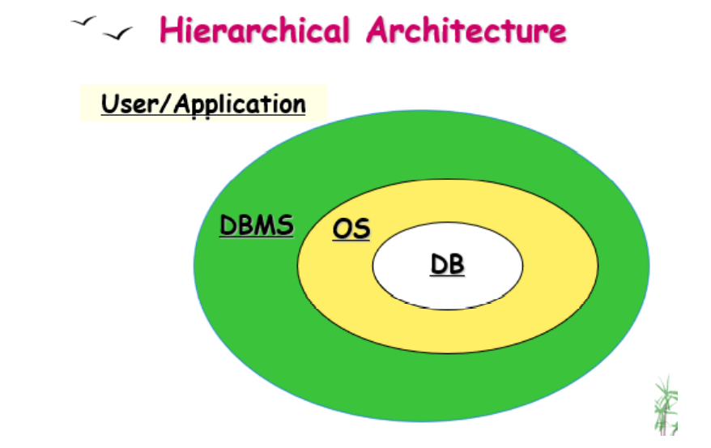

#### 使用文件系统来存储和操作数据的缺点**drawbacks**

* 数据冗余redundancy和不一致inconsistency——不同文件中的信息重复
* 访问数据困难Difficulty in accessing data ——需要编写一个新程序来执行每个新任务
* 数据隔离isolation — 多种文件和格式
* 完整性问题lIntegrity problems
  * 完整性约束（例如，帐户余额> 0）被“埋没”在程序代码中，而不是明确说明
  * 难以添加新约束或更改现有约束
* 更新的原子性**Atomicity** of updates
  * 失败可能会使数据处于不一致状态，并执行了部分更新 
  * 将资金从一个账户转移到另一个账户应该完成或根本不发生
* 多个用户的并发访问lConcurrent access by multiple users
  * 需要并发访问以提高性能
  * 不受控制的并发访问可能会导致不一致
  * 两个人同时阅读余额并更新
* 安全问题 Security
  * 难以为用户提供对部分（但不是全部）数据的访问权限

#### View of Data

数据库系统提供数据的**抽象视图*abstract view*** 

* 隐藏数据存储和维护方式的某些复杂性详细信息

* 通过多个抽象级别实现
  * 物理级别**Physical level**
    * 描述记录（例如客户）的存储方式
  * 逻辑级别**Logical level**
    * 描述数据库中存储的数据，以及数据之间的关系
    * 描述整个数据库
  * 视图级别**View level**
    * 描述数据库的一部分
    * 一种隐藏方法：（a）数据类型的详细信息和（b）出于安全目的的信息（例如员工的工资）
* 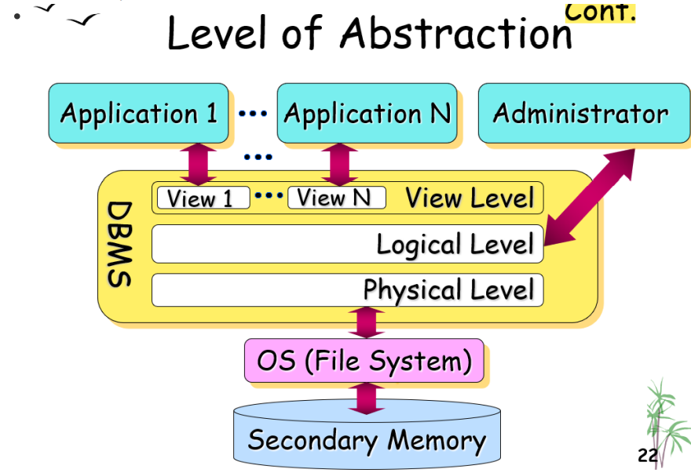

#### Instances and Schemas实例和模式

**模式Schema** – 数据库的整体设计——类似于程序中变量的类型信息 

**实例Instance** – 在特定时间点存储在数据库中的信息的集合——类似于变量的值

DBS 的几种模式：

* 物理模式**Physical schema**：物理级别的数据库设计 
* 逻辑模式**Logical schema**：逻辑级别的数据库设计 
* 子模式**Sub schemas**：在视图级别描述不同的视图

物理数据独立性**Physical Data Independence**  – 应用程序不依赖于物理架构，因此在物理架构更改时无需重写 

* 应用程序依赖于逻辑架构
* 物理架构隐藏在逻辑架构下

#### Data Modelss数据模型

用于描述的工具集合 

* 数据 Data
* 数据关系 Data relationships
* 数据语义 Data semantics
* 数据约束 Data constraints

提供一种在物理、逻辑和视图级别描述数据库设计的方法。

* Relational model关系模型——使用表的集合来表示数据以及这些数据之间的关系
* Entity-Relationship data model实体关系数据模型
  * 主要用于数据库设计
  * 实体**Entity**：现实世界中可与其他对象区分开来的“事物”或“对象”
    * 由一组属性**attributes**描述
  * 关系**Relationship**：多个实体之间的关联 
  * 实体集**Entity Set**：相同类型的所有实体的集合 
  * 关系集**Relationship Set**：同一类型的所有关系的集合
* Object-based data models 基于对象的数据模型
  * Object-oriented面向对象
  * Object-relational对象关系
* Semistructured data model 半结构化数据模型
  * XML
* Other older models:其他旧模型：
  * Network model 网络模型
  * Hierarchical model分层模型

#### Database Languages

数据库系统提供 

* 用于指定数据库模式的数据定义语言Data Definition Language  （DDL） 
  * 用于定义数据库架构的规范表示法Specification notation 
  * DDL 编译器根据 DDL 语句生成表，并将这些表的架构定义存储在数据字典**data dictionary**中
  * 数据字典包含元数据（即，描述数据的数据） 
    * 数据库架构 Database schema 
    * 完整性约束 Integrity constraints
    * 授权Authorization
* 用于表达数据库查询和更新的数据操作语言 Data Manipulation Language （DML） 
  * 用于访问和操作由相应数据模型组织的数据的语言（DML 也称为查询语言**query language**）
    * 检索信息 **Retrieval**（查询query）
    * 插入新信息 **Insertion**
    * 删除信息 **Deletion**
    * 信息修改**Modification**
  * 两类语言
    * 过程性**Procedural** – 用户指定需要哪些数据以及如何获取这些数据 
    * 声明性**Declarative (nonprocedural非过程)**  – 用户指定需要哪些数据，而不指定如何获取这些数据
      * SQL是最广泛使用的非程序查询语言

在实践中，DDL 和 DML 构成了单一数据库语言的一部分 ——SQL（Structured Query Language结构化查询语言）

应用程序通常通过以下任一方式访问access数据库： 

* 允许嵌入式embedded SQL 的语言扩展 （SQL与高级语言结合使用时，这个高级语言叫做数组语言，以特殊字符开始SQL，通过预处理器将SQL语句转成数组语言的过程调用）
* 应用程序接口（例如，ODBC(**Open** **Database** **Connectivity**)/JDBC(**JAVA Database Connectivity**)），允许将 SQL 查询发送到数据库

#### Relational Databases

关系数据库基于关系数据模型 *relational data model*

数据和数据之间的关系由表的集合*collection of tables* 表示 

包括一个 DML 和一个 DDL 

#### Database Design

设计数据库的一般结构的过程： 

* 逻辑设计——确定数据库模式。数据库设计要求我们找到一个“好”的关系模式集合。
  * 业务决策 – 我们应该在数据库中记录哪些属性？ 
  * 计算机科学决策 - 我们应该拥有什么关系模式，属性应该如何在各种关系模式之间分配？
* 物理设计—— 确定数据库的物理布局

#### Database Users and Administrators

数据库用户通过用户希望与系统交互的方式来区分

* 应用程序程序员 **Application programmers** – 通过 DML 调用与系统交互 
* 熟练用户**Sophisticated users**  – 使用数据库查询语言处理表单请求
* 专门用户**Specialized users**  – 编写不适合传统数据处理框架的专用数据库应用程序
* 无经验用户**Naive users**  – 调用以前编写的永久应用程序之一，例如，通过 Web 访问数据库的人员、银行出纳员、文职人员

#### Database Administrator数据库管理员DBA

数据库管理员的职责包括：

* 模式定义Schema definition
* 存储结构和访问方法定义 
* 授予Granting用户访问数据库的权限 
* 指定Specifying完整性约束 
* 充当与用户的联络人 liaison
* 监控性能并响应需求变化

#### Data Storage and Querying

DBMS的功能：

* **Storage Management**存储管理

  * 数据库数据通常使用文件系统存储在二级内存（硬盘）上
  * 存储管理器Storage Manager是一个程序模块（软件）
    * 存储管理器负责
      * 与文件系统交互
      * 高效存储、检索和更新数据
    * 存储管理器包括以下组件
      * 授权和完整性管理器 Authorization and integrity manager
        * 测试完整性约束的满足情况，并检查用户访问数据的权限
      * 事务管理器 Transaction manager
        * 确保数据库在系统出现故障时仍保持一致状态
        * 确保并发事务执行继续进行而不会发生冲突
      * 文件管理器 File manager
        * 在磁盘存储上分配空间
        * 管理用于表示存储在磁盘上的信息的数据结构（付出一定管理代价）
      * 缓冲区管理器 Buffer manager
        * 将数据从磁盘存储提取到主存
        * 决定要在主存中缓存哪些数据
    * 存储管理器实现以下数据结构
      * **Data File**数据文件：存储数据库本身
      * **Data Dictionary**数据字典：存储有关数据库结构的元数据，特别是数据库的架构
      * **Indices**索引：提供对具有特定价值的数据项的快速访问

* **Query Processing**查询处理

  * DBS的主要目的之一是简化和便利对数据的访问

  * DBS通过以下方式实现这一目标： 数据抽象 非过程语言 

  * 查询处理器**Query Processor** 在逻辑级别将用非过程语言编写的更新和查询转换为物理级别的高效操作序列

  * 查询处理器组件包括

    * DDL Interpreter解释器 
      * 解释数据字典中的 DDL 语句和记录定义
    * DML Compiler编译器 
      * 将 DML 语句转换为包含低级指令的评估计划
    * Query Evaluation Engine查询评估引擎
      * 执行 DML 编译器生成的低级指令

  * 查询处理步骤

    1. Parsing and translation.解析和翻译

    2. Optimization优化

    3. Evaluation评估

       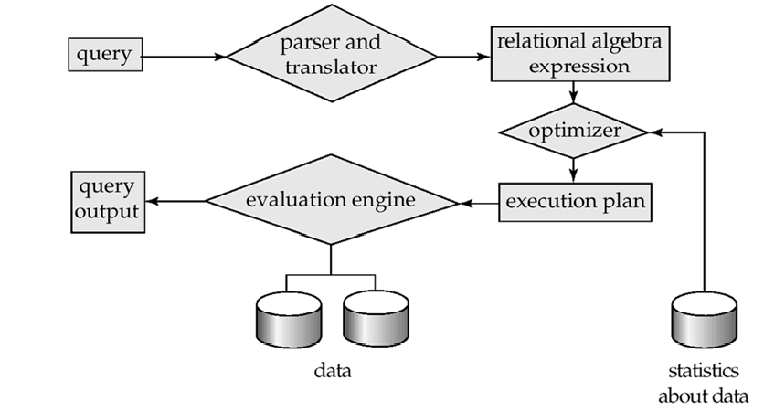

#### Transaction Management事务管理

* 事务是在数据库应用程序中执行单个逻辑函数的操作的集合
* 事务管理组件确保数据库在发生系统故障（例如，电源故障和操作系统崩溃）和事务故障时仍保持**一致consistent (correct) state** 。 
* 并发控制管理器**Concurrency-control manager** 控制并发事务之间的交互，保证数据库的一致性

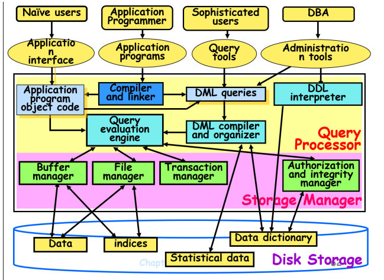

#### Database Architecture

数据库系统的体系结构受运行数据库的基础计算机系统的极大影响 

* Centralized集中式
* Client-server客户端-服务器 
* Parallel (multi-processor)并行（多处理器） 
* Distributed分布式

## 第二章relational model关系模型

### 2.1Structure of Relational Databases

#### Basic Structure

在逻辑层面上，关系数据库是称为关系的二维表的集合

**关系**表示实体集或关系集

关系的一行 表示实体 或关系

关系的每一行都可以称为**元组tuple**

关系的每列都有一个名称->关系的命名列称为**属性attributes** 每个属性的允许值集称为属性的**域domain**

属性值（通常）必须是**原子的atomic**,不可分割的

特殊值 **null** 是每个域的成员

**Relation**：形式上，给定集合 D1， D2， ....Dn关系 r 是 D1 x D2 x ...x Dn因此，关系是一组 n 元组 （a1， a2， ...， an），其中每个ai∈Di

**Tuple Variable**元组变量：元组变量是代表元组的变量，其域是特定关系的所有元组的集合

**Relation Schema**关系架构：A1、 A2、 ...、 An 是属性名称，R = （A1， A2， ...， An ） 是一个关系架构，r(R)表示（denotes ）关系架构 R 上的关系，关系的当前值（关系实例）由表指定。

关系是无序的

一个数据库由多个关系组成，将所有信息存储为单个关系

关系对应表，元组对应行，属性对应列，关系是元组的集合，表是行的集合

#### keys码/键

**超码 superkey** ：
形式：一个或多个属性的集合
作用：在一个关系中唯一地标识一个元组。
特点：

* 可能包含无关属性
* 超码的任意超集也是超码。（通俗讲，就是同一个关系r上，如果某个属性集合S包含超码K，即K是S的子集，那么S也是 r 的超码）
* 一张表（一个关系）一定有超码，因为至少所有属性的组合一定是超码，能唯一确定一个元组
  不唯一

**候选码candidate key**:
形式：一个或多个属性的集合
作用：在一个关系中唯一地标识一个元组。
特点：

* <u>是超码的一个子集</u>
* 任意真子集都不可能是超码，候选码就是最小的超码
* 没有无关属性
* 不唯一

**主码primary key**：
形式：一个或多个属性的集合
作用：在一个关系中唯一地标识一个元组。
特点：

* <u>是候选码之一</u>
* 唯一或没有
* 由数据库设计者指定，不指定的话表就没有主码

**外码 foreign key** :

* 什么时候有外码？
  关系 r1 的属性中包含关系 r2的主码 ，设这个属性为 k

* 哪个是外码
  k 就是 r1 的外码

* r1 、 r2 与外码的关系？
  r1 是 k 依赖的参照关系（referencing relation)
  r2 是 k 的被参照关系（referenced relation)

**参照完整性约束referential integrity constraint** :在参照关系中，任意元组在特定关系上的取值必然等于被参照关系中某个元素在特性关系上的取值

r1 在 k 属性上的取值是r2 在 k 属性（属性名称可能不一样）上取值的子集
如果把 r1 中某个元组的 k 属性的取值看做一个变量x，r2中k属性的取值的集合设为s,
那么s 就是变量 x 的值域。

#### 查询语言

用户从数据库请求信息时使用的语言。 

语言类别：过程性（procedural）、非程序性或声明性（Non-procedural, or declarative）

“Pure” languages（形成人们使用的查询语言的基础）： 

* 关系代数（Procedural） 

* 元组关系演算（Nonprocedural）

* 域关系演算（Nonprocedural）

### 2.2Fundamental Relational-Algebra-Operations基本关系代数运算

（对行的操作）基本操作

由一组运算符组成，将一个或两个关系作为输入，并生成一个新关系作为结果

#### 选择select: δ选择一行

>  δ<sub>p</sub>(**r**) = {*t* | *t* ∈*r* **and** *p(t)*}
>
>  δ<sub> Sage< 20</sub>  (Student)  or   δ <sub>4 < 20</sub> (Student)

#### 投影project: π

> π<sub>Sname,Sdept</sub>(Student) or δ <sub>2,5</sub>(Student)   结果是去掉重复行的

#### 并union: ∪

> 属性必须有相同的**<u>元（arity）</u>**
>
> 域必须是**<u>相容的(compatible)</u>**
>
> *r* ∪ *s* = {*t* | *t* ∈*r* or *t* 属于 *s*}  
>
> ∪<sub>Sname,Sdept</sub>(Student) or ∪<sub> 2,5</sub>(Student)

#### 差set difference: *–* 

> 属性必须有相同的**<u>元（arity）</u>**
>
> 域必须是**<u>相容的(compatible)</u>**
>
> *r* *–* *s* = {*t* | *t* ∈*r* and t ∉ *s* }

#### 笛卡尔积cartesian product: x

> *r* x *s* = {*t q* | *t* ∈ *r* and *q*  ∉ *s*} 当属性不相容时，必须重命名，否则为Ø

#### 重命名rename: ρ

> ρ<sub>X</sub>(E) E这个关系名字重命名为X

### 2.3Additional Relational-Algebra-Operations额外的~

#### 交Set intersection：∩

> 属性必须有相同的**<u>元（arity）</u>**
>
> 域必须是**<u>相容的(compatible)</u>**
>
> r∩s=r−(r−s)

#### 自然连接Natural join ：⋈

> r⋈s 
> 相当于在笛卡儿积运算之后去除了重复的属性值

#### 除Division ：÷

> *r* ÷*s* = { *t* | *t*∈π<sub> R-S</sub> (*r*)  Λ ∀u ∈ *s* ( *tu* ∈ *r* ) } （其中 tu 表示元组 t 和 U 的串联，以生成单个元组）
>
> 1.找到s的与r重合的列Y，并取出来记为s<sub>y</sub>
>
> 2.找到r中不是Y的列X作取消重复值得到X'
>
> 3.求r中X'属性对应的像集Z(X‘中有几个元素就有几个表)（每一个值都拿出来列一个表）
>
> 4.挨个判断Z中的像集是否都包含s<sub>y</sub>，如果包含则保留，如果不包含则从X'删除，最后的X’为所求

#### 赋值Assignment ：←

> 赋值运算符←←提供了一个用来表达复杂查询的简单方法，使用了一个临时的变量来表达
>
> temp1 ← R × S  ，  temp2 ← δr.A1=s.A1 ∧ r.A2=s.A2 ∧ ... ∧ r. An=s. An(temp1)

### 2.4Extended Relational-Algebra-Operations扩展的~

#### 广义投影Generalized Projection 

> E是任意的关系代数表达式，其中F1,F2…Fn每一个都是涉及常量以及E中属性计算的算术表达式，例如：Π<sub>ID,name,deptname,salary/12</sub>(Instructor)

#### 聚集函数Aggregate Functions

> 聚集运算可以对值的集合使用**聚集函数**，**聚集函数**输入值的一个汇聚，将单一的值最为返回
>
> #### g<sub>sum(c) as sum-balance</sub>(r)， 得到结果为一个关系，需要选择出来或者投影出来用，as后可将这一列重命名
>
> **avg**: average value
> **min**: minimum value
> **max**: maximum value
> **sum**: sum of values
> **count**: number of values

#### 外连接Outer Join

> 外连接为自然连接的扩展，为了**避免信息的丢失avoids loss of information**，会在结果中创建带空值null的元组
>
> #### 右外连接 Right outer join (⟖)
>
> R⟖S
> 右外连接结果中包含S中的所有元素，对每个元组，若R在公共属性名字上相等的元组，则正常连接，若R没有在功能属性名字上相等的元组，则保留此组，并将其他列设置为**NULL**
>
> #### 左外连接 Left outer join (⟕)
>
> R⟕S
> 同右外连接，结果包含R中的所有元组
>
> #### 全外连接 Full outer join (⟗)
>
> R⟗S
> 同右外连接，结果包含R和S中所有的元组

### 2.5Null Values空值

- *null*表示未知*unknown*的值或不存在*does not exist*的值
- 任何涉及*null*的**算术表达式**的结果都是*null*
- 聚集函数*aggregate function*忽略null值（在SQL中）
- 对于重复删除*duplicate eliminate*和分组*grouping*，null被当作其他的任意值，两个null值被当作是一样的
- 与 *null* 值的**比较**返回特殊的真值：***unknown***
- 如果选择谓词*select predicate*的结果计算结果为未知，则将其视为 ***false***
- 使用未知真值(unknown)的三值逻辑：
  - OR: (unknown **or** true)     = true, 
        (unknown **or** false)    = unknown
        (unknown **or** unknown) = unknown
  - AND:  (true **and** unknown)    = unknown, 
    (false **and** unknown)    = false,
      (unknown **and** unknown) = unknown
  - NOT: (**not** unknown) = unknown
- 在 SQL 中，如果谓词 P 的计算结果为未知，则"P is unknown"的计算结果为 true

### 2.6Modification of the Database修改数据库

删除 插入 更新 所有这些操作都使用赋值运算符表示

#### 删除 Deletion

删除请求的表示方式与查询类似，只是不是向用户显示元组，而是从数据库中删除选定的元组。 只能删除整个元组;无法仅删除特定属性上的值 删除在关系代数中表示为：r ← r - E (r为关系，E为关系代数查询)

> eg. *account* ← *account* – δ<sub> *branch_name* *= “Perryridge”*</sub> (*account* )

#### 插入 Insertion

要将数据插入关系中，我们要么： 指定要插入的元组 编写一个查询，其结果是要插入的一组元组。在关系代数中，插入表示为：r ← r ∪ E (r为关系，E为关系代数查询)

> *account* ← *account* ∪ {(“A-973”, “ Perryridge ”, 1200)}

#### 更新 Updating

一种机制，用于更改元组中的值，使用广义投影运算符执行， r ← π <sub>F<sub>1</sub>,F<sub>2</sub>,...F<sub>l</sub></sub>(r)每个 F<sub>i</sub> 要么是 r 的第i个属性（如果未更新第 i 个属性），或者， 如果要更新属性，F<sub>i</sub> 是一个表达式，仅涉及常量和 r 的属性，这为属性提供了新值。

> *account* ← π <sub>*account_number*, *branch_name*, *balance* * 1.05</sub> (*account*)


## 第三章SQL

### 3.1Data Definition数据定义

#### Data Definition Language（数据定义语言）

允许指定有关每个关系的信息，包括： 

* 每个关系的架构schema。 

* 与每个属性关联的值的域domain。 

* 完整性约束–Integrity constraints 

* 要为每个关系维护maintained的索引集The set of indices 。 

* 每个关系的安全和授权信息Security and authorization information。 

* 磁盘disk上每个关系的物理存储结构。

#### SQL 中的域类型（基本类型定义）

**char(n).**固定长度字符串，用户指定的长度为 n

> 像数组，查找方便

**varchar(n).** 可变长度字符串，具有用户指定的最大长度 n。

> 像链表，节省空间

**int.** 整数（取决于机器相关的整数的有限子集）。

**smallint**.小整数（整数域类型的与计算机相关的子集）。

**numeric(p,d).**定点数，具有用户指定的 p 位精度（总长度），小数点右侧有 d 位。

**real, double precision.**  浮点和双精度浮点数，具有与机器相关的精度。

**float(n).**浮点数，用户指定的精度至少为 n 位。 

#### Create Table Construct创建表构造

SQL 关系是使用**<u>create table</u>**命令定义的：

``` sql
create table r (A1 D1, A2 D2, ..., An Dn,
                (integrity-constraint1),
                ...,
                (integrity-constraintk))
/* r 是关系的名称 
每个 Ai 都是关系 r 架构中的一个属性名称 
Di 是属性 Ai 域中值的数据类型*/
create table branch # eg.
	(branch_name char(15) not null,
     branch_city char(30),
     assets		 integer)
```

#### Drop Table Constructs删除表构造

**drop table** r 命令从数据库中删除有关丢弃关系的所有信息。不仅删除 r 的所有元组，还删除 r 的架构

**delete table** r 保留关系 r，但删除 r 中的所有元组。

#### Alter Table Constructs加属性

>  **alter table** *r* **add** *A D*   // 加属性
>
>  // 其中 A 是要添加到关系 r 的属性的名称，D 是 A 的域。
>
>  // 关系中的所有元组都被指定为 null 作为新属性的值
>
>  ~~**alter table** *r* **drop** *A*      //删除属性(实际为把所有的列复制到新的表中)~~
>
>  // 其中 A 是关系 r 的属性的名称，**大多数数据库都不支持删除**

### 3.2Basic Query Structure基本查询结构

SQL基于关系代数（relational algebra ）和关系演算（relational calculus）

典型的 SQL 查询的格式为：

``` sql
select distinct A1, A2, ..., An # 属性
from r1, r2, ..., rm # 关系
where P # 谓语
```

>  等价于关系代数表达式 
>
>  ***π<sub>A1,A2,...An</sub>(δ<sub>P</sub>(r1×r2×...×r<sub>m</sub>))***
>
>  SQL 查询的**结果是关系**


#### select子句（Clause）

select子句（Clause）列出了查询结果中所需的属性，对应于关系代数的投影运算π

SQL **名称不区分大小写**， SQL 允许在关系和查询结果中使用重复项

要强制消除重复项，请在选择后插入**distinct** 关键字。

``` sql
# distinct关键字-》消除重复项（去掉重复行）
select distinct branch_name
from loan

# all关键字-》指定不删除重复项，默认查询结果为all
select all branch_name
from loan

# *号表示“所有属性”
select *
from loan

# select子句可以包含设计运算: +, –, *, /,不改变原关系
select loan_number, branch_name, amount*100
from loan

```


#### where子句（Clause）

where 子句指定结果必须满足的条件，对应于关系代数的选择谓词

SQL 在where子句中使用逻辑连接词（logical connectives ）**and, or, not** 

逻辑连接词的操作数可以是涉及比较运算<、>、<=、>=、==、<>(不等于)

比较可以应用于算术表达式（arithmetic expressions），字符串，特殊类型（如日期类型）的结果

``` sql
# 基本使用
select loan_number
from loan
where branch_name = 'Perryridge' and amount > 1200

# between and 使用
select loan_number
from loan
where amount between 90000 and 100000
```


#### from子句（Clause）

from 子句列出了查询中涉及的关系 对应于关系代数的笛卡尔积运算“×”。

``` sql
# 基本使用
select *
from borrower, loan
```

#### as关键字

``` sql
# as子句-》对select子句中的属性重命名
select customer_name,borrower.loan_number as loan_id, amount
from borrower, loan
where borrower.loan_number = loan.loan_number

# Tuple Variables_元组变量通过使用 as 子句在 from 子句中定义。（给表取了一个新名字使用），此处关键字 as 可以省略
select customer_name, T.loan_number, S.amount
from borrower as T, loan as S
where T.loan_number = S.loan_number
```

#### 字符串操作

``` sql
# 运算符"like"使用使用两个特殊字符描述的模式：
# % 字符匹配具有任意长度（可以是 0）的任何子字符串。
# _ 字符匹配任何字符。
# escape 定义转义字符，在表达式中含有%、_、[、]时使用
select customer_name
from customer
where customer_street like '% Main%';
/*
    '张%';	# 匹配"张"姓同学
    '%平';	# 匹配以“平”结尾的同学
    '%\__' escape '\'; 	# 匹配倒数第2个字是“_”的字符串
    '%平%';	# 匹配含有"平"的字符串
*/

# 模糊语句——扩展（来源网上）
SELECT 字段 FROM 表 WHERE 某字段 LIKE 条件;
# []：表示括号内所列字符中的一个（类似正则表达式）
# [^]：表示不在括号所列之内的单个字符。
select * 
from flow_user 
where username like '老[0-9]';

select * 
from flow_user 
where regexp_like (username, '[张王李]飞');#Oracle 10g以上的版本用法

select * 
from flow_user 
where username LIKE'[^王李张]飞';
```

#### Order by 对元组的显示进行排序

order by 子句会导致查询结果中的元组按排序顺序显示，默认为升序，可以对多个属性进行排序

``` sql
# 普通默认升序排列或加asc
select distinct customer_name
from borrower, loan
where borrower.loan_number = loan.loan_number and 
	branch_name = 'Perryridge' 
	order by customer_name

# 降序排序 desc关键字降序 asc关键字升序
select *
from loan
order by amount desc, loan_number asc

```


### 3.3Set Operations集合操作

以下三个操作都会自动消除重复项，想要显示重复项就需要在后面加关键字 all

一般为用来对两个select语句得到的结果进行操作的

**union**对应(关系代数表达式里的)∪

**intersect**对应∩

**except**对应-

``` sql
SELECT * FROM dept
UNION
SELECT* FROM dept WHERE deptno = 10;

SELECT * FROM dept
INTERSECT
SELECT* FROM dept WHERE deptno = 10;

SELECT * FROM dept
UNION ALL
SELECT * FROM dept WHERE deptno = 10;
```

### 3.4Aggregate Functions聚合函数

### 普通：

这些函数对关系的列的多集值进行操作，并返回值，**要求不能为空，可以有重复值**

  **avg:** average value
  **min:** minimum value
  **max:** maximum value
  **sum:** sum of values
  **count:** number of values

``` sql
select avg (balance) # 求平均值
from account
where branch_name = 'Perryridge'

select count (*) # 计算元组的数量
from customer

select count (distinct customer_name) # 计算不重复的元组数量，去除重复（eliminate duplicates）
from depositor
```

#### Group By以组为单位

集合函数之外的选择子句中的属性必须按列表分组显示

GROUP BY 语句用于结合集合函数，根据一个或多个列对结果集进行分组。

``` sql
SELECT column_name, aggregate_function(column_name)
FROM table_name
WHERE column_name operator value
GROUP BY column_name
```

#### Having

having 子句中的谓词（predicates）**在组形成之后应用**

而 where 子句中的谓词**在形成组之前应用**

只有满足having条件的组才输出，只筛选group by之后的


select语句返回的列只有两种情况

* 在聚集函数中的
* group by 分过组后的

``` sql
# 普通示例
SELECT Websites.name, Websites.url, SUM(access_log.count) AS nums FROM (access_log
INNER JOIN Websites
ON access_log.site_id=Websites.id)
GROUP BY Websites.name
HAVING SUM(access_log.count) > 200;

# 执行顺序
SELECT 		5
FROM		1
WHERE		2
GROUP BY	3
HAVING		4
Order by	6
```

### 3.5Null Values空值

元组的某些属性可能具有空值（用 null 表示）

null 表示未知值或值不存在。

谓词为 null 可用于检查空值

任何涉及null的**算术表达式**的结果都是***null***

任何与 null 的**比较**都返回***unkown***

使用未知真值(unknown)的三值逻辑：

- OR: (unknown **or** true)     = true, 
      (unknown **or** false)    = unknown
      (unknown **or** unknown) = unknown
- AND:  (true **and** unknown)    = unknown, 
  (false **and** unknown)    = false,
    (unknown **and** unknown) = unknown
- NOT: (**not** unknown) = unknown

如果子句谓词(clause predicate)的计算结果(evaluates评估)为未知，则将其视为 false 

除 count（*） 之外的所有聚合操作都会忽略聚合属性上具有空值的元组

``` sql
select loan_number
from loan
where amount is null

5 + null returns null
5 < null or null <> null or null = null return null
null is null returns true
null=null	returns unknown

select sum (amount)
from loan
# 上述语句忽略null金额，如果non-null空量，则结果为null
```


### 3.6Nested Subqueries嵌套子查询

SQL 提供了一种用于嵌套子查询的机制（mechanism）。 

子查询（**subquery**）是嵌套在另一个查询中的"**select-from-where** "表达式。 

子查询的常见用途是执行集成员身份（set membership）、集比较（set comparisons）和设置基数（set cardinality）的测试

**相关子查询**：子查询中包含外边的查询

#### 3.6.1集合成员资格（连接词in，对应not in）：是否是集合中的成员

#### 3.6.2集合的比较（some all子句）

some 子句 - 至少比某一个…

all 子句 - 比所有都…

#### 3.6.3空关系测试（exists结构，对应not exists）

**exists r ⇔ r ≠ ∅**

**not exist r ⇔ r = ∅**

**关系代数÷**可以使用两个exists（第一个为除数位置的关系）实现

#### 3.6.4重复元组存在性测试（unique结构/not unique）

SQL提供一个布尔函数，用于测试在一个子查询的结果中是否存在重复元组。如果作为参数的子查询结果中**没有重复的元组unique结构将返回true值**

#### 3.6.5（派生关系Derived Relations）from子句中的子查询

SQL允许在from子句中使用子查询表达式。
任何select-from-where表达式返回的结果都是关系，因而**可以被插入到另一个select-from-where中任何关系可以出现的位置**

#### 3.6.6定义临时关系（with子句）

`with子句`提供定义临时关系的方法，**这个定义只对包含with子句的查询有效**

``` sql
select distinct customer_name
from borrower
where customer_name in 
					(select customer_name                                           from depositor)# 测试集成员资格 in
					
select distinct customer_name
from borrower
where customer_name not in 
					(select customer_name                                                 from depositor)# 测试不具备集成员资格not in
select branch_name
from branch
where assets > some # 设置集成员比较 >
			(select assets 
             from branc 
             where branch_city = 'Brooklyn') 
             
select branch_name
from branch
where assets > all # all子句，这里assets要大于所有子查询的assets
				(select assets
                 from branch
                 where branch_city = 'Brooklyn') 
                 
select distinct customer_name
from borrower
where exists # exists子句，子句中存在就返回true
		(select * 
         from depositor 
         where depositor.customer_name =  borrower.customer_name )

select T.customer_name
from depositor as T
where unique ( # unique子句，子句中唯一存在就返回真
    	select R.customer_name 
    	from account, depositor as R 
    	where T.customer_name = R.customer_name and 
    	R.account_number = account.account_number and 
    	account.branch_name = 'Perryridge') 

select branch_name, avg_balance 
from (select branch_name, avg (balance) # from子查询
      from account
      group by branch_name)
      as branch_avg(branch_name, avg_balance)
where avg_balance > 1200

with max_balance (value) as # with子句定义临时关系
	select max (balance) 
	from account 
select account_number 
from account, max_balance 
where account.balance = max_balance.value

```


### 3.7Complex Queries (用with子句的复杂查询)

``` sql
with branch_total (branch_name, value) as
    select branch_name, sum (balance)
    from account
    group by branch_name
with branch_total_avg (value) as
    select avg (value)
    from branch_total
select branch_name
from branch_total, branch_total_avg
where branch_total.value >= branch_total_avg.value
/*
	查找所有分行账户总存款均高于账户总存款平均值的所有分行(多用了个with)
*/
```

### 3.8Views视图

视图是使用**create view**语句定义的，该语句具有以下格式 

>  **create view** *v* **as** *<* query expression >

其中`< query expression >`是任何合法的 SQL 表达式。 视图名称由 v 表示

定义视图后，视图名称可用于引用视图生成的虚拟关系。

创建视图时，查询表达式存储在数据库中；使用视图将表达式替换为查询。

``` sql
create view all_customer as
	(select branch_name, customer_name
     from depositor, account
     where depositor.account_number = account.account_number)
     union
     (select branch_name, customer_name
      from borrower, loan
      where borrower.loan_number = loan.loan_number)
# A view consisting of branches and their customers由分支机构及其客户组成的视图
```

如果在定义 v1 的表达式中使用 v2，则视图关系 v1 称为***depend directly***于视图关系 v2

如果 v1 直接依赖于 v2，或者存在从 v1 到 v2 的依赖关系路径，则视图关系 v1 称为***depend on*** 视图关系 v2 如果视图关系 v 依赖于自身，则称其为***recursive***(递归)关系。

**视图展开View Expansion**

表达式的视图展开将重复以下替换步骤： 

> **repeat**
>
> Find any view relation *vi* in *e*1 
>
> Replace the view relation *vi* by the expression defining *vi* 
>
> **until** no more view relations are present in *e*1

翻译：重复在 e1 中查找任何视图关系 vi，将视图关系 vi 替换为定义 vi 的表达式，直到 e1 中不再存在视图关系

只要视图定义不是递归的，此循环就会终止

### 3.9Modification of the Database数据库的修改

#### Deletion删除某行

删除某列使用alter语句（涉及表的结构schema为DDL语句）

`注意`: **delete 后必须为 from 而不是 table**

```sql
# 删除余额低于银行平均水平的所有账户的记录。
delete from account
where balance < (select avg (balance)
                 from account)
/*
	问题：当我们从存款中删除元组时，平均余额会发生变化
	SQL的解决方案（不解决平均金额不对的问题）：
		1. 首先，计算平均余额并找到所有要删除的元组
		2. 接下来，删除上面找到的所有元组（无需重新计算 avg 或重新测试元组）
*/
```

#### Insertion插入某行

``` sql
insert into account
	select loan_number, branch_name,  200
	from loan
	where branch_name = 'Perryridge' 

insert into account(branch_name, balance, account_number)
values ('Perryridge',  1200, 'A-9732') 

insert into account
values ('A-9732', 'Perryridge', null) # 可以置为空
```

#### Updates更新

对普通表的更新

``` sql
# 题目：将余额超过 10000 美元的所有账户增加 6%，所有其他账户增加 5%。
# 第一种：顺序很重要
update account
set balance = balance * 1.06
where balance > 10000

update account
set balance = balance * 1.05
where balance * 10000

# 第二种 推荐用法Conditional Updates（条件更新）
update account
	set balance = case
		when balance <= 10000
			then balance *1.05
		else   balance * 1.06
		end

```

通过==视图==更新

大多数 SQL 实现仅允许在单个关系上定义的简单视图（无聚合）上进行更新

有些通过视图进行的更新不可能转换为数据库关系的更新，不能的情况（情况来源csdn非非官方）：

（1）聚合函数；
（2）DISTINCT关键字；
（3）GROUP BY子句；
（4）ORDER BY子句；
（5）HAVING子句；
（6）UNION运算符；
（7）位于选择列表中的子查询；
（8）FROM子句中包含多个表；
（9）SELECT语句中引用了不可更新视图；
（10）WHERE子句中的子查询，引用FROM子句中的表；
（11）ALGORITHM 选项指定为TEMPTABLE（使用临时表总会使视图成为不可更新的）。

``` sql
create view loan_branch as # 创建视图
select loan_number, branch_name
from loan

insert into v # 通过视图使用insert into，其余没有赋值的属性为null
values ('L-99','Downtown', '23') 
```


### 3.10Joined Relations**

**Join operations** 联接操作采用两个关系，并因此返回另一个关系。 

这些附加操作通常用作 from 子句中的子查询表达式

**Join condition** 连接条件 – 定义两个关系中的哪些元组匹配，以及连接结果中存在哪些属性

**Join type** 联接类型– 定义如何处理每个关系中与另一个关系中的任何元组不匹配的元组（基于连接条件）

可以使用的**join type**（来源菜鸟教程）：

- **INNER JOIN**：如果表中有至少一个匹配，则返回行
- **LEFT JOIN**：即使右表中没有匹配，也从左表返回所有的行
- **RIGHT JOIN**：即使左表中没有匹配，也从右表返回所有的行
- **FULL JOIN**：只要其中一个表中存在匹配，则返回行
- **cross join** : 结果是笛卡尔积，就是第一个表的行数乘以第二个表的行数。

**join conditions**有：

* natural
* on< predicate >
* using(A<sub>1</sub>,A<sub>2</sub>,...A<sub>n</sub>)

eg：P83 可参考[SQL JOIN 中 on 与 where的区别](https://www.runoob.com/w3cnote/sql-join-the-different-of-on-and-where.html )     [菜鸟教程join](https://www.runoob.com/sql/sql-join.html)

``` sql
loan inner join borrower on
	loan.loan_number = borrower.loan_number
loan left outer join borrower on
	loan.loan_number = borrower.loan_number
loan natural inner join borrower
loan natural right outer join borrower
loan full outer join borrower using (loan_number)
```

## 第四章Advanced SQL高级SQL

### 4.1SQL Data Types and Schemas

#### Built-in Data Types in SQL内置数据类型

**date**：由年月日组成，格式为  yyyy -mm-dd 

**time**： 由 小时：分钟：秒 组成，格式为  hh:mm:ss

**time(i)** ：由小时：分钟：秒加上 i （i为秒后的位数，精确到秒）个额外的数字组成，指定秒的分数，格式为 hh:mm:ss:ii...i

**Timestamp**：时间戳，日期加一天中的时间

**interval**：时间段，第一种用法是从另一个日期/时间/时间戳值中减去一个日期/时间/时间戳值，得到一个间隔值；第二种用法是间隔值可以添加到日期/时间/时间戳值

> 可以从日期/时间/时间戳中提取单个字段的值:
>
> ​	**extract** (**year from** r.starttime) 
>
> 可以将字符串类型转换为日期/时间/时间戳:
>
> ​	**cast** < string-valued-expression> **as date**
>
> ​	**cast** <string-valued-expression> **as time**

#### User-Defined Types用户定义的类型

**create type** ：SQL 中的构造创建用户定义类型

``` sql
create type Dollars as numeric (12,2) final 
```

**create domain** :在 SQL-92 中构造创建用户定义的域类型

``` sql
create domain person_name char(20) not null
```

类型和域是相似的。 域可以具有在其上指定的约束，例如不为 null。

#### Domain Constraints域约束

域约束是最基本的完整性约束形式。它们测试插入到数据库中的值，并**测试查询以确保比较有意义**。

可以从现有数据类型创建新域

``` sql
create domain Dollars numeric(12, 2)
create domain Pounds numeric(12,2)
```

转换类型：cast关键字

``` sql
(cast r.A as Pounds)
```

#### Large-Object Types大型对象类型

大型对象（照片、视频、CAD 文件等）存储为大型对象： 

**blob**：二进制大型对象 -- 对象是未解释的二进制数据的大型集合（其解释留给数据库系统外部的应用程序） 

**clob**：字符大对象 -- 对象是字符数据的大型集合

当查询返回大型对象时，将返回指针而不是大型对象本身

### 4.2Integrity Constraints 

完整性约束通过确保对数据库的授权更改不会导致数据一致性的丢失来防止对数据库的意外损坏。

（来源网络）数据完整性包括：实体完整性、域完整性、参照完整性、用户定义的完整性。

（来源网络）完整性约束的类型可分为三种类型：与表有关的约束、域(Domain)约束、断言(Assertion)**本节按此分类**

（来源网络）与表有关的约束：包括列约束(表约束+NOT NULL)和表约束(PRIMARY KEY、foreign key、check、UNIQUE) 。

#### Constraints on a Single Relation**对单个关系的约束

**not null、primary key、unique、check** (P ), where *P* is a predicate

check子句前可选择使用constraint子句;用于指示更新违反了哪个约束。

``` sql
# (1) not null（非空)约束： 只用于定义列约束。（见下一章）
    create table Employee
        (emp_id int not null,
        emp_name varchar(10) not null,
        address varchar(40))
	create domain Dollars numeric(12,2) not null # 声明域不为空

# (2) primary key(主键)约束：用于定义基本表的主键，起惟一标识作用，其值不能为null,也不能重复，以此来保证实体的完整性。（见下一章）
    create table branch
        (branch_name char(15),
         branch_city char(30),
         assets	integer,
         primary key (branch_name))#主键声明1

    create table branch
        (branch_name char(15) primary key,#主键声明2
         branch_city char(30),
         assets	integer,)
	/*
	1.在一个表中，只能定义一个primary key约束，但可定义多个unique约束。
	2.对于指定为primary key的一个列或多个列的组合，其中任何一个列都不能出现空值，而对于unique所约束的惟一键，则允许为null,只是null值最多有一个。
	3.候选码允许为null，但是null只能有一个。
	*/
	
# (3) unique(惟一)约束：用于指明创建惟一约束的列上的取值必须惟一。（见下一章）
    create table EmployeeInfo
        (emp_id int not null,
        emp_name varchar(10) not null,
        phone char(11) unique,
        address varchar(40))

# (4) check（校验）约束：用来检查字段值所允许的范围。DBMS每当执行delete,insert或update语句时，都对这个约束过滤。如果为true，则执行。否则，取消执行并提示错误。SQL-92 中的检查子句允许限制域。子句constraint是可选的;用于指示更新违反了哪个约束。

    create table Emp_Sal
        (emp_id int, 
         account CHAR(4),
         salary DECIMAL(5,1),
         constraint validsal 
         check(salary >=1000 and salary<=10000))
    create domain hourly_wage numeric(5,2)
    	constraint value_test 
    	check(value > = 4.00)

```

#### Referential Integrity参照完整性

**primary key** 子句列出组成主键的属性。 

**unique**子句列出组成候选键的属性。

**foreign key** 子句列出组成外键的属性和外键所引用的关系的名称。 

默认情况下，外键引用被引用表的主键属性。

``` sql
# 1、primary key
create table customer
    (customer_name	char(20),
    customer_street	char(30),
    customer_city	char(30),
    primary key (customer_name ))

create table branch
    (branch_name char(15),
     branch_city char(30),
     assets numeric(12,2),
     primary key (branch_name ))
     
# 2.unique ( A1, A2, …, Am)

# (3) foreign key(外键)约束（来源网络）：定义了一个表中数据与另一个表中的数据的联系。
create table account
	(account_number	char(10),
     branch_name	char(15),
     balance integer,
     primary key (account_number),
     foreign key (branch_name) references branch )

create table depositor
	(customer_name char(20),
    account_number char(10),
    primary key (customer_name, account_number),
    foreign key (account_number) references account,
    foreign key (customer_name) references customer)
     /*可以为表的一列或多列创建foreign key 约束，如果为多列创建 foreign key约束，将分别与主表中的相应主键相对应。*/
```

#### Assertions断言

Assertions是一个谓词，表示我们希望数据库始终满足的条件

做出断言时，系统会测试其有效性，并在可能违反断言的每次更新上再次测试该断言,此测试可能会引入大量的开销。因此，应非常谨慎地使用断言。

SQL 中的Assertions采用以下形式:

``` sql
create assertion <assertion-name> check <predicate>
# Asserting (for all X, P(X))是通过迂回方式实现：（not exists X such that not P(X)）

# 每笔贷款至少有一名借款人，其账户的最低余额为1000.00美元
create assertion balance_constraint check
(not exists (
	select *
    from loan
    where not exists (
        select *
        from borrower, depositor, account
        where loan.loan_number = borrower.loan_number       
        and borrower.customer_name = depositor.customer_name
        and depositor.account_number = account.account_number
        and account.balance >= 1000)))
```

### 4.3Authorization

对数据库各部分的授权形式Forms（以下为<font color='red'>**自然语言**</font>，不是授权名）：

​	**Read**：允许读取，但不允许修改数据。

​	**Insert**：允许插入新数据，但不允许修改现有数据。

​	**Update**：允许修改，但不允许删除数据。

​	**Delete**：允许删除数据。

修改数据库模式schema的授权形式（在第 8 章中介绍）：

​	**Index**：允许创建和删除索引。（索引不能修改，系统自动维护）

​	**Resources**：允许创建新关系。

​	**Alteration**：允许在关系中添加或删除属性。

​	**Drop**：允许删除关系。

#### Authorization Specification in SQL授权规范

​	**grant**语句用于授予授权

``` sql
grant <privilege list(特权列表，所有的特权，所有允许的特权)>
on <relation name or view name> to <user list(用户id列表 公共的，所有当前和未来的用户)>
```

​	授予视图特权（Granting a privilege on a view）并不意味着授予对底层关系（对表的操作）的任何特权。

​	表和视图相互独立（有表的权限不代表又视图的权限）

​	特权的授予者必须已经拥有指定项的特权（或者是数据库管理员）。

#### Privileges in SQL权限

以下为<font color='red'>**特权本身的名字**</font>，类似关键字。

​	**select**：允许对关系进行读取访问，或使用视图进行查询的能力

``` sql
grant select on branch to U1, U2, U3 
# 授予用户 U1、U2 和 U3 在分支关系上select的权限
```

​	**insert**: 插入元组的能力

​	**update**: 使用 SQL 更新语句进行更新的功能

​	**delete**: 删除元组的能力。

​	**all privileges**: 用作所有允许权限的缩写形式

#### Revoking Authorization in SQL撤销授权

​	**revoke**语句用于撤销授权

``` sql
revoke <privilege list>
on <relation name or view name> 
from <user list>

revoke select on branch  from U1, U2, U3
```

​	如果同一权限由不同的grantees(有权利授权的人)授予同一用户两次，则该用户可以在撤销（revocation）后保留该权限。 依赖于要撤消的权限的所有权限也将被撤消。

​	当A给B权限，B给C权限；当B被A撤销权限，C同时也被撤销（是符合常理、现实生活的）

### 4.4Embedded SQL嵌入式

​	此部分用的较少，大多数通过封装实现操作数据库。

​	SQL 标准定义了 SQL 在各种编程语言（如 C、Java 和 Cobol）中的嵌入。

​	嵌入SQL查询的语言称为主语言（**host language**），并且主语言中允许的SQL结构包括嵌入式SQL。

**EXEC SQL**语句用于标识对预处理器（preprocessor）的嵌入式SQL请求。

> C语言示例：
>
> ​	EXEC SQL
>
> ​	<embedded SQL statement>
>
> ​	END_EXEC
>
> 注：语句规范因语言而异，eg.Java：\#SQL { …. }; 

``` sql
# eg 从主语言中，查找某个帐户中金额超过可变金额的客户的姓名和城市。
EXEC SQL
	declare c cursor for # 声明游标（cursor游标），相当于一块缓冲区
	select depositor.customer_name, customer_city
	from depositor, customer, account
	where depositor.customer_name=customer.customer_name
		and depositor account_number=account.account_number
		and account.balance > :amount # 加“:”的后面表示amount为诸语言中的变量；如果不加“:”则默认认为amount是SQL中的列名/表名
END_EXEC
```

#### 在嵌入式中使用cursor（游标）

注意：以下细节因语言而异。 例如，Java 嵌入定义了 Java 迭代器来单步执行结果元组。

##### 基本操作

1. 使用**declare**声明游标（缓冲区）

``` sql
EXEC SQL
	declare c cursor for # C为游标名称
	(一个select查询语句)
END_EXEC
```

2. 使用**open**语句执行查询

   注：相当于执行一遍声明部分下面的select语句

``` sql
EXEC SQL 
	open c 
END_EXEC
```

3. 使用**fetch**语句取出缓冲区的数据

   注：取缓冲区的数据是一行一行取的，执行一次相当于游标自动加一指向下一行。

``` sql
EXEC SQL 
	fetch c into :cn, :cc 
END_EXEC
```

4. 使用**close** 语句释放缓冲区

   注：关闭后数据清空，缓冲区释放。

``` sql
EXEC SQL 
	close c 
END_EXEC
```

（来源百度百科）**SQLCA（SQL Communication Access**,会被传递到需要与[数据库服务器](https://baike.baidu.com/item/数据库服务器)进行通信的所有数据库[库函数](https://baike.baidu.com/item/库函数)中。它会在所有嵌入式 SQL 语句上被隐式传递。

可以将SQLCA看成一个结构体，里边有很多属性SQLSTATE是其中一个，设置为"02000"，以指示没有更多可用数据


#### 通过游标更改Updates Through Cursors：

``` sql
declare c cursor for
    select *
    from account
    where branch_name = ‘Perryridge’
for update
```

### 4.5Dynamic SQL

允许程序在运行时构造和提交 SQL 查询。

``` sql
# 在 C 程序中使用动态 SQL 的示例。
char *  sqlprog = “update account
    set balance = balance * 1.05
    where account_number = ?” # "?"为占位符
EXEC SQL prepare dynprog  from :sqlprog;
char account [10] = “A-101”;
EXEC SQL execute dynprog using :account;
```

动态 SQL 程序包含一个**”?“**，它是执行 SQL 程序时提供的值的占位符

### 4.6ODBC and JDBC

[这部分PPT无，但是感觉这个很详细可参考](https://www.php.cn/mysql-tutorials-414951.html)

## 第五章Entity-Relationship Mode实体-联系模型

### 5.1Modeling

数据库可以建模为： 1.实体（entities）的集合，2.实体之间的关系

实体**entity**是存在且可与其他对象区分开来的对象。 

实体集**entity set** 是相同类型即具有相同性质（或属性）的一个实体集合。

实体由一组属性**attributes**表示，属性是实体集的每个成员所拥有的描述性性质。

#### Relationship Sets**

关系是多个实体之间的关联，联系集（Relationship Sets）是相同类型联系的集合，正规的说，联系集是n≥2个（可能相同的）实体集上的数学关系

如果E1，E2，...，En 是实体集，则关系集 R 是{(*e*1, *e*2, … *en*) | *e*<sub>1</sub> ∈ *E*<sub>1</sub>, *e*<sub>2</sub> ∈*E*<sub>2</sub>, …, *e<sub>n</sub>* ∈ *E<sub>n</sub>*}的一个**子集**，其中(*e*1, *e*2, …, *e**n*) 是一个关系

**attribute**也可以是关系集的属性

#### Attributes

每个实体的每个属性都有一个值 

当实体在某个属性上没有值时使用**空null**值。

​	空值可以表示“不适用”（该实体的这个属性不存在值）/表示属性值未知（未知的值可能是缺失的或不知道的）

域**Domain**或值集**value set** – 每个属性都有一个可取值的集合

E-R模型中的属性类型： 

* 简单和复合属性-**Simple and composite** attributes。 

* 单值和多值属性–**Single-valued and multi-valued** attributes 

* 派生属性–**Derived** attributes

##### Simple and Composite Attributes（横向）

​	**Simple attributes**简单属性：不能划分为更小的部分subparts

​	**Composite attributes**复合属性：可分为更小的部分，子部分叫Component Attributes

​		如果我们在某些情况下引用完整属性，而在其他情况下仅引用属性的一部分，选择复合属性是很好的选择。

​		复合属性可以是有层次的。	复合属性帮助将相关属性组合在一起，使建模更清晰

##### Single-Valued and Multi-Valued Attributes单值和多值属性（纵向）

​	**Single-valued attributes**：属性对于一个特定实体都只有单独的一个值

​	**Multi-valued attributes**：对某个特定实体而言，一个属性可能对应于一组值，用{phone-number}表示（用花括号括起来）

#### Derived Attributes派生属性

​	派生属性的值可以从其他相关属性或实体派生出来。派生属性的值不存储，而是在需要的时候计算出来。

#### Degree of a Relationship Set__联系集的度

联系集的度**degree**指参与联系集的实体集的数目。 

涉及两个实体集的关系集是**binary**（或degree two）。 （和两个实体相联系）

通常，数据库系统中的大多数关系集都是binary的。

关系集可能涉及两个以上的实体集。 两个以上的实体集之间的关系很少见。 大多数关系都是二元的。

### 5.2Constraints 约束

#### Mapping Cardinality Constraints映射基数约束

表示一个实体通过一个联系集能关联的实体的个数

映射基数在描述二元关系集时最有用

对于二元关系集，映射基数必须是以下类型之一： 

* 一对一**one-to-one** 两个实体集的主码都可以做主码

* 一对多**one-to-many** many的主码可以做主码

* 多对一**many-to-one** many的主码可以做主码

* 多对多**many-to-many** P(A)∪P(B)

注： A和B作为二元关系集中的两个关系，A 和 B 中的某些元素可能不会映射到另一个元素集中的任何元素

#### Participation Constraints参与约束

实体集之间的关联称为参与。

E 是实体集，R 是关系集

如果 E 中的每个实体都参与 R 中的至少一个联系中 则 E 在 R 中的参与称为全部**total**的

如果 E 中的某些实体仅参与 R 中的关系  则 E 在 R 中的参与称为 部分**partial**的

#### Keys for Relationship Sets

联系集的**super key**是一个或多个属性的集合，其值唯一地决定每个实体。 

联系集的**candidate key** 是最小超码

尽管可能存在多个候选码，但选择其中一个候选键作为**primary key**。 应选择主码，使其属性从不更改或很少更改。

设 R 是涉及实体集 E1,E2 ,...En的联系集，联系集 R 中的关系描述如下：

> 如果联系集R没有属性与之相关联，那么属性集合
>
> ​            Primary-key(E1) ∪ Primary-key(E2) ∪... ∪Primary-key(En)
>
> 描述了集合R中的一个联系
>
> 
>
> 如果联系集R有属性a1,a2,…,am与之相关联，那么属性集合
>
> ​            Primary-key(E1) ∪ Primary-key(E2) ∪... ∪Primary-key(En)∪{a1,a2,…,am}
>
> ​			\\---------------------------------------------------------------------------------/
>
> ​														超码super key（参与实体集的主键组合形成联系集的超码）
>
> 主键 （Ei） 表示（denote）构成实体集 E 的主键的属性集
>
> {a1,a2,…an}  是联系集 R 的属性

eg.（customer_name，account_number）是*depositor*存款联系的超码

联系集的主码结果依赖于联系集的映射基数。

注意：这意味着一对实体在特定联系集中最多可以有一个关系

### 5.3E-R Diagram 

汇总：书P172 	   pptP81-82

矩形**Rectangles**表示**实体集entity sets**。

菱形**Diamonds**代表**联系集relationship set**。 

线段**Lines**将属性链接到实体集，将实体集链接到联系集。 

椭圆**Ellipses**表示属性**attributes** 双线椭圆**Double ellipses** 表示**多值属性multivalued attributes**。 虚线椭圆**Dashed ellipses** 表示**派生属性derived attributes**。 

下划线**Underline**表示**主码属性primary key attributes**

双横线**double line**表示**total**参与

Cardinality Constraints基数约束，通过在关系集和实体集之间，绘制**有向线 （→）**，表示"**一个**"， 一条**无向线 （—）**，表示"**多个**"。

实体在联系中扮演的功能称为实体的**角色（role）**，关系集中涉及的实体集不必是不同的 可以使用角色指定实体如何通过关系集进行交互（同样的实体集可以以不同的角色参与一个联系集多于一次）P35

eg.P37-P41

**基数限制的替代表示法Alternative Notation for Cardinality Limits**（常见但不常用）：基数限制也可以表示参与约束，P42（此题表示customer对loan为一对多）左边表示这个实体集于关系的参与度的下限，右边数字表示实体集与这个关系参与度的下限。表示更加精确

#### E-R Diagram with a Ternary Relationship 三元关系

我们最多允许三元ternary（或更大degree）关系中的一个箭头表示基数约束（三元联系最多只能有一个是多）

如果有多个箭头，则有两种方法可以定义含义：A、B 和 C 之间的三元关系 R，箭头指向 B 和 C 可能意味着1. 每个 A 实体都与 B 和 C 中的唯一实体相关联  2. 来自 （A， B） 的每对实体都与一个唯一的 C 实体相关联，并且每对 （A， C） 都与唯一的 B 相关联

为了避免混淆，**禁止使用多个箭头**

### 5.4Design Issues 设计问题

使用实体集**entity sets** 还是属性**attributes**：选择主要取决于被建模企业的结构，以及与所讨论属性相关的语义

#### 使用实体集or联系集

准则（guideline）：指定（designate）一个关系集来描述实体之间发生的操作（当描述发生在实体间的行为时采用联系集）

不要将一个实体集的主键用作另一个实体集的属性P47

不要将相关实体集的主键属性指定(designate)为关系集的属性（已隐式在中）P48

二元与 n 元关系集：

* 尽管可以使用许多不同的二元关系集来替换非二元（n元，对于 n > 2）关系，但 n元关系集更清楚地表明，多个实体参与单个关系。

* 某些看似非二元的关系可能使用二元关系更好地表示 。三元关系父母，将孩子与他/她的父亲和母亲联系起来，最好用两个二元关系，父亲和母亲代替 使用两个二元关系允许部分信息（例如，只知道母亲）P52-54

#### 二元联系集or n元联系集Converting Non-Binary Relationships to Binary Form

通常，任何非二元关系都可以通过创建人工实体集来使用二元关系来表示P56

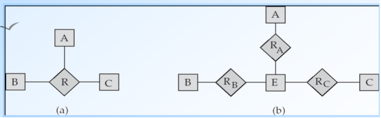

转换的缺点：

* 可能必须为表示联系集的实体集创建标识（identifying）属性

* n元联系集可以更清楚地表示几个实体集参与单个联系集

* 可能无法将三元联系上的约束转换为二元联系上的约束

#### 联系属性的布局Placement of relationship attributes

如果每个帐户只能有一个客户，则可以使访问日期成为帐户的属性，而不是关系属性

（也就是说，从帐户到客户的关系是多对一的，或者等效地，客户到帐户的关系是一对多

**一对多**关系集的属性可以被重新定位到“多”侧的实体集。

对于**一对一**关系集，另一方面，可以放置在任意一侧。

对于**多对多**关系，关系集的属性只能放在关系集上

### 5.5Weak Entity Sets弱实体集

没有足够的属性以形成主码的实体集称为弱实体集**weak entity set**。

弱实体集的存在依赖于**标识实体集Identifying Entity Set**或**属主实体集owner entity set**的存在：

* 必须通过一个**全部参与total**，**一对多one-to-many**，的关系来与弱实体集相关联
* 这个标识关系(**Identifying relationship**)（关联弱实体集和标识性强实体集的联系集）使用**双线菱形double diamond**在ER图中表示。

弱实体集的分辨符（**discriminator**）（或部分码**partial key**）是一组属性，用于区分弱实体集的所有实体，这些实体与标识实体集的同一实体相关。

弱实体集的主键由(弱实体集的存在所依赖的强实体集的主键)加上(弱实体集的鉴别器)构成

使用**双矩形double rectangles**来表示弱实体。 我们用**虚线dashed line**强调弱实体集的**鉴别器discriminator**。

### 5.6Extended E-R Features扩展的E-R特性

[参考（和书上顺序差不多例子也相同，但符号不可借鉴）](https://www.cnblogs.com/RDaneelOlivaw/p/8215224.html)

**特化**和**概化**定义了一个高层实体集和一个或多个低层实体集之间的包含关系。特化是取出高层实体集的一个子集来形成一个低层实体集。概化是用两个或多个不想交的（低层）实体集的并集形成一个高层实体集。高层实体集的属性被低层实体集继承。

#### Specialization特化(在实体集内部进行分组的过程。)

**自顶向下**的设计过程**Top-down design process**：我们在实体集中指定与集合中其他实体不同的子分组 这些子分组将成为较低级别的实体集。这些实体集具有不适用于较高级别实体集的属性或参与的关系。

由标记为 **ISA 的三角形组件**表示（例如，客户"是"人）。P67（考试这么写）

高层和低层实体集按普通实体集表示。书上P167（不是用ISA表示的，考试打灭）

#### Generalization概化

**自底向上**的设计过程**A bottom-up design process** – 将共享相同功能的多个实体集合并到更高级别的实体集中。 专业化和普遍化是彼此的简单反转;它们以相同的方式在E-R图中表示

术语"专业化"和"泛化"可互换(interchangeably)使用

可以基于不同的功能对实体集进行多个特化。

高层与低层实体集也分别称作**超类（superclass）和子类（subclass）**。

ISA 关系也称为超类-子类（**superclass - subclass**）关系


特化和概化的区别在于出发点和总体目标：

* 特化：从单一实体集出发，通过创建不同的低层实体集来强调同一实体集中不同实体间的差异。低层实体集可以有不适用于高层实体集中所有实体的属性，也可以参与到不适用于高层实体集中所有实体集的联系中。

* 概化：基于“一定数量的实体集共享一些共同特征（用相同的属性描述，且参与到相同的联系集中）”。在这些实体集共性的基础上将它们总和成一个高层实体集，用于强调低层实体集间的相似性并隐藏差异。(概化使共享属性不重复出现，表达简洁。)

#### 属性继承**Attribute inheritance** 

较低级别的实体集继承它所链接到的较高级别实体集的所有属性和参与的。

在实体集的层次结构中：

​	如果一个实体集作为低层实体集只参与到一个ISA联系中，则称这个实体集只具有**单继承（single inheritance）**；

​	如果一个实体集作为低层实体集参与到多个ISA联系中，则称这个实体集具有**多继承（multiple inheritance）**，且产生的结构称为**格（lattice）**。

#### Design Constraints on a Specialization/Generalization对特化/概化的设计约束

<font color='blue'>对概化的</font>：

1. 涉及”**判定哪些实体能成为给定低层实体集的成员**”的约束。成员资格可以是下列其中一种：

​	**条件定义的（condition-defined）**：在条件定义的低层实体集中，成员资格的确定基于实体是否满足一个显式的条件或谓词。

​				e.g.设高层实体集student具有属性student_type，所有student实体都根据student_type属性进行评估；满足条件student_type=”graduate”的实体属于graduate低层实体集；满足条件student_type=”undergraduate”的实体属于undergraduate低层实体集。

​	**用户定义的（user-defined）**：在用户定义的低层实体集中，由数据库用户将实体指派给某个实体集。（负责决策的用户根据个人观点进行分配，执行将一个实体加入某个实体集的操作。）

2. 涉及”**在一个<font color='red'>概化</font>中一个实体是否可以属于多个实体集**“的约束。低层实体集可以是下列其中一种：

​	**不相交（disjoint）**：要求一个实体至多属于一个低层实体集。在 E-R 图中通过在 ISA 三角形旁边书写disjoint来注明

​	**重叠（overlapping）**：同一实体可以同时属于同一概化中的多个实体集。使用分开的箭头表示重叠概化，单个箭头表示不相交概化。e.g一个person可以既是employee又是student，使用分开的箭头表示重叠概化。一个箭头从employee指向person，一个箭头从student指向person；一个employee不能既是instructor

3. 对概化的**完全性约束（completeness constraint）**。定义高层实体集中的一个实体是否必须至少属于该概化/特化的一个低层实体集。此类约束可以是下列其中之一：

​	**全部概化（total generalization**）或特化（**specialization**）：每个高层实体必须属于一个低层实体集。

​	**部分概化（partial generalization**）或特化（**specialization**）：允许一些高层实体不属于任何低层实体集。

默认情况下为部分概化。如果需要表示全部概化，可在E-R图中加入关键词total，并画一条从关键词到相应空心箭头（表示不相交概化）的虚线，或画一条到空心箭头集合（表示重叠概化）的虚线。

完全性约束和不相交约束彼此没有依赖关系。约束模式也可以是部分-不相交或全部-重叠的。

对给定概化或特化使用约束带来某些插入和删除需求。又是secretary，使用单个箭头表示不相交概化，从instructor和secretary指向employee。

<font color='blue'>对特化的：</font>：

​	**重叠特化（overlapping specialization）：**一个实体集可能属于多个特化实体集。

​	**不相交特化（disjoint specialization）：**一个实体集至多属于一个特化实体集。

#### Aggregation聚集

E-R模型的一个局限性在于它不能表达联系间的联系。

**聚集（aggregation）：**将联系视为高层实体的一种抽象。高层实体集可像对任何其他实体集一样处理。

可以通过聚合消除冗余。将关系视为抽象实体，允许关系抽象为新实体。

聚集的主码定义该聚集的联系集的主码，不需要单独的关系来表示聚集

### 5.7Design of the Bank Database

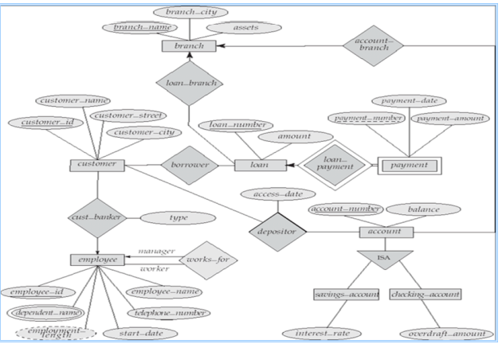

#### E-R Design Decisions设计过程需要考虑的：

使用**属性or实体集**来表示对象

现实世界的概念来讲用**实体集or关系集**

使用**三元关系or一对二元关系**

**强实体集or弱实体集**

用**特化/概化**（有助于设计的模块化）

使用**聚合**？（可以将聚合实体集视为单个单元，而不必担心其内部结构的细节）

### 5.8Reduction to Relation Schemas转换为关系模式

[E-R图转换为关系模型](https://www.cnblogs.com/yijiahao/p/11707183.html)

主键允许实体集和联系集统一（uniformly）表示为表示数据库内容(content)的关系模式**Relation Schemas**。 

符合 E-R 关系图的数据库可以由模式的集合表示。

对于每个实体集和关系集，都有一个唯一的模式，该模式被分配了相应实体集或关系集的名称。 

每个模式都有许多列（通常对应于属性），这些列具有唯一的名称。

#### 将实体集表示为模式

强实体集将简化为具有相同属性的架构。 弱实体集将成为一个表，其中包含标识强实体集的主键列

* 复合属性：为每个子属性创建一个单独的属性，不为复合属性自身创建创建一个单独的属性。
* 多值属性：创建新的关系模式来存储多值属性，并为这个关系构建外码约束。
* 派生属性：不在关系数据模型中显示达的表示出来。

弱实体集将成为一个表，其中包含标识强实体集的主键列

#### 将联系集表示为模式

多对多关系集表示为一个模式，其中包含两个参与实体集的主码的属性以及关系集的所有描述性属性。

多对一和一对多的联系集可以通过向"多"端添加一个额外的属性来表示，其中包含"一"端的主键

对于一对一关系集，可以选择任何一方作为"多"方 （可以将额外的属性添加到与两个实体集对应的任意一个表中）

#### 模式的冗余Redundancy of Schemas

如果**participation**在"**many**"端是**partial**，则将模式替换为与"许多"端对应的模式中的额外属性可能会导致空值**null**

连接弱实体集与其所依赖的强实体集的联系集的模式是冗余的。

### 5.9Database Design

### 将特化表示为模式Representing Specialization as Schemas

方法一：让高层实体形成一个模式。为每个低层实体集形成一个模式，包括较高级别的实体集的主键和本地属性。


缺点：想要获取低层实体信息，需要访问两个关系，一个对应于低级模式，另一个对应于高级模式。

方法二：为每一个实体集形成一个模式，其中包含所有的本地属性和继承属性。

如果特化是全部的，那么概化实体集的模式不需要存储信息，可以定义为包含特化关系并集的”视图“关系。但是外键约束可能仍然需要显示模式（explicit schema ）


缺点：street和city可能会冗余的存储给即是customer又是employee的人。

#### 与聚合相对应的模式Schemas Corresponding to Aggregation

若想要表示聚合，需要创建一个包含聚合联系的主键、联系实体集的主键和所有描述性属性的模式。

## 第六章 Relational Database Design关系数据库设计

### 6.1Features of Good Relational Design好的关系设计的特点

银行的模式

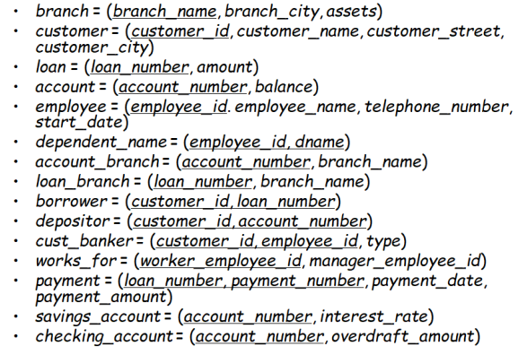

#### 设计选择-更小的模式smaller schemas

PPT4-6  在bor_loan中，由于loan_number不是候选码，因此贷款金额可能必须重复。 这表明需要分解bor_loan。

并非所有的分解都是好的。

有损分解**lossy decomposition**PPT7

无损分解**lossless decomposition**：分解后的关系自然连接等于原来的关系  PPT7-9  书P183

### 6.2Atomic Domains and First Normal Form原子域和第一范式

一个域是**原子的（atomic）**，如果该域的元素被认为是不可分的单元。如果关系模式R的所有属性的域都是原子的，则关系模式R属于**第一范式（First Normal Form,1NF）**

非原子值使**存储复杂化complicate storage**，并鼓励**冗余redundant**（重复）存储数据

原子性**Atomicity**实际上是如何使用域元素的属性==？？？PPT P12==

导致在应用程序中而不是在数据库中对信息进行编码是不好的（在应用程序中拆分而不是在数据库中拆分是不好的）。

#### Goal — Devise a Theory for the Following目标：为以下方面制定理论

确定特定关系R是否为”good“形式

如果关系R不是”good“形式，就把关系R分解为一组关系{*R*1*, R*2*, ..., Rn*}且满足	1.每个关系都是good形式	2.分解是无损连接分解**lossless-join decomposition**

我们的理论基于： 功能依赖关系**functional dependencies** 	多值依赖关系**multivalued dependencies**

### 6.3Decomposition Using Functional Dependencies使用函数依赖进行分解

#### functional dependency函数依赖

对合法关系集的约束Constraints。 

要求某一组属性的值唯一确定另一组属性的值。 

函数依赖关系是key概念（notion）的推广（generalization）。

（书上）令r(R)是一个关系模式。R的子集K是r(R)的超码（superkey）的条件是：在关系r(R)的任意合法实例中，对于r的实例中的所有元组对t<sub>1</sub>和t<sub>2</sub>总满足，若t<sub>1</sub>≠t<sub>2</sub>，则t<sub>1</sub>[K] ≠ t<sub>2</sub>[K]，也就是说，在关系r(R)的任意合法实例中没有两条元组在属性集K上可能具有相同的值。

（书上/PPT16）鉴于超码是能够唯一标识整条元组的属性集，函数依赖让我们可以表达唯一标识某些属性的值的约束。考虑一个关系模式r(R)，令a ⊆ R 且 b ⊆ R.

* 给定r(R)的一个实例，我们说这个示例**满足（satisfy）函数依赖** α → β 的条件是：对实例中所有的元组对t<sub>1</sub>和t<sub>2</sub>，若t<sub>1</sub>[α] = t<sub>2</sub>[α]，则t<sub>1</sub>[β] = t<sub>2</sub>[β]
* 如果在r(R)的每个合法实例中都满足函数依赖 α → β ，则我们说该函数依赖在模式r(R)上**成立（hold）**

K是关系模式R的的超码<font color='red'>⇔ </font>K→R

K是关系模式R的的候选码<font color='red'>⇔</font> K→R 并且不存在 α ⊂K, α→ R

函数依赖使我们可以表示无法使用超码表达的约束。PPT19

以两种方式使用函数依赖： 

* 判定关系的实例是否满足给定函数依赖集F。 如果关系 r 在函数依赖关系的集合 F 下是合法的，我们说 **r 满足satisfies F**。 
* 说明合法关系集上的约束。因此，我们将只关心满足给定函数依赖集的那些关系实例。如果我们希望只考虑模式R上满足就桉树以来即F的关系，我们说F在r(R)上成立**hold**。

注： 关系架构的特定实例(**specific instance**)可能满足函数依赖关系，即使函数依赖关系并非在所有合法实例上都成立。

有些函数依赖称为**平凡的trivial**，因为它们在所有关系中都满足。通常，如果 β ⊆ α ，那么α → β是平凡的。

#### 6.3.1Boyce-Codd Normal Form Boyce-Codd/BCNF范式

具有函数依赖集F的关系模式R属于BCNF的条件是，对F<sup>+</sup>中所有形如α → β的函数依赖（其中 β ⊆ R， α ⊆ R）,下面至少有一项成立：

1. α → β是平凡的函数依赖（即 β ⊆ α）~~不咋用~~
2. α 是模式R的一个超码

注：按照定义来看，任何只包含两个属性的模式都属于BCNF

##### Decomposing a Schema into BCNF将模式分解为BCNF

分解的一般规则：设R为不属于BCNF的一个模式。则存在至少一个非平凡的函数依赖α → β，其中α 不是R的超码，我们在设计中将R分解为：1. （α ∪ β） 2.（R- ( β - α ) )

##### BCNF和保持依赖BCNF and Dependency Preservation

约束**constraints**（包括函数依赖关系）在实践中检查成本高昂，除非它们**仅与一个**关系相关

有些情况下到BCNF的分解会妨碍对某些函数依赖的高效检查

并不能总是同时实现BCNF和保持依赖，所以考虑第三范式

##### Testing for BCNF检验

方法一：检查非平凡的依赖项α → β是否违反BCNF	1.计算α <sup>+</sup>（α 的属性闭包）	2.验证他是否包含R的所有属性，即它是R的超码。

方法二（简化的）：检查关系模式R是否属于BCNF，检查给定集合F中的函数依赖是否违反BCNF就足够了，而不是检查F<sup>+</sup>中的所有依赖项：如果F中没有一个函数依赖违反BCNF，则F<sup>+</sup>中的任何依赖项也不会违反BCNF

但是方法二中，在R分解中测试关系时，只是用F是不正确的，例子在PPT p67

#### 6.3.2Third Normal Form(3NF)第三范式

具有函数依赖集F的关系模式R属于**第三范式（3NF）**的条件是：对于F<sup>+</sup>中所有形如 α → β 的函数依赖（其中其中 β ⊆ R， α ⊆ R），以下至少一项成立：

1. α → β是一个平凡的函数依赖（即 β ⊆ α）
2. α 是模式R的一个超码
3. β - α 中的每个属性A都包含于R的一个候选码中。（注：β - α中的每个属性A可能包含于**不同的**候选码中）

任何满足BCNF 的模式都满足3NF，所以BCNF是比3NF更严格的范式。

**动机motivation**：有些情况下，BCNF不是保留依赖的，在更新时有效检查函数依赖的冲突是非常重要的。

第三范式为一个较弱的范式，称为第三范式，允许一些冗余（也会产生一些问题），但是可以在不计算连接的情况下在单个关系上检查函数依赖关系，并且在3NF中总是**无损连接lossless-join和保持依赖dependency preserving**的。

##### Testing for 3NF

优化：只需要检查F中的函数依赖，不需要检查F<sup>+</sup>中的所有函数依赖。

1. 如果α为超码，则使用属性闭包检查每个依赖项
2. 如果α不是超码，我们必须验证在β中的每个属性是否都包含在R的候选码中。（此测试很昂贵，因为涉及查找候选码）==3NF 检测已被证明是 NP-hard ppt 77==。有趣的是，分解成第三范式（稍后描述）可以在多项式时间(polynomial time)内完成。

### 6.4Functional Dependency Theory函数依赖理论

我们现在考虑范式理论，它告诉我们一组给定的函数依赖关系在**逻辑蕴涵logically imply**些函数依赖关系

然后，我们开发**算法algorithms**以生成**无损分解lossless decovmpositions**为BCNF和3NF。

然后，我们开发算法来测试分解是否**保留依赖dependency-preserving**

#### 6.4.1函数依赖集的闭包Closure of a Set of Functional Dependencies

给定关系模式r(R)，如果r(R)的每一个满足F的实例也满足f，则R上的函数依赖f被r上的函数依赖集F**逻辑蕴含（logically imply）**。eg.如果 *A* → *B* and *B* → *C*, 那么*A* → *C*

F<sup>+</sup>符号来表示F集合的**闭包（closure）**，也就是能够从给定F集合推导出的**所有**函数依赖的集合。F<sup>+</sup> 是 F 的超集superset。

我们可以使用以下三条规则寻找逻辑蕴涵的函数依赖，通过反复应用这些规则，可以找出给定F的全部F<sup>+</sup>，这组规则称为Armstrong‘s axioms（公理）

> 1. if β ⊆ α , then α → β           **(reflevity)**自反律
>
> 2. if α → β, then  γ α →γ β       **(augmentation)**增广律
>
> 3. if α → β , and β  → γ , then  α → γ  **(transitivity)**传递律
>
> Armstrong 公理是
>
> * sound（正确有效的），因为它们不产生任何错误的函数依赖，只产生成立的函数依赖。
>
> * complete （完备的），因为对于给定函数依赖集F，它们能产生全部F<sup>+</sup>.
>
> 为进一步简化，可以使用以下附加规则：
>
> 1. If  α → β holds *a*nd α → γ  holds,  then α → β γ  holds **(union)**合并律
>
> 2. If α → β γ holds,  then  α → β holds and α → γ  holds **(decomposition)**分解律
>
> 3. If α → β holds *a*nd β γ → δ holds,  then α γ → δ holds **(pseudotransitivity)**伪传递率


> 计算F<sup>+</sup>步骤：
>
> 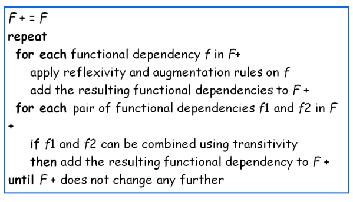
>
> 


#### 6.4.2属性集的闭包Closure of Attribute Sets

如果α → B，我们称属性B被 α **函数确定（functionally determine）**

我们将函数依赖集F下被 α 函数确定的所有属性的集合称为F下α 的闭包，记为 α<sup>+</sup>.

> 计算α<sup>+</sup>的算法：
>
> 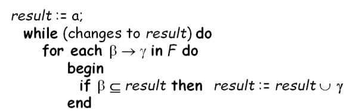
>
> 第一步：自反律
>
> 循环内：自反+传递（if后合并律）
>
> 有优化，以后讲

属性闭包算法的多种用途：

* 判断α是否是R的超码（计算α<sup>+</sup>，检查α<sup>+</sup>是否包含R中的所有属性）
* <font color='red'>※有用</font>：通过检查是否β ⊆ α<sup>+</sup>，我们可以检查函数依赖 α → β是否成立（是否属于F<sup>+</sup>）。
* 计算F<sup>+</sup>的方法：对任意的 γ ⊆ R，，我们找到γ<sup>+</sup>；对任意的S ⊆ γ<sup>+</sup>，我们输出一个函数依赖 γ → S。

#### 6.4.3正则覆盖Canonical Cover

函数依赖可能有**冗余依赖项 （redundant dependencies）**，可以从其他依赖项推断出这些依赖项

直观的说，F 的正则覆盖是一组等效于 F 的“最小”函数依赖项，没有冗余依赖关系或依赖关系的冗余部分

##### **无关属性extraneous attribute** 

> 如果去除函数依赖中的一个属性不改变该函数依赖集的闭包，则称该属性是无关的（extraneous）。**无关属性（extraneous attribute）**的形式化定义如下：考虑函数依赖集F及F中的函数依赖α → β。
>
> * 如果A ∈ α 并且F逻辑蕴涵（ F - { α → β } ）∪ { ( α  - A )→ β}，则属性A在 α 中是无关的。
> * 如果A ∈ β并且函数依赖集（ F - { α → β } ）∪ { α  → ( β- A ) }逻辑蕴涵F，则属性A 在 β中是无关的。

> 如何**检验**一个属性是无关属性。令R为一关系模式，且F是在R上成立的给定函数依赖集，考虑依赖 α → β 中的一个属性A
>
> * 如果A ∈ β ，计算F‘下的α<sup>+</sup>(α的闭包)；如果α<sup>+</sup>包含A ，则A在β中是无关的。
> * 如果A ∈ α ，令 γ = α - { A }，计算F下的γ<sup>+</sup>(γ的闭包)；如果γ<sup>+</sup>包含β中的所有属性，则A在α 中是无关的。

##### 正则覆盖Canonical Cover

F 的**正则覆盖canonical cover**F<sub>c</sub>是一个依赖集 ，使得 F 逻辑蕴涵 F<sub>c</sub> 中的所有依赖，并且 F<sub>c</sub> 逻辑蕴涵 F 中的所有依赖，此外Fc必须具有如下性质：

1.  F<sub>c</sub>中任何函数依赖都不含无关属性
2.  F<sub>c</sub> 中函数依赖的左半部都是唯一的。即，F<sub>c</sub>中不存在两个依赖 α1 → β1和 α1 → β1，满足 α1= α2。

> 正则覆盖算法：
>
> F<sub>c</sub> = F(<font color='red'>注意：以下的F都为F<sub>c</sub></font>)
>
> 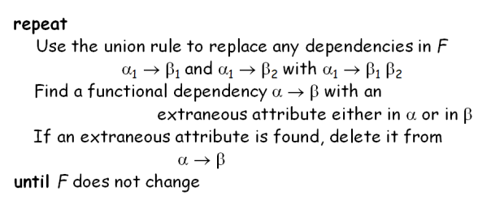
>
> 注意：删除某些无关属性后，合并律可能会又变得适用，因此必须重新应用
>
> 网上解释：[3NF分解](https://my.oschina.net/u/4411837/blog/4322411#:~:text=3NF%E5%88%86%E8%A7%A3%E4%B8%80%E8%88%AC%E5%88%86%E4%B8%BA%E4%B8%A4%E7%A7%8D%EF%BC%9A%20%E4%BF%9D%E6%8C%81%E4%BE%9D%E8%B5%96,%E5%92%8C%20%E6%97%A0%E6%8D%9F%E8%BF%9E%E6%8E%A5%20%E3%80%82)
>
> ​	右侧先拆单，依赖依次删，再拆左非单

#### 6.4.4无损分解Lossless-join Decomposition

无损分解和无损连接分解是相同的（有损分解和有损连接分解同理）

> 无损分解指的是对关系模式分解时，原关系模型下任一合法的关系值在分解之后应能通过自然联接运算恢复起来(分解后替代没有信息损失)。反之，则称为有损分解。

对于 R = （R1， R2） 的情况，我们要求对于架构 R 上的所有可能关系 R满足：r = Π <sub>R<sub>1</sub></sub>(r ) ⋈ Π<sub>R<sub>2</sub></sub>(r) ，则将 R 分解为 R1 和 R2 是无损分解

**检验无损分解**：如果以下两个函数依赖（**R1∩R2→R1 	R1∩R2→R2**）中至少有一个属于 F<sup>+</sup> 中时，则为无损分解，换句话说，如果**R1∩R2是R1或R2的超码**，R上的分解就是无损分解

#### 6.4.5保持依赖Dependency Preservation

令F为模式R上的一个函数依赖集，R1,R2,...,Rn为R的一个分解。F在R<sub>i</sub>的**限定(restriction)**是**F<sup>+</sup>**中所有只包含Ri中属性的函数依赖的集合F<sub>i</sub>。由于一个限定中的所有函数依赖只涉及一个关系模式的属性，因此判断这种依赖是否满足可以只检查一个关系。

**保持依赖Dependency Preservation**：

* 如果F上的每一个函数依赖都在其分解后的某一个关系上成立 ⇒ 分解是函数依赖的

* 对F上的**每一个**α→β使用下面的过程：

  result := α ;（赋值语句）

  while(result发生变化)do

  ​	for each 分解后的R

  ​		t=(result∩Ri)+ ∩Ri  

  ​		result=result∪t

  这里的属性闭包是在函数依赖集F下计算出来的。如果result中包含了β的所有属性，则函数依赖α→β。**分解是保持依赖的当且仅当上述过程中F的所有依赖都被保持。**

是无损分解不一定保持函数依赖（PPT p31）

如果 (*F*<sub>1</sub> ∪ *F*<sub>2</sub> ∪ *…* ∪ *F*<sub>n</sub> )<sup>+</sup> = *F* <sup>*+*</sup>，则分解为保持依赖的

为了检查在将 R 分解为 R1、R2、...， Rn 时是否保留了依赖项α → β，我们应用以下测试（对 F 执行属性闭包）算法和上面相同

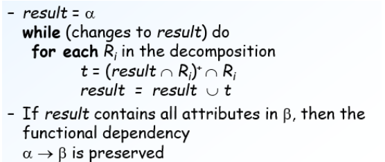

我们将测试应用于 F 中的所有依赖项，以检查分解是否保持依赖

此判定方法的代价是多项式时间（polynomial time），而不是计算 F<sup>+ </sup>和（F<sub>1</sub> ∪ F<sub>2</sub> ∪ ...∪ F<sub>n</sub>）<sup>+</sup>所需的指数时间的代价

### 6.5Algorithms for Functional Dependencies分解算法[B站](https://www.bilibili.com/video/BV1CD4y1974g?from=search&seid=11954966729834900882&spm_id_from=333.337.0.0)

#### 6.5.1 BCNF Decomposition Algorithm分解算法

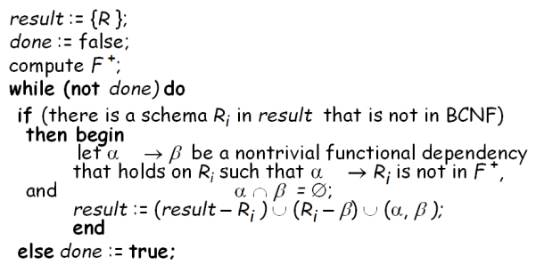

#### 6.5.2 3NF Decomposition Algorithm分解算法

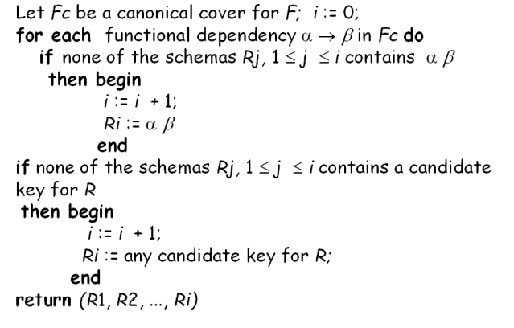

>  书中有可选的移除冗余关系的办法
>
>  上述算法确保：每个关系模式Ri都符合3NF	分解保留依赖和无损连接。
>
>  网上口诀：保函依赖分解题，先求最小依赖集（正则）。
>
>  ​		依赖两侧未出现，分成子集放一边，剩余依赖变子集。
>
>  ​		若要连接成无损，再添候选做子集。

#### 6.5.3 BCNF和3NF的比较

3NF的一个优点是，我们总是可以在满足无损分解和保持依赖的前提下得到3NF设计

3NF的一个缺点是，我们可能不得不用空值表示数据项间的某些可能有意义的联系，并且存在信息重复的问题。

对应用函数依赖进行数据库设计的目标是：1.BCNF	2.无损	3.保持依赖

如果不能全部做到，可以接受 1.缺少保持依赖	2. 3NF导致的冗余

### 6.6Decomposition Using Multivalued Dependencies 使用多值依赖的分解（第四范式的范围）

#### Multivalued Dependencies (MVDs)多值依赖

多值依赖并不排除某些元组的存在，而是要求某种形式的其他元组存在于关系中，由于这个原因，函数依赖有时称为相等产生依赖（equality-generating dependency），而多值依赖称为元组产生依赖（tuple-generating dependency）

> 令R为关系模式并且令α ⊆ *R* 且 β ⊆ *R.*  **多值依赖** α →→ β在R上成立的条件是：
>
> 在R的任意合法实例中，对于r中任意一对满足*t*<sub>1</sub>[α] = t<sub>2</sub> *[α]的元组对*t<sub>1</sub>和 *t<sub>2</sub>*，r中都存在元组*t*<sub>3</sub>和*t<sub>4</sub>*，使得
>
> *t*<sub>1</sub>[α] = *t<sub>2</sub>* [α] = *t*<sub>3</sub> [α] = *t*<sub>4</sub> [α]
>
> *t*<sub>3</sub>[β] = *t*<sub>1</sub> [β]
>
> *t*<sub>3</sub>[*R* *–* β] = *t*<sub>2</sub>[*R* *–* β]
>
> *t*<sub>4</sub> [β] = *t*<sub>2</sub>[β]
>
> *t*<sub>4</sub>[*R* *–* β] = *t*<sub>1</sub>[*R* *–* β] 

#### Use of Multivalued Dependencies多值依赖关系的使用

我们以两种方式使用多值依赖：

1. 检验关系以<font color='red'>确定determine</font>它们在一组给定的功能和多值依赖关系下是否合法
2. 在合法关系集上指定约束； 因此，我们将只考虑满足给定的函数依赖集和多值依赖集的关系。 

如果关系 r 无法满足给定的多值依赖关系，可以通过向 r 中增加元组构造一个确实满足多值依赖关系的关系r ‘。

从多值依赖的定义中可以推导出：α →→ β ⇒ α →→ β，也就是说每一个函数依赖也是一个多值依赖

D 的**闭包 D<sup>+</sup>** 是由D 逻辑蕴涵的所有函数和多值依赖关系的集合。 我们可以从D计算D<sup>+</sup>，使用函数依赖关系和多值依赖关系的形式定义。 我们可以用这样的推理来管理非常简单的多值依赖关系，这在实践中似乎是最常见的。 对于复杂的依赖关系，最好使用推理规则系统来推理依赖关系集。

#### Fourth Normal Form第四范式

关系模式 R 相对于函数和多值依赖关系的集合 D 在 4NF 中，如果对于 D+ 中形式的α →→ β的所有多值依赖项，其中α ⊆ R 和 β ⊆ R 至少有以下一项成立：

* α →→ β  是平凡的（即β ⊆ α 或 β ∪ α = R）

* α 是 R 超码 

如果关系在 4NF 中，则在 BCNF 中

#### 多值依赖关系的限制

==D 对 Ri 的限制是集合 Di 由 D+ 中仅包含 Ri 属性的所有功能依赖项 表单的所有多值依赖项   （  Ri） 其中   Ri 和    位于 D+ 中==


第四范式分解算法

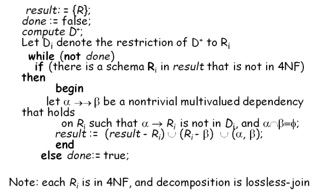

### 6.7More Normal Form更多的范式


#### 6.8Database-Design Process数据库设计过程

#### 规范化的目标Goals of Normalization

> 1. 设R是具有一组函数依赖项的关系模式
> 2. 确定关系R是否处于“良好”形式。
> 3. 如果关系模式R不是“good”形式，就把R分解为一组关系方案 { R <sub>1</sub>, R <sub>2</sub>, ..., R <sub>n</sub> }使得
>    1. 每个关系模式都处于good形式
>    2. 分解时**无损连接分解（lossless-join decomposition）**
>    3. 分解最好（preferably）**保留依赖（dependency preserving）**
>
> BCNF有多好？PPT p37==？==
>
> ​	BCNF中似乎存在未充分规范化的数据库模式。

### 6.9Modeling Temporal Data时态数据建模


## 第七章 Transactions事务

### Transaction Concept事务概念

**ACID特性（Properties）：**

​	**事务**是访问并可能更新各种数据项的程序执行**单元unit**。为了保持数据的完整性，数据库系统必须确保：

1. **原子性Atomicity**:事务的所有操作在数据库中要么全部正确反映出来，要么完全不反映。

2. **一致性Consistency**:隔离执行事务时(换言之                                                                                                                                 ，在没有其他事务并发执行的情况下)保持数据库的一致性。

3. **隔离性Isolation**:尽管多个事务可能并发执行，但系统保证，对于任何一对事务Ti和Tj)，在Ti看来,Tj或者在Ti开始之前已经完成执行，或者在Ti完成之后开始执行。因此，每个事务都感觉不到系统中有其他事务在并发地执行。

4. **持久性Durability**:一个事务成功完成后，它对数据库的改变必须是永久的，即使出现系统故障。

### Transaction State事务状态

我们需要更准确地定义一个事务成功完成的含义。为此我们建立了一个简单的抽象事务模型。事务必须处于以下状态之一。

* **活动的( active)**：初始状态,事务执行时处于这个状态。
* **部分提交的( partially committed)**：最后一条语句执行后。
* **失败的( failed)**:发现正常的执行不能继续后。
* **中止的(aborted)**:事务回滚并且数据库已恢复到事务开始执行前的状态后。
* **提交的(committed)**:成功完成后。

在不出现故障的情况下，所有的事务都能成功完成。但是，事务并非总能顺利执行完成，这种事务称为中止事务。如果要保持事务的原子性，中止事务必须对数据库的状态不造成影响。这样中止事务对数据库所做过的任何改变都必须撤销。一旦中止事务造成的变更撤销，我们就说事务**已回滚rolled back**。

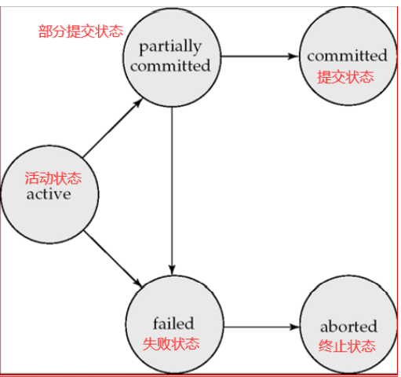

#### **Implementation of Atomicity and Durability原子性和持久性的实现**

数据库系统的恢复管理组件实现了对原子性和持久性的支持。（eg. shadow-database影子数据库，维持指针dp-pointer，指向数据库的当前副本，以下两种情况需要更新数据库新副本 1.事务达到部分提交  2.所有更新的页面都已刷新到磁盘。）

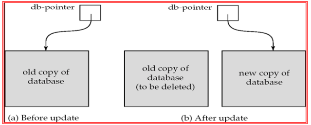

db_pointer始终指向数据库的当前一致副本。 如果事务失败，可以使用db_pointer指向的旧一致副本，并且可以删除卷影副本。 

影子数据库方案： 

> 假定一次只有一个事务处于活动状态。
>
> 假定磁盘不会出现故障
>
> 对文本编辑器很有用，但是 对于大型数据库来说效率极低（为什么？ 称为卷影分页的变体可减少数据复制，但对于大型数据库仍然不切实际 
>
> 不处理并发事务

### Concurrent Executions并发执行

允许多个事务在系统中同时运行。 优点是： 

* 提高了处理器和磁盘利用率**increased processor and disk utilization**，从而提高了事务吞吐量 
  * 例如，一个事务可以使用 CPU，而另一个事务正在读取或写入磁盘 
* 减少事务的平均响应时间**reduced average response time** ：短事务不需要等待长事务。 

并发控制方案**Concurrency control schemes** – 实现隔离的机制 

* 也就是说，控制并发事务之间的交互，以防止它们破坏数据库的一致性

#### Schedule机制

机制是一系列指令，用于指定执行并发事务指令的时间顺序 

* 一组交易的时间表必须由这些交易的所有指令组成

* 必须保留指令在每个单独交易中出现的顺序。 

成功完成其执行的事务将具有提交**commit**指令作为最后一个语句

未能成功完成其执行的事务将具有中止**abort**指令作为最后一个语句

### Serializability可串行化

**基本假设** – 每个事务都保持数据库的一致性。 因此，一组事务的串行执行可保持数据库的一致性。

如果某个（可能是并发的）计划等效于串行计划，则该计划是可序列化的。 不同形式的附表等同产生了以下概念： 1. 冲突可序列化**conflict serializability**           2. 视图可序列化性**view serializability**

简化的交易视图 我们忽略读取和写入指令以外的操作 我们假设事务可以在读取和写入之间对本地缓冲区中的数据执行任意计算。 我们简化的时间表仅包括读取和写入指令。

#### Conflicting Instructions 冲突的说明

交易的指令 li 和 lj 分别为 Ti 和 Tj，当且仅当存在一些由 li 和 lj 访问的项目 Q 时发生冲突，并且这些指令中至少有一个写了 Q。    

1. li = read（Q）， lj = read（Q）。  li 和 lj 不冲突。
2. li = read（Q）， lj = write（Q）。 它们相互冲突。
3. li = write（Q）， lj = read（Q）。  它们相互冲突
4. li = write（Q）， lj = write（Q）。 

它们相互冲突 直观地说，li和lj之间的冲突迫使它们之间有一个（逻辑的）时间顺序。 如果 li 和 lj 在一个时间表中是连续的，并且它们不冲突，那么即使它们在时间表中互换(**interchanged**)，它们的结果也将保持不变。

#### Conflict Serializability冲突可串行化

如果一个调度S可以通过一系列不冲突指令的交换来转换为调度S'，我们说S和S'是冲突等价**conflict equivalent**的。 

我们称一个调度 S 是冲突可串行化**conflict serializable**的，如果它与一个串行调是冲突等价**conflict equivalent**的、

#### Other Notions of Serializability可串行化性的其他概念

>  下面的计划生成与串行计划相同的结果，< T1、T5 >，但不是冲突等效或视图等效。
>
>  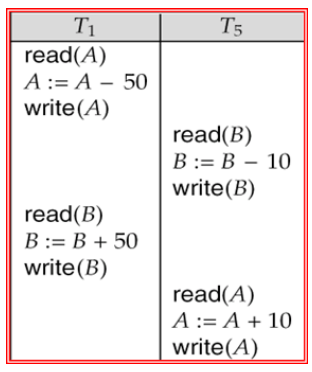
>
>  确定这种等效性需要分析读取和写入以外的操作。

### Testing for Serializability测试可串行化

考虑一组事务 T1、T2、...、Tn 的某个时间表 

优先级图**Precedence graph** — 一个直接图，其中顶点是事务（名称）。

如果两个事务发生冲突，我们绘制一个从 Ti 到 Tj 的弧线，Ti 访问了之前发生冲突的数据项。 在Tj执行read(Q)之前，Ti执行write(Q) 在Tj执行之前write(Q)，Ti执行 read(Q) 在Tj执行write(Q)之前，Ti执行write(Q) 我们可以按访问的项目标记弧线。

当且仅当明细表的优先级图是非循环的acyclic时，调度才可冲突序列化conflict serializable 。 

存在周期检测算法，需要 n<sup>2</sup> 数量级的运算，其中 n 是图中的顶点数。 （更好的算法采用 n + e 阶，其中 e 是边数。)

如果优先图是非循环的，则可以通过图的拓扑排序*topological sorting* 来获得可序列化顺序。

### Recoverability

#### Recoverable Schedules可恢复调度

可恢复调度( recoverable schedule):对于每对事务Ti和Tj，如果Tj读取了之前由Ti所写的数据项，则Ti先于Tj提交。例如，如果要使调度9是可恢复的，则T,应该推迟到T提交后再提交。

#### Cascading Rollbacks级联回滚

因单个事务故障导致一系列事务回滚的现象称为**级联回滚**( cascading rollback)。

#### Cascadeless Schedule无级联调度

级联回滚导致撤销大量工作，是我们不希望发生的。我们希望对调度加以限制，避免级联回滚发生。这样的调度称为无级联调度。规范地说，**无级联调度(cascadeless schedule)**应满足:对于每对事务Ti和Tj，如果Tj读取了先前由Ti所写的数据项，则Ti必须在Tj这一读操作前提交。容易验证每一个无级联调度也都是可恢复的调度。

#### Concurrency Control并发控制

数据库必须提供一种机制，以确保所有可能的调度都是 1.冲突或视图可序列化。 2.是可恢复的，最好是无级联cascadeless的

一次只能执行一个事务的策略会生成串行计划，但并发程度较差 

在执行调度后测试其可串行化有点为时已晚！ 

目标 – 开发可序列化的并发控制协议。

#### Concurrency Control vs. Serializability Tests并发控制与可序列化性测试

并发控制协议允许并发调度，但要确保调度是可冲突/视图序列化的，并且是可恢复和无级联的。

并发控制协议在创建优先级图时通常不会检查优先级图

​	相反，协议强加了一个避免不可序列化的时间表的纪律。 

不同的并发控制协议在它们允许的并发量和它们产生的开销量之间提供了不同的权衡。 

可串行化测试有助于我们理解并发控制协议为何正确。

#### Weak Levels of Consistency一致性水平低

某些应用程序更愿意处于较低的一致性水平下，允许不可序列化的计划

​	例如，想要获得所有帐户的近似总余额的只读事务 

​	例如，为查询优化计算的数据库统计信息可以是近似值

​	此类事务不必相对于其他事务进行序列化

性能的精度权衡Tradeoff accuracy for performance

#### Levels of Consistency in SQL-92一致性级别

•**Serializable** — default默认

•**Repeatable read可重复读取** — only committed records to be read, repeated reads of same record must return same value. However, a transaction may not be serializable – it may find some records inserted by a transaction but not find others.仅要读取的已提交记录，重复读取同一记录必须返回相同的值。 但是，事务可能不可序列化 – 它可能会找到事务插入的某些记录，但找不到其他记录。

•**Read committed读取已提交** — only committed records can be read, but successive reads of record may return different (but committed) values.只能读取已提交的记录，但连续读取的记录可能会返回不同（但已提交）的值。

•**Read uncommitted读取未提交** — even uncommitted records may be read.  甚至可能读取未提交的记录。


警告：默认情况下，某些数据库系统不确保可序列化调度为默认 例如，Oracle和PostgreSQL默认支持称为快照隔离的一致性级别（不是SQL标准的一部分）

### Implementation of Isolation

#### Transaction Definition in SQLSQL 中的事务定义

数据操作语言必须包含用于指定组成事务的操作集的构造。 

在 SQL 中，事务以隐式方式开始。 

SQL 中的事务的结束方式为： 

​	提交工作**Commit work** 提交当前事务并开始一个新事务。 

​	回滚工作**Rollback work** 会导致当前事务中止。 

在几乎所有数据库系统中，默认情况下，如果每个 SQL 语句成功执行，也会隐式提交 

​	隐式提交可以通过数据库指令关闭，例如，在JDBC中，connection. setAutoCommit（false）;
