#### 【第一题】：通过比较ISO七层模型、模型、和课堂上介绍的五层模型比较计算机网络体系结构，请画出三种体系结构的示意图，并分别描述、比较各层的功能和支持的协议。

答：三种体系结构的示意图及对应简要功能如下图所示：

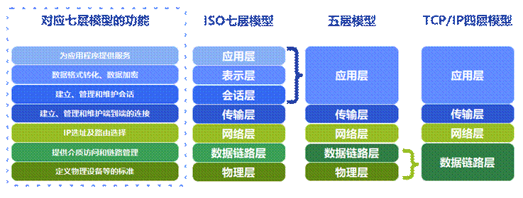

七层模型每层相对应的网络协议如下表所示：

| ISO七层协议模型 | 对应的协议                             |
| --------------- | -------------------------------------- |
| 应用层          | HTTP，TFTP，FTP，NFS，WAIS，SMTP，IMAP |
| 表示层          | Telnet，Rlogin，SNMP，Gopher           |
| 会话层          | SMTP，DNS                              |
| 传输层          | TCP，UDP                               |
| 网络层          | IP，ICMP，ARP，IGMP                    |
| 数据链路层      | PPP，MAC，TDMA，ARP，CSMA              |
| 物理层          | 大量IEEE协议                           |

ISO模型的**应用层**功能为：为计算机用户提供应用接口，也为用户直接提供各种网络服务，是最靠近用户的一层。

ISO模型的**表示层**功能为：提供各种用于应用层数据的编码和转换功能,确保一个系统的应用层发送的数据能被另一个系统的应用层识别，此外还可以进行数据压缩和加密。

ISO模型的**会话层**功能为：负责建立、管理和终止表示层实体之间的通信会话。该层的通信由不同设备中的应用程序之间的服务请求和响应组成。

以上提到的三层应用层、表示层和会话层，在四层和五层结构中被合并为应用层，也就是说在四五层的结构中应用层的功能和涉及的协议为这三层的功能和协议。以下是我的理解：首先，这三层都是处理的相同数据单位的数据，针对相同的数据来回的传输反而非常复杂；其次，如果没有将三层合并，那么应用层“做的事”就非常少，就只是对操作系统进行交互就可以了，层与层之间的封装传输也会浪费一些时间，所以不如将他们合并。

**传输层**的功能为：建立了主机端到端的链接，传输层的作用是为上层协议提供端到端的可靠和透明的数据传输服务，包括处理差错控制和流量控制等问题。该层向高层屏蔽了下层数据通信的细节，使高层用户看到的只是在两个传输实体间的数据通路。

**网络层**的功能为：通过IP寻址建立两个节点之间的连接，为源端的运输层送来的分组，选择合适的路由和交换节点，正确无误地按照地址传送给目的端的运输层。

**数据链路层**的功能为：将比特组合成字节,再将字节组合成帧,使用链路层地址来访问介质,并进行差错检测。ISO模型和五层的**物理层**的功能为：通过物理介质传输比特流。常用设备有（各种物理设备）集线器、中继器、调制解调器、网线、双绞线、同轴电缆。

在TCP/IP四层模型中将数据链路层和物理层合并为数据链路层，那么其功能也就是这两个层的合并，接下来是我自己的一些理解：之所以在TCP/IP四层模型中合并了这两个层，是因为对于TCP/IP协议或者说是传输层和网络层来说，物理层是完全透明的，只和应用层和数据链路层进行交互就足够了。

#### 【第二题】：如何理解HTTP协议是无状态的？以登录淘宝购物为例，举例说明有状态的场景、无状态的场景、以及为了解决无状态而引入Cookie之后的场景。

HTTP协议是无状态的是指协议对于事务处理没有记忆功能。缺少状态意味着，假如后面的处理需要前面的信息，则前面的信息必须重传，这样可能导致每次连接传送的数据量增大。优点是当服务器不需要前面信息时，应答更快。

直观地说，就是每个请求都是**独立的**。在同一个连接中，两个执行成功的请求之间是**没有关系的**。客户端和服务器端都不会保存之前请求或应答的数据或状态，服务器每次处理请求成功后就关闭连接，处理下一个任意的请求，不用管是谁发来的请求。

无状态的场景：用户登录淘宝，**输入用户名和密码**，把登录信息传给服务器，服务器进行业务处理，从底层数据库中判断登录信息正确，传回给用户**登录成功信息**，服务器处理完本次**连接结束**。当用户想要**请求查看历史订单**时，相当于输入查看订单的网址，向服务器**发送请求**，服务器接收到以后并不知道是谁发送的请求，客户端也**没有再次发送登录信息**，服务器端也不知道该返回谁的订单，返回这不是没登录就能查看的，就**返回了登录界面**，用户**再次输入用户名和密码**，服务器**再次处理登录信息**，然后重定向**返回历史订单消息**。也就是说当需要用到登录信息时，服务器都会返回到登录界面才知道是谁请求的，返回谁的数据，这样也可以实现使用，但是需要大量的登录输入信息的操作，并不能让用户满意。

有状态的场景：我的理解为session的机制就类似于这个“状态”，在服务器开辟一段缓存用来存放历史的状态等信息。用户还是登录淘宝，**输入用户名和密码**，把登录信息传给服务器，服务器进行业务处理，从底层数据库中判断登录信息正确，传回给用户**登录成功信息**，服务器处理完本次**连接结束**，但是服务器**记住了这个登录信息**，知道这个客户端发来的请求是请求谁的，这时用户想要**请求查看历史订单**时，相当于输入查看订单的网址，向服务器**发送请求**，服务器就很自然的返回了这个人的订单。

引入cookie之后的场景：我的理解cookie类似于一个客户端的记事本，与session不同的是在客户端维护所谓“状态”。还是用户登录淘宝，**输入用户名和密码**，此时**客户端记住了这个登录需要的用户名和密码**，然后把登录信息传给服务器，服务器进行业务处理，从底层数据库中判断登录信息正确，传回给用户**登录成功信息**，服务器处理完本次**连接结束**，用户想要**请求查看历史订单**时，相当于输入查看订单的网址，**cookie**在头部加上了登录信息**，向服务器**发送请求，服务器解析请求，返回这个人的订单，是每次都重新传了这个信息。

#### 【第三题】：什么是DNS？请以访问淘宝网主页www.taobao.com为例说明DNS的解析过程，并借助图表比较迭代查询和递归查询的区别。

DNS(Domain Name System)域名解析服务，最基本的作用就是将用户提供的域名转换成为服务器的地址。

DNS域名解析过程：

①在浏览器中输入www.taobao.com域名，回车请求。

②浏览器检查缓存中有没有域名对应的IP，如果有直接访问。

③在操作系统的hosts文件中有没有配置，如果有直接访问。

④向本地区的DNS域名服务器发起请求，如果能解析直接访问。

⑤到根域名服务器请求解析，根域名服务器返回顶级名称服务器-> com顶级名称服务器请求，顶级名称服务器返回二级名称服务器-> taobao.com二级名称服务器请求-> [www.taobao.com](http://www.taobao.com)权威名称服务器请求，结束后解析的结果返回给用户，客户端缓存在本地系统缓存中

⑥域名解析结束。

以下为迭代查询和递归查询的图表及区别对比表：

| **递归查询：**                                               | **迭代查询：**                                               |
| ------------------------------------------------------------ | ------------------------------------------------------------ |
| 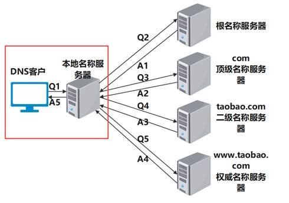                      | 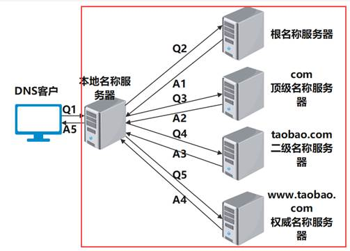                      |
| 主机向本地域名服务器一般递归查询。                           | 本地域名服务器向根域名服务器使用迭代查询。                   |
| 客户端只发一次请求，要求对方给出最终结果，如果对方不能给出就要找能解答这个查询的服务器 | 客户端发出一次请求，对方如果没有授权回答，它就会返回一个能解答这个查询的服务器 |
| 递归查询时，返回的结果只有：查询成功或查询失败。             | 迭代查询，返回的是最佳的查询点或者主机地址.                  |

一个很形象的比喻：

递归查询就像一个“懒惰”的老板，老板想吃冰淇淋，仅需传达给秘书（对于老板而言，去哪里买不需要关心，秘书可以解决）；秘书接到任务，去告诉店员要一个冰淇淋（对秘书来说，仅需传达给店员，不需要知道怎么做；店员会把想要的给他)；店员接到需求，生产出冰淇淋，交给秘书（问题最小单元触发，终止问题分解；向上反馈）；秘书拿到了冰淇淋，跑到公司交给老板（秘书得到结果，经过包装后，向上反馈）；老板拿到了冰淇淋（老板坐在办公室一动没动，得到了想要的东西）。

迭代查询就像一个“亲力亲为”的老板，老板想吃冰淇淋，问秘书怎么可以吃到（对于老板而言，秘书应该可以回答问题）；秘书把老板指向店铺（对于老板，知道了去哪里能买到冰淇淋的线索；对秘书而言，完成了"重定向"，任务就结束了）；老板对店员说，给我冰淇淋（老板把同样的问题问了一遍店员；相同逻辑的重复调用）；店员把冰淇淋递给老板；老板得到了想要的冰淇淋。（店员的任务就是把结果给顾客；而老板也得到了自己想要的）

#### 【第四题】：请在浏览器中访问淘宝网首页，并通过浏览器开发者模式获取此访问的HTTP请求和应答报文，将你获取到的完整报文头部信息截图粘贴于此：

| **Response:**  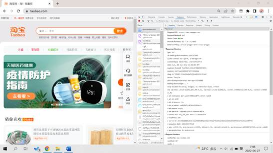 | **Request:**  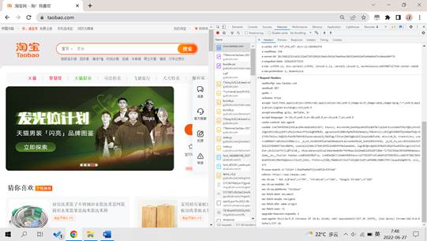 |
| ------------------------------------------------------ | ----------------------------------------------------- |
|                                                        |                                                       |

请以访问淘宝网主页为例，用图文解释HTTP请求的过程与原理。HTTP的请求方法有哪些？举例说明各自有哪些使用场景？HTTP哪些常用的状态码？举例说明各自有哪些使用场景。

HTTP【请求的过程】如下：

1. 用户在浏览器输入要请求的url

2. 浏览器向域名服务器申请解析用户输入的url（涉及DNS），具体解析见第三题

3. 浏览器获取目标IP后与服务器进行三次握手建立TCP连接（三次挥手）

4. TCP连接成功后，浏览器发送请求命令，命令类型包括如下介绍的9种

5. 浏览器发送完请求头信息后，服务器会相应一个状态码，然后开始回送应答HTTP

6. Web服务器向后端服务器请求业务操作，后端服务器返回实际数据

7. 服务器发送所请求的实际数据

8. 关闭TCP连接（4次挥手），请求结束。图片如下：

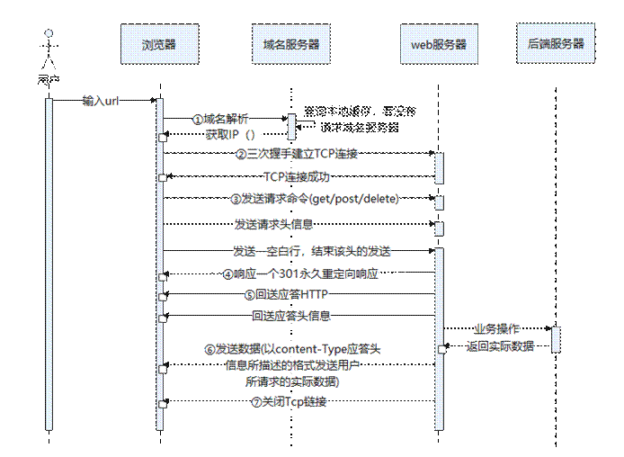

​    HTTP的【请求方法及各自的使用场景】：

GET：是最常用的HTTP请求方法，会显示请求指定的资源，并返回响应主体。GET请求可被缓存，会被保留在浏览器历史记录中，可被收藏为书签，不应在处理敏感数据时使用，有长度限制，只应当用于取回数据（不修改）。**比如**，淘宝进行的搜索、查询、页面资源获取都是使用的GET方法。

HEAD：与GET方法一样，都是向服务器发出指定资源的请求，只不过服务器将不传回资源的本文部分，只返回头部消息。使用场景：不需获取资源的时候，了解资源的一些信息；通过查看响应中的状态码，可以确定资源是否存在；通过查看首部，测试资源是否被修改。比如，淘宝中查看我的历史订单就会请求资源状态，请求的方式就是HEAD。

POST：特点几乎与get相对，请求不会被缓存，不会保留在浏览器历史记录中，不能被收藏为书签，对数据长度没有要求。用于向指定资源提交数据，请求服务器进行处理（例如提交表单或者上传文件），数据被包含在请求本文中。**比如**，登录淘宝需要填写的账号密码，点击登录以后提交表单请求的就是POST方法。

PUT：用于将数据发送到服务器来创建/更新资源。PUT方法是幂等的：调用一次与连续调用多次是等价的（即没有副作用），而POST方法连续调用多次可能会有副作用，**比如**将一个订单重复提交多次。

DELETE：请求服务器删除指定URL所对应的资源。但是，客户端无法保证删除操作一定会被执行，因为HTTP规范允许服务器在不通知客户端的情况下撤销请求。

TRACE：实现沿通向目标资源的路径的消息“回环”测试。

PATCH：用于对资源进行部分修改。

OPTIONS：用于获取目的资源所支持的通信选项。

CONNECT 方法可以开启一个客户端与所请求资源之间的双向沟通的通道。它可以用来创建隧道（tunnel）。

​    HTTP【常用的状态码及各自的使用场景】：状态码共有60余种，此处只写了15种

| 状态码 | 描述及场景                                     | 在淘宝中举例场景                                       |
| ------ | ---------------------------------------------- | ------------------------------------------------------ |
| 200    | 请求成功。一般的GET与POST请求都用这个          | 请求资源都需要，大多数都用                             |
| 204    | 无内容。服务器成功处理，但未返回内容           |                                                        |
| 206    | 部分内容。服务器成功处理了部分GET请求          | 当下载到一半                                           |
| 301    | 资源（网页等）被永久转移到其它URL              |                                                        |
| 302    | 临时移动。与301类似。但资源只是临时被移动      | 退出登录重定向时出现，但我没理解为啥会这样，截图在网盘 |
| 304    | 服务器执行成功，请求资源结果与本地缓存相同     | 比如刷新网页，部分资源显示                             |
| 307    | 临时重定向。与302类似。使用GET请求重定向       |                                                        |
| 400    | 客户端请求的语法错误，服务器无法理解           | 出错的情况，开发时常见                                 |
| 401    | 请求要求用户的身份认证                         |                                                        |
| 402    | 为将来预留的                                   |                                                        |
| 403    | 服务器理解请求客户端的请求，但是拒绝执行此请求 |                                                        |
| 404    | 请求的资源（网页等）不存在                     |                                                        |
| 500    | 服务器内部错误，无法完成请求                   | 出错的情况，开发时常见                                 |
| 501    | 服务器不支持请求的功能，无法完成请求           | 出错的情况，开发时常见                                 |
| 503    | 服务器暂时的无法处理客户端的请求               | 出错的情况，开发时常见                                 |

 

#### 【第五题】：请详细介绍一下TCP的三次握手机制。并通过实例说明TCP握手为什么是三次，为什么不能是两次？不能是四次？

a)三次握手是指建立一个TCP连接需要客户端和服务器共发送3个包。过程描述如下：

第一次握手(SYN=1,seq=x)：客户端发送一个TCP的SYN标志位为1的包，指明客户端打算连接的服务器的端口，以及自己的初始序号X,保存在包头的序列号字段里。
 发送完毕后，客户端进入SYN_SEND状态。

第二次握手(SYN=1,ACK=1,seq=y,ACKnum=x+1)：服务器发回确认包(ACK)应答。即SYN标志位和ACK标志位均为1。服务器端选择自己ISN序列号，放到seq域里，同时将确认序号(AcknowledgementNumber)设置为客户的ISN加1，即X+1。
 发送完毕后，服务器端进入SYN_RCVD状态。

第三次握手(ACK=1，ACKnum=y+1)：客户端再次发送确认包(ACK)，SYN标志位为0，ACK标志位为1，并且把服务器发来ACK的序号字段+1，放在确定字段中发送给对方，并且在数据段放写ISN的+1
 发送完毕后，客户端进入ESTABLISHED状态，当服务器端接收到这个包时，也进入ESTABLISHED状态，TCP握手结束。

下图1为课件(ch4 p158)上的有关TCP三次握手的过程：

| 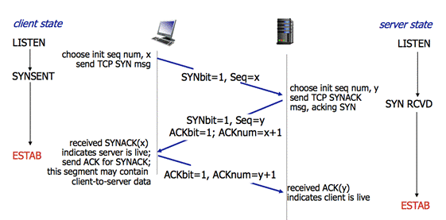  图 1课件上TCP三次握手图示 | 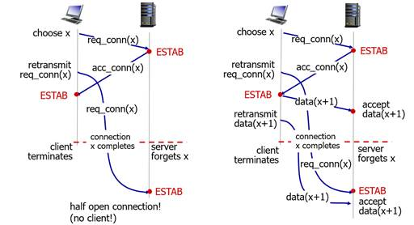  图 2课件上2次握手失败场景 |
| ------------------------------------------------------------ | ------------------------------------------------------------ |
|                                                              |                                                              |

b)课件中的【两次握手失败场景】如图2所示：第一种情况是半连接的情况，只有服务器维护了连接；第二个场景是旧的数据被当成新的数据接收了，导致错误。可以看出两次握手只能确保单通道是可靠的，而TCP是双工的，需要互相确认都可以发包和收包，所以不能两次握手。

假设【四次握手场景1】：将以上描述的客户端令为A，服务端令为B

①客户端发送同步信号SYN+A的初始序列号

②B确认收到A的同步信号，并记录A的ISN到本地，命名B的ACK序列号

③B发送同步信号SYN+B的初始序列号

④A确认收到B的同步信号，并记录B的ISN到本地，命名A的ACK序列号

显然二三步是可以合并发送一个包的，提高连接的速度和效率，TCP协议需考虑到可靠性和传输效率，所以四次握手是效率更低的。

假设【四次握手场景2】：将三次握手后再多一次服务器发送确认包，其实这样可以一直发送下去，但是三次就已经可以保证两端都是保持连接的了，这样不仅没有必要，而且对于什么时候“握手结束”界定也不够清晰。

综上所述只有三次握手才能满足TCP的要求，实现可靠和高效。

举例：当用户申请访问taobao.com时，先向淘宝的服务器发送一个请求包进入SYN_SEND状态，服务器收到后返回一个确认包应答进入SYN_RCVD状态，客户端收到后再次发送应答包，然后客户端进入ESTAB状态，客户端收到后也进入ESTAB状态。

#### 【第六题】：请详细介绍TCP四次挥手过程，并通过实例说明TCP挥手为什么需要四次呢？另外，TCP四次挥手过程中，为什么需要等待2MSL,才进入CLOSED关闭状态？

a)TCP四次挥手过程描述如下：

l 第一次挥手(FIN=1，seq=x)：假设客户端想要关闭连接，客户端发送一个FIN标志位置为1的包，表示自己已经没有数据可以发送了，但是仍然可以接受数据。
 发送完毕后，客户端进入FIN_WAIT_1状态。

l 第二次挥手(ACK=1，ACKnum=x+1)：服务器端确认客户端的FIN包，发送一个确认包，表明自己接受到了客户端关闭连接的请求，但还没有准备好关闭连接。
 发送完毕后，服务器端进入CLOSE_WAIT状态，客户端接收到这个确认包之后，进入FIN_WAIT_2状态，等待服务器端关闭连接。

l 第三次挥手(FIN=1，seq=y)：服务器端准备好关闭连接时，向客户端发送结束连接请求，FIN置为1。
 发送完毕后，服务器端进入LAST_ACK状态，等待来自客户端的最后一个ACK。

l 第四次挥手(ACK=1，ACKnum=y+1)：客户端接收到来自服务器端的关闭请求，发送一个确认包，并进入TIME_WAIT状态，等待可能出现的要求重传的ACK包。
 服务器端接收到这个确认包之后，关闭连接，进入CLOSED状态。

l 客户端等待了2MSL之后，没有收到服务器端的ACK，认为服务器端已经正常关闭连接，于是自己也关闭连接，进入CLOSED状态。

| 课件中关于四次挥手(ch4 p161)的图片如下：  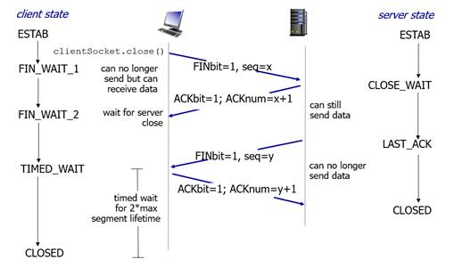 | 举例：比如客户端请求断开TCP连接，发出请求后进入FIN_WAIT_1状态（一次挥手）；服务端接到后发送确认包，但是自己还没准备好进入关闭状态，进入CLOSE_WAIT状态，客户端收到后进入FIN_WAIT_2状态（二次挥手）；服务端准备好关闭时，给客户端发送FIN包，自己进入LAST_ACK状态，客户端收到后TIME_WAIT状态（三次挥手）；客户端发送一个确认包，服务端收到后进入CLOSED状态，客户端发送确认包后再过两个最大段生命周期后进入CLOSED状态。 |
| ------------------------------------------------------------ | ------------------------------------------------------------ |
|                                                              |                                                              |

四次挥手把同意对方请求跟自身请求分离开。是因为在客户端请求断开时，服务器可能还有数据未发完，所以需要分开操作：先同意对方关闭连接，对方无法传输数据（第二次挥手）；自己若还有数据未发送完，接着发送直至全部发送完毕，请求自身关闭连接（第三次挥手），所以最终是四次挥手。

【等待2MSL,才进入CLOSED关闭状态原因】：考虑的是上述中的服务器端没有收到客户端进入TIMED_WAIT状态时发送的确认包的情况。服务器端会在自己LAST_ACK状态发送FIN包开始计时，如果2MSL之后还没有收到客户端的确认包就会重新发送自己的FIN包（超时重传），就视为客户端没有收到，而真实情况是有可能客户端收到了但是发来的确认包丢失，而如果服务器端重新发送的FIN就会在在客户端进入TIMED_WAIT状态后的2MSL之内到达客户端，客户端这个时候就可以知道服务器端没有收到自己的确认包重新发送，直到服务器端不再继续向客户端发送FIN包。

#### 【第七题】：与UDP相比，TCP提供了可靠传输、流量控制和拥塞控制等服务。TCP协议是如何保证可靠传输的？谈谈你对停止等待协议、ARQ协议和滑动窗口协议的理解？

TCP保证可靠传输的手段：

l TCP连接的每一端都设有两个窗口——一个发送窗口和一个接收窗口。

l TCP给发送的每一个包进行编号，接收方对数据包进行排序，把有序数据传送给应用层。

l TCP的可靠传输机制用字节的序号进行控制，所有的确认都是基于序号而不是报文段。

l TCP在IP不可靠服务的基础上建立了rdt，手段包括管道化的报文段（GBN/SR）、累计确认（GBN）、单个重传定时器（超时重传）

l TCP的接收端会丢弃重复的数据。

l 校验和：TCP将保持它首部和数据的检验和。这是一个端到端的检验和，目的是检测数据在传输过程中的任何变化。如果有差错，就丢弃这个报文段和不确认收到此报文段。

l 流量控制：TCP的接收端只允许发送端发送接收端缓冲区能接纳的数据。当接收方来不及处理发送方的数据，能提示发送方降低发送的速率，防止包丢失。

l 拥塞控制：当网络拥塞时，减少数据的发送。

 

ARQ（自动重传）协议：有很多种类，是指无需接收方请求发送方重传某个出错分组就可以有重传行为的一类协议，包括停止等待ARQ，回退N步ARQ（滑动窗口协议）、选择重传ARQ协议，只是用不同的原理实现可靠。

停止等待协议：发送方设置超时计时器，每次发送完一个分组就开始计时，暂时保存副本，等待确认分组，确认分组收到后再传输下一个，超时计时器到时间就视为对方没有收到分组，就进行重传，如果收到了迟到的确认也什么都不做。此方式信道利用率很低等待时间长，优点是实现容易。是最简单的ARQ协议。

滑动窗口协议：发送方设置超时计时器，发送方需要维持窗口，接收方只需一个缓存单元，接收方采用累计确认——只发送顺序接受的最高序号的分组，当收到乱序的分组进行丢弃（接收方不进行缓存），很可能会产生重复的ACK；发送方每发送一个分组就开始计时，当计时器时间到了还没有收到这个分组或这个分组以后的ACK，就将窗口内这个分组之后的所有分组都进行重传。优点是简单，所需资源少（接收方只维持一个窗口）；缺点是一旦出错，回退N步（重传这个以后的所有分组）代价更大，适用于出错少没必要使用复杂的SR的情况。

#### 【第八题】：做到这道题目，你突然发现网络变慢，所以你想通过ICMP协议做一些简单的网络诊断。

首先你要查看本机网络适配器的全部配置信息，请在console中完成此任务，并将结果截图（需包含完整console边框）粘贴于此：

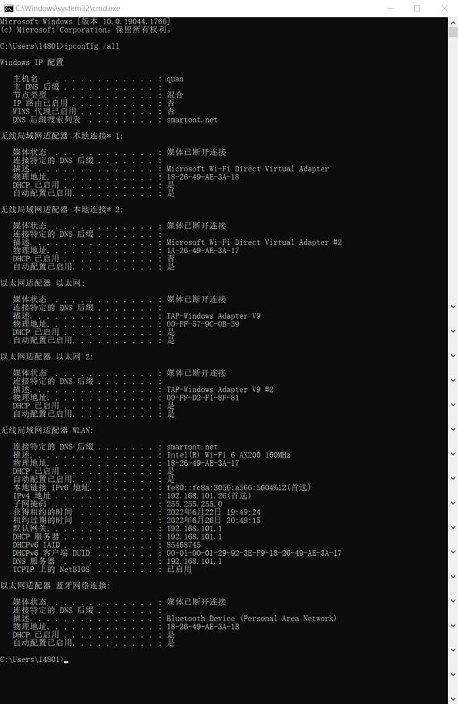

 

接下来，在console内继续进行本机回路测试，请将结果截图（需包含完整console边框）粘贴于此：

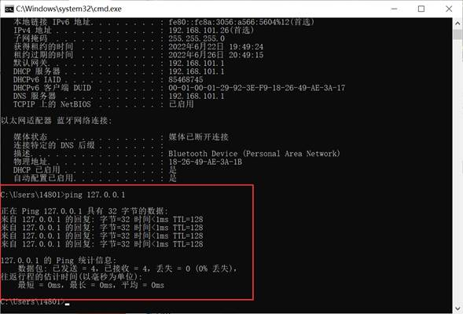

在确定本机回路畅通后，你又使用相同的命令对淘宝网主页进行了连通性测试，请将结果截图（需包含完整console边框）粘贴于此：

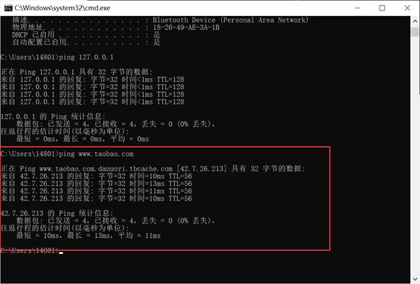

比较本机回路测试和远程主机连通性测试的结果，你都有哪些发现？

【不同点】

l 显然可以看到本机回路测试的往返行程的估计时间都是0ms，本机回路没有经过路由器，淘宝的往返行程估计时间要更长。

l 本机回路测试的TTL=128，而淘宝的TTL=56，TTL是由发送主机设置的，以防止数据包不断在IP互联网络上永不终止地循环，可以由此推断出发送的主机操作系统（未被修改的），本机回路测试中TTL=128（Windows系统设置）-0（经过路由器个数），ping淘宝时的TTL=64（LINUX设置的）-11（经过路由器个数）

l 两次连接的目标主机不同，一个是本机127.0.0.1，一个是42.7.26.213。

【相同点】

l 两次无论是哪次的发送和接收数据都是32字节，说明本机回路和远程淘宝服务器都是可以连接的，且丢失率都为0%。

 

 

#### 【第九题】：确定链路连通正常后，你猜测网络卡顿可能是由于路由延迟产生的，那么接下来你将通过console命令对路由信息进行测试。

首先，请显示本机路由表信息，将结果截图（需包含完整console边框）粘贴于此：

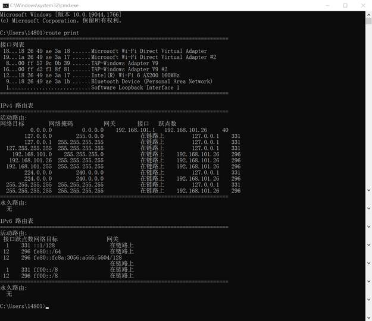

接下来，你要探测从本机到淘宝网服务器的路由信息，请将结果截图（需包含完整console边框）粘贴于此：

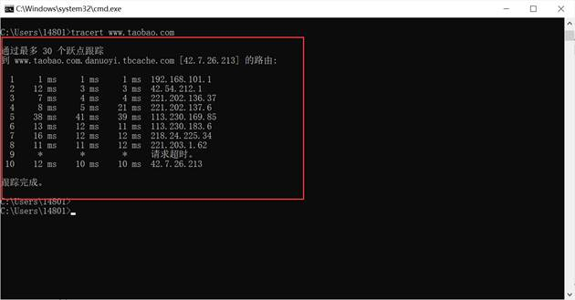

这时，你发现淘宝网上没有找到你想找的东西，想要再去ebay（www.ebay.com）逛一逛，请探测本机到ebay服务器的路由信息，并将结果截图（需包含完整console边框）粘贴于此：

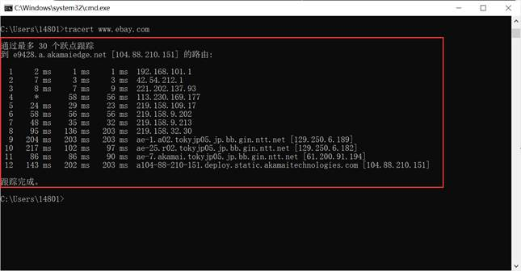

请观察两次路由探测的结果，分析其中的异同点：

【相同点】

第一次和第二次的第一个路由和第二个路由的IP相同，时间也差不多，经过查询第一个路由是和本地在同一个局域网下的，第二个路由是联通代理商在这个地区的局域路由。

【不同点】

第二次从3-> 4的时间变慢，经过查询是归属地出市了的原因，3是在本市的（辽宁锦州），4在省会（辽宁沈阳）。

第二次从8-> 9后时间突然再次变慢，在IP地址查询工具查询得知8为中国 联通骨干网，9的归属地就在美国了，可以看出路由转发到了国外，且速度变慢，说明距离更远的服务器会更慢一点，是受物理因素制约的；而淘宝的路由跟踪的IP都是辽宁省（也是在辽宁请求访问的）内的，所以自然就更快一些。

而第一次的路由探测时间几乎没有特别慢的，因为目标IP就在省内。

淘宝的路由探测有一次是请求超时的。

 

#### 【第十题】：这时，细心的你可能会发现，访问淘宝网的URL协议并不是我们常见的HTTP，而是HTTPS。那么，什么是HTTPS？HTTPS与HTTP的区别何在？请用借助图表描述HTTPS的实现流程。

答：HTTPS在HTTP上构建SSL加密层，并对传输的数据进行加密。它是HTTP协议的安全版本。HTTPS的主要功能为：加密数据并建立信息安全通道，以确保传输过程中的数据安全；验证网站服务器的真实身份。区别共总结出六条，如下：

①HTTPS基于传输层，HTTP基于应用程序层;

②HTTP明文传输，数据都是未加密的，安全性较差，HTTPS（SSL+HTTP）数据传输过程是加密的，安全性较好;

③HTTPS协议需要到CA申请证书;

④HTTP页面响应速度比HTTPS快;

⑤HTTP用的端口是 80，HTTPS是 443;

⑥HTTPS是建构在 SSL/TLS之上的HTTP协议，所以HTTPS更耗费服务器资源。

HTTPS的实现流程如下图所示：

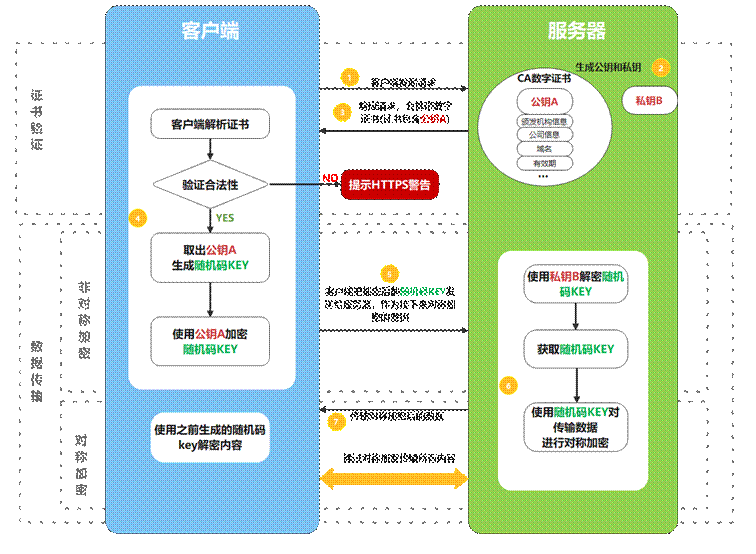

实现流程的描述如下：

1.客户端发起HTTPS请求：（用户在浏览器里输入一个https网址，申请连接）

2.有证书的服务端生成本次的私钥和公钥：私钥自己保存，用公钥加密的内容必须用私钥才能解开，同样，私钥加密的内容只有公钥能解开。

3.服务端对请求进行响应，向客户端发送数字证书（包括本次的公钥）

4.客户端解析证书，然后生成随机码KEY，并通过公钥进行加密。

5.传送加密后的随机码KEY：目的是让服务端得到这个随机值，之后客户端和服务端的通信就通过这个随机值来进行加密解密了。

6.服务端用私钥解密，得到了客户端传过来的随机值(私钥)，然后把内容通过该值进行对称加密传输，也就是使用同一个“加密暗号”。

7.服务端传输加密后的信息

8.客户端解密信息，并循环7、8两步，直到断开连接。
