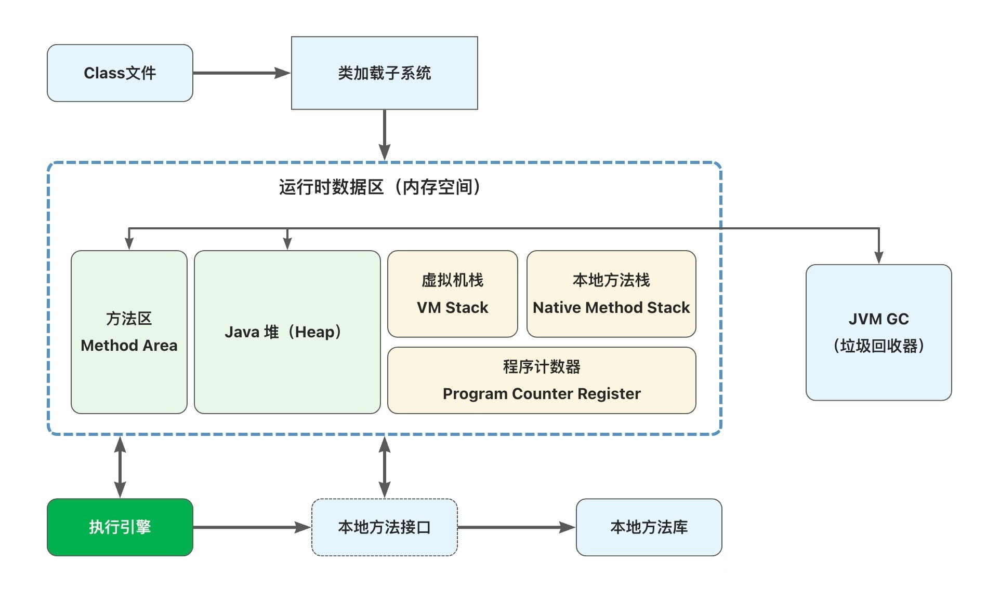
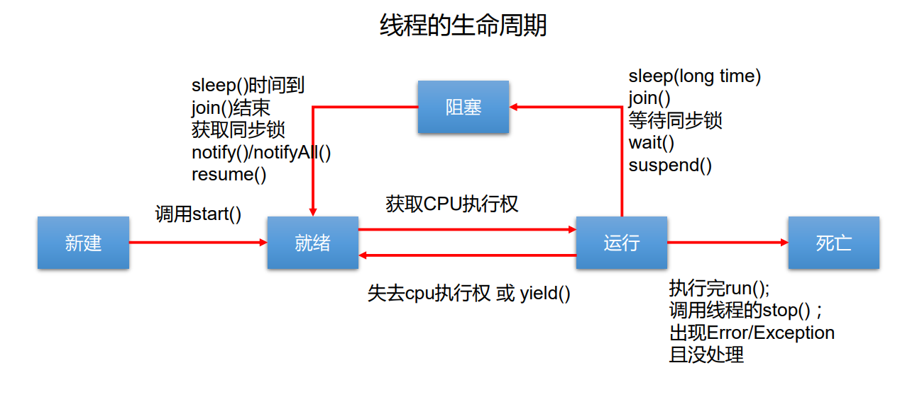

### 1.进程与线程

- 进程是执行程序的一次**执行过程**，是一个动态的概念，是系统**分配资源**的基本单位
- 一个进程可以包含若干个线程，线程是**CPU调度和执行的单位**


**程序**是指令、数据及其组织形式的描述，进程是**程序**的实体。

每个线程有自己**独立**的**虚拟机栈、程序计数器**

多个线程**共享**同一个进程中的结构：**方法区、堆**




单核CPU和多核CPU的理解：

* 单核CPU，其实是一种假的多线程，因为在一个时间单元内，也只能执行一个线程 的任务。例如：虽然有多车道，但是收费站只有一个工作人员在收费，只有收了费 才能通过，那么CPU就好比收费人员。如果有某个人不想交钱，那么收费人员可以 把他“挂起”（晾着他，等他想通了，准备好了钱，再去收费）。但是因为CPU时 间单元特别短，因此感觉不出来。
* 多核才能更好的发挥多线程的效率。（现在的服务器都是多核的）

Java应用程序至少3个线程：

* main()主线程
* gc()垃圾回收线程（典型的守护线程，如果JVM中只有守护线程，那么将退出）
* 异常处理线程


并行与并发：

并行：多个CPU同时执行多个任务。多个人做多件事。

并发：一个CPU(采用时间片)同时执行多个任务。一个人做多件事。


### 2.创建线程的方式：

#### 方式一：继承Thread类

1. 定义子类继承Thread类
2. 子类中**重写Thread类中的run方法**
3. 创建Thread子类对象，即创建了线程对象
4. 调用线程对象start方法：启动线程，调用run方法。

注意：

* 如果自己手动调用run()方法，那么就只是普通方法，没有启动多线程模式
* run()方法由JVM调用，什么时候调用，执行的过程控制都有操作系统的CPU 调度决定
* 想要启动多线程，必须调用start方法
* 一个线程对象只能调用一次start()方法启动，如果重复调用了，则将抛出以上的异常“IllegalThreadStateException”，如果再启动一个线程，必须重新创建一个Thread子类的对象，调用此对象的start()方法

#### 方式二：实现Runnable接口:

1. 创建一个实现了Runnable接口的类
2. 实现类去**实现Runnable中的抽象方法**: run()
3. 创建实现类的对象
4. 将**此对象作为参数传递**到Thread类的构造器中，创建Thread类的对象
5. 通过Thread类的对象调用start()


比较创建线程的两种方式：

开发中：优先选择实现Runnable接口的方式。原因如下:

1. 实现的方式没有类的**单继承性的局限**性
2. 实现的方式更适合来处理**多个线程**有**共享数据**的情况。

联系：`public class Thread extends Object implements Runnable`

相同点：两种方式都需要重写run()，将线程要执行的逻辑声明在run()中，这两种方式要想启动线程，都要调用Thead类中的start()方法


#### 方法三：实现Callable接口：-->JDK5.0以后新增的

1. 借助FutureTask执行

   FutureTask类同时实现了两个接口，Future和Runnable接口，所以它既可以作为Runnable被线程执行，又可以作为Future得到Callable的返回值。

   ```java
     //定义实现Callable接口的的实现类重写call方法。
     public class MyCallableTask implements Callable<Integer>{
         @Override
             public Integer call() throws Exception {
                //TODO 线程执行方法
             }
     }
     ---------------------------------------------------------
     //创建Callable对象
     Callable<Integer> mycallabletask = new MyCallableTask();
     //开始线程
     FutureTask<Integer> futuretask= new FutureTask<Integer>(mycallabletask);
     new Thread(futuretask).start();
     --------------------------------------------------------
     通过futuretask可以得到MyCallableTask的call()的运行结果：
     futuretask.get();
   
   ```

   

2. 借助线程池来运行

   - 线程池中执行Callable任务原型：

   ```java
     public interface ExecutorService extends Executor {
         //提交一个Callable任务，返回值为一个Future类型
         <T> Future<T> submit(Callable<T> task);
   
             //other methods...
     }
   ```

   - 借助线程池来运行Callable任务的一般流程为

   ```java
      ExecutorService exec = Executors.newCachedThreadPool();
      Future<Integer> future = exec.submit(new MyCallableTask());
   ```

   ​		通过future可以得到MyCallableTask的call()的运行结果： future.get();

   

##### Runnable和Callable的区别：

- 1、Callable规定的方法是call(),Runnable规定的方法是run().
- 2、Callable的任务执行后可返回值（支持泛型的返回值），而Runnable的任务是不能返回值的
- 3、call方法可以抛出异常，run方法不可以
- 4、运行Callable任务可以拿到一个Future对象，表示异步计算的结果。它提供了检查计算是否完成的方法，以等待计算的完成，并检索计算的结果。通过Future对象可以了解任务执行情况，可取消任务的执行，还可获取执行结果。

##### Future接口

- Future是一个接口，代表了一个异步计算的结果。接口中的方法用来检查计算是否完成、等待完成和得到计算的结果。
- 当计算完成后，只能通过get()方法得到结果，get方法会阻塞直到结果准备好了。
- 如果想取消，那么调用cancel()方法。其他方法用于确定任务是正常完成还是取消了。
- 一旦计算完成了，那么这个计算就不能被取消。
- 可以对具体Runnable、Callable任务的执行结果进行取消、查询是 否完成、获取结果等。


##### FutureTask类

- FutureTask类实现了RunnableFuture接口，而RunnnableFuture接口继承了Runnable和Future接口，所以说FutureTask是一个提供异步计算的结果的任务。
- FutureTask可以用来包装Callable或者Runnbale对象。因为FutureTask实现了Runnable接口，所以FutureTask也可以被提交给Executor（如上面例子那样）。
- FutrueTask是Futrue接口的唯一的实现类

#### 方法四：使用线程池

* 背景：经常创建和销毁、使用量特别大的资源，比如并发情况下的线程， 对性能影响很大。
* 思路：提前创建好多个线程，放入线程池中，使用时直接获取，使用完 放回池中。可以避免频繁创建销毁、实现重复利用。类似生活中的公共交 通工具。
* 好处：
  * 提高响应速度（减少了创建新线程的时间）
  * 降低资源消耗（重复利用线程池中线程，不需要每次都创建） 
  * 便于线程管理
    * corePoolSize：核心池的大小
    * maximumPoolSize：最大线程数
    * keepAliveTime：线程没有任务时最多保持多长时间后会终止


* 线程池相关的API：ExecutorService 和 Executors
* ExecutorService：真正的线程池接口。常见子类ThreadPoolExecutor
  * void execute(Runnable command) ：执行任务/命令，没有返回值，一般用来执行 Runnable
  * Future submit(Callable task)：执行任务，有返回值，一般又来执行 Callable
  * void shutdown() ：关闭连接池
  * Executors：工具类、线程池的工厂类，用于创建并返回不同类型的线程池
    * Executors.newCachedThreadPool()：创建一个可根据需要创建新线程的线程池
    * Executors.newFixedThreadPool(n); 创建一个可重用固定线程数的线程池
    * Executors.newSingleThreadExecutor() ：创建一个只有一个线程的线程池
    * Executors.newScheduledThreadPool(n)：创建一个线程池，它可安排在给定延迟后运 行命令或者定期地执行。


Java的调度方法

* 同优先级线程组成先进先出队列（先到先服务），使用**时间片**策略
* 对高优先级，使用优先调度的抢占式策略

注：

* 线程创建时继承父线程的优先级

* 低优先级只是获得调度的概率低，并非一定是在高优先级线程之后才被调用


### 3.线程的生命周期




suspend()方法可能死锁，所以不使用，resume()与其搭配，所以也过时啦


### 4.线程的同步

Java对于多线程的安全问题提供了专业的解决方式：同步机制

如何解决线程同步问题

#### 方法一：同步代码块

```java
synchronized (对象/同步监视器){ 
	// 需要被同步的代码
} 
```

说明:

1. 操作共享数据的代码，即为需要被同步的代码。-->不能包含代码多了，也不能包含代码少了。
2. **共享数据**:多个线程共同操作的变量。比如: ticket就是共享数据。
3. **同步监视器**,俗称:锁。任何一个类的对象，都可以充当锁。
   要求:多个线程必须要共用同一把锁。

补充：在实现Runnable接口创建多线程的方式中，我们可以考虑使用this充当同步监视器。
在继承Thread类创建多线程的方式中，慎用this充当同步监视器，考虑使用当前类充当同步监视器。


#### 方法二：synchronized还可以放在方法声明中，表示整个方法为同步方法。 例如： 

```java
public synchronized void show (String name){
    //非静态方法锁的是this（当前对象）
    //静态方法锁的是class
}
```

如果操作共享数据的代码完整的声明在一个方法中，我们不妨将此方法声明同步的。

关于同步方法的总结:

* 同步方法仍然涉及到同步监视器，只是不需要我们显式的声明。
* 非静态的同步方法,同步监视器是: this
  静态的同步方法，同步监视器是:当前类本身

#### 方法三：Lock锁——JDK5.0新增

ReentrantLock，意思是“可重入锁”。ReentrantLock是唯一实现了Lock接口的类，并且ReentrantLock提供了更多的方法。下面通过一些实例看具体看一下如何使用ReentrantLock。

```java
class A{
    private final ReentrantLock lock = new ReenTrantLock();
    public void m(){
        lock.lock();
        try{
        	//保证线程安全的代码;
        }
        finally{
        	lock.unlock(); 
        }
    }
}

```


##### synchronized 与 Lock 的对比

1. Lock是显式锁（**手动开启和关闭锁**，别忘记关闭锁），synchronized是 **隐式锁**，出了作用域**自动释放**
1. Lock只有代码块锁，synchronized有代码块锁和方法锁
1. 使用Lock锁，JVM将花费较少的时间来调度线程，性能更好。并且具有 更好的扩展性（提供更多的子类）

优先使用顺序： Lock＞ 同步代码块（已经进入了方法体，分配了相应资源） ＞ 同步方法 （在方法体之外）


##### 释放锁的操作

* 当前线程的同步方法、同步代码块执行结束。
* 当前线程在同步代码块、同步方法中遇到break、return终止了该代码块、 该方法的继续执行。
* 当前线程在同步代码块、同步方法中出现了未处理的Error或Exception，导致异常结束。
* 当前线程在同步代码块、同步方法中执行了线程对象的wait()方法，当前线 程暂停，并释放锁。

##### 不会释放锁的操作

* 线程执行同步代码块或同步方法时，程序调用Thread.sleep()、 Thread.yield()方法暂停当前线程的执行
* 线程执行同步代码块时，其他线程调用了该线程的suspend()方法将该线程挂起，该线程不会释放锁（同步监视器）。
  * 应尽量避免使用suspend()和resume()来控制线程

### 5.线程的通信

#### wait() 与 notify() 和 notifyAll()

* wait()：令当前线程挂起并放弃CPU、同步资源并等待，使别的线程可访问并修改共享资源，而当 前线程排队等候其他线程调用notify()或notifyAll()方法唤醒，唤醒后等待重新获得对监视器的所有 权后才能继续执行。
* notify()：唤醒正在排队等待同步资源的线程中优先级最高者结束等待
* notifyAll ()：唤醒正在排队等待资源的所有线程结束等待

这三个方法只有在synchronized方法或synchronized代码块中才能使用，否则会报 java.lang.IllegalMonitorStateException异常。

因为这三个方法必须有锁对象调用，而任意对象都可以作为synchronized的同步锁， 因此这三个方法只能在**Object类**中声明。

三个方法的调用者必须是同步代码块或同步方法中的同步监视器。


#### sleep()和wait()方法的异同：

1. 相同点：一旦执行方法，都可以使得当前的线程进入阻塞状态。
2. 不同点：
   1. 两个方法声明的位置不同：Thread类中声明sleep() , Object类中声明wait()
   2. 调用的范围不同：sleep()可以在任何需要的场景下调用，wait()必须使用在同步代码块或同步方法中
   3. 关于是否释放同步监视器：如果两个方法都使用在同步代码块或同步方法中，sleep()不会释放锁，wait()会释放锁

