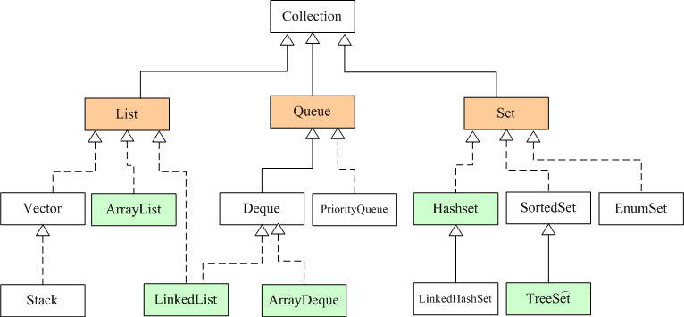
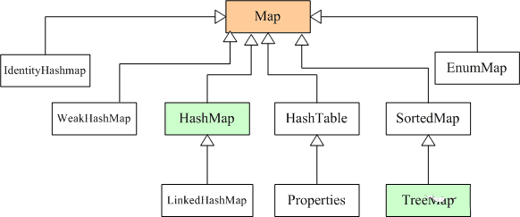
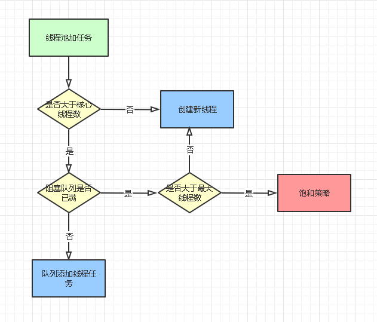
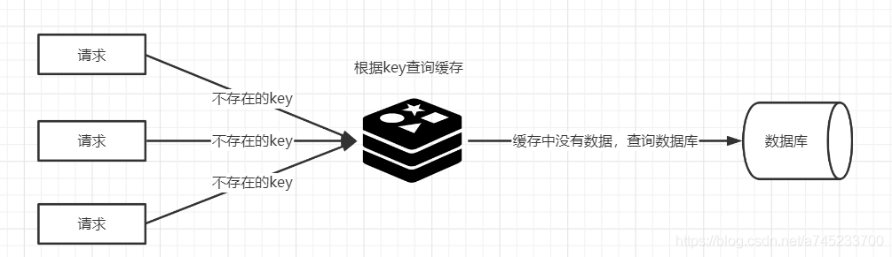
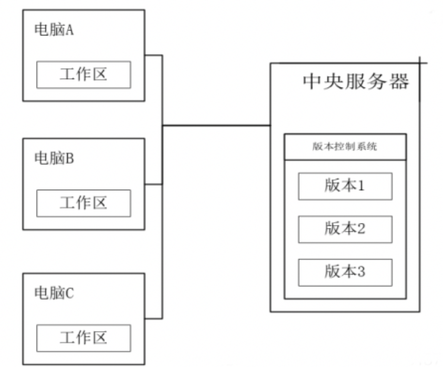
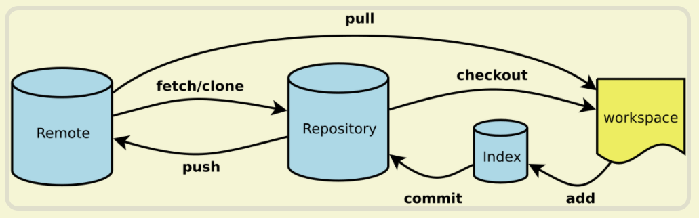
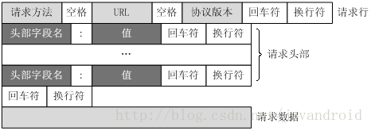
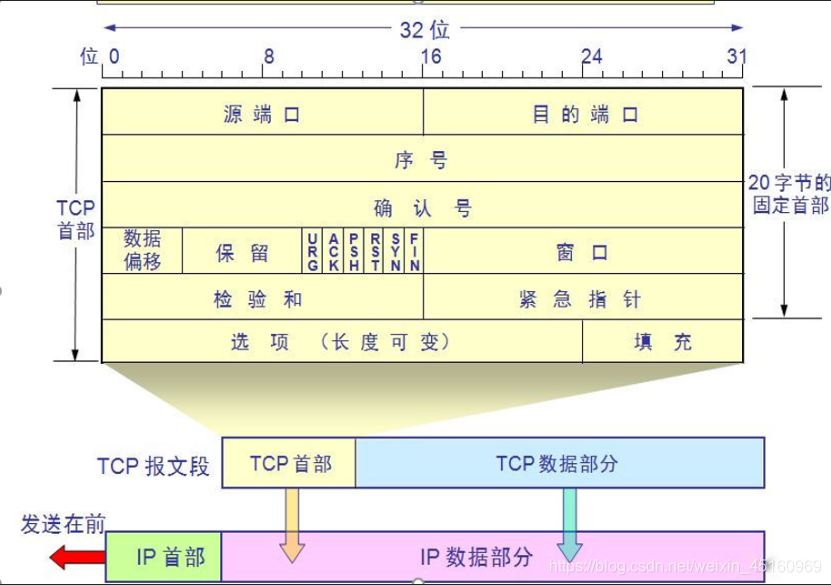
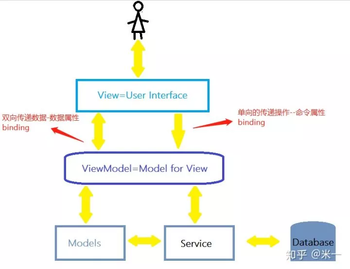

还是想系统的梳理一下被问到的问题，有些问题确实有点相似，春招依托答辩总要吸取一些经验的

# Java

## 引入

### Java能用来干什么

Java是一种可以撰写跨平台应用程序的、面向对象的程序设计语言。是一种编程语言，不过是一种针对jvm的语言，Java编译后是字节码，而jvm会把这些字节码解释成机器码，然后做出相应的动作。

- 可以做桌面GUI应用程序，早期的 GUI 程序主要使用 AWT 和 Swing 开发
- web网站后台开发，Google、Facebook、Amazon、淘宝、百度、携程等国内外巨头无一不在使用 Java
- 嵌入式开发，嵌入式系统是完整工业产品的一部分，由微型芯片、微处理器等构成，它们往往比较廉价，性能不高，所以一般被当做低级系统。
- Android APP 开发，使用 Java 语言进行开发，不过它不是基于 J2ME，而是基于 Android 自己的开发组件，叫做 Android SDK。抖音
  淘宝
  微信
- 企业级应用，功能强大，性能出众，而且安全性好，易于扩展，有专门的企业级开发版本 Java EE
- web服务器， Tomcat、WebSphere、JBoss、WebLogic、Jigsaw、Rimfaxe Web Server（RWS）等，其中前 4 个使用最广泛。

### 什么是面向对象

面向对象是一种思想，世间万物都可以看做一个对象

#### 面向对象和面向过程的区别？

面向过程：

- 优点：性能比面向对象高，因为类调用时需要实例化，开销比较大，比较消耗资源;比如单片机、嵌入式开发、Linux/Unix等一般采用面向过程开发，性能是最重要的因素。
- 缺点：没有面向对象易维护、易复用、易扩展。

面向对象：

- 优点：易维护、易复用、易扩展，由于面向对象有封装、继承、多态性的特性，可以设计出低耦合的系统，使系统更加灵活、更加易于维护。
- 缺点：性能比面向过程低。

## 基础

### “==”、“=”和equals的区别

1)对于==，比较的是值是否相等

如果作用于基本数据类型的变量，则直接比较其存储的 值是否相等，

如果作用于引用类型的变量，则比较的是所指向的对象的地址是否相等。

> 其实==比较的不管是基本数据类型，还是引用数据类型的变量，比较的都是值，只是引用类型变量存的值是对象的地址

2)对于equals方法，比较的是是否是同一个对象

首先，equals()方法不能作用于基本数据类型的变量，

另外，equals()方法存在于Object类中，而Object类是所有类的直接或间接父类，所以说所有类中的equals()方法都继承自Object类，在没有重写equals()方法的类中，调用equals()方法其实和使用==的效果一样，也是比较的是引用类型的变量所指向的对象的地址，不过，Java提供的类中，有些类都重写了equals()方法，重写后的equals()方法一般都是比较两个对象的值，比如String类。

3)对于=，简单的赋值运算符，将右操作数的值赋给左侧操作数，可以放在+、-、*、/等后面，相当于把左操作数与右操作数做运算后赋值给左操作数

### int和Integer的区别，怎么比较

#### 对比

（1）Integer是int的包装类；int是基本数据类型；

（2）Integer变量必须实例化后才能使用；int变量不需要；

（3）Integer实际是对象的引用，指向此new的Integer对象；int是直接存储数据值 ；

（4）Integer的默认值是null；int的默认值是0。

#### 比较

（1）由于Integer变量实际上是对一个Integer对象的引用，所以两个通过new生成的Integer变量永远是不相等的（因为new生成的是两个对象，其内存地址不同）。

（2）Integer变量和int变量比较时，只要两个变量的值是相等的，则结果为true（因为包装类Integer和基本数据类型int比较时，java会自动拆包装为int，然后进行比较，实际上就变为两个int变量的比较）

（3）非new生成的Integer变量和new Integer()生成的变量比较时，结果为false。（因为非new生成的Integer变量指向的是java常量池中的对象，而new Integer()生成的变量指向堆中新建的对象，两者在内存中的地址不同）

（4）对于两个非new生成的Integer对象，进行比较时，如果两个变量的值在区间-128到127之间，则比较结果为true，如果两个变量的值不在此区间，则比较结果为false

对于第4条的原因： java在编译Integer i = 100 ;时，会翻译成为Integer i = Integer.valueOf(100)。而java API中对Integer类型的valueOf的定义如下，对于-128到127之间的数，会进行缓存，Integer i = 127时，会将127进行缓存，下次再写Integer j = 127时，就会直接从缓存中取，就不会new了。

### 怎么理解接口和实现的关系


### 对多态的理解

本质上多态分两种：

> **1、编译时多态（又称静态多态）**方法重载
>
> **2、运行时多态（又称动态多态）**方法重写

重载（overload）就是编译时多态的一个例子，编译时多态在编译时就已经确定，运行的时候调用的是确定的方法。

**我们通常所说的多态指的都是运行时多态，也就是编译时不确定究竟调用哪个具体方法，一直延迟到运行时才能确定。**这也是为什么有时候多态方法又被称为延迟方法的原因。

Java实现多态有 3 个必要条件：继承、重写和向上转型。只有满足这 3 个条件，开发人员才能够在同一个继承结构中使用统一的逻辑实现代码处理不同的对象，从而执行不同的行为。

- 继承：在多态中必须存在有继承关系的子类和父类。
- 重写：子类对父类中某些方法进行重新定义，在调用这些方法时就会调用子类的方法。
- 向上转型：在多态中需要将子类的引用赋给父类对象，只有这样该引用才既能可以调用父类的方法，又能调用子类的方法。

## 数据结构

### 讲讲堆和栈

#### 1.程序内存中的堆栈

##### 1.1栈

由操作系统自动分配释放 ，用于存放函数的参数值、局部变量等，其操作方式类似于数据结构中的栈。

函数中定义的局部变量按照先后定义的顺序依次压入栈中，也就是说相邻变量的地址之间不会存在其它变量。栈的内存地址生长方向与堆相反，由高到底，所以后定义的变量地址低于先定义的变量。栈中存储的数据的生命周期随着函数的执行完成而结束。

##### 1.2堆

堆由开发人员分配和释放， 若开发人员不释放，程序结束时由 OS 回收，分配方式类似于链表。

堆的内存地址生长方向与栈相反，由低到高，但需要注意的是，后申请的内存空间并不一定在先申请的内存空间的后面。原因是先申请的内存空间一旦被释放，后申请的内存空间则会利用先前被释放的内存，从而导致先后分配的内存空间在地址上不存在先后关系。堆中存储的数据若未释放，则其生命周期等同于程序的生命周期。

堆与栈实际上是操作系统对进程占用的内存空间的两种管理方式，主要有如下几种区别：

（1）管理方式不同。栈由操作系统自动分配释放，无需我们手动控制；堆的申请和释放工作由程序员控制，容易产生内存泄漏；

（2）空间大小不同。每个进程拥有的栈的大小要远远小于堆的大小。理论上，程序员可申请的堆大小为虚拟内存的大小，进程栈的大小 64bits 的 Windows 默认 1MB，64bits 的 Linux 默认 10MB；

（3）生长方向不同。堆的生长方向向上，内存地址由低到高；栈的生长方向向下，内存地址由高到低。

（4）分配方式不同。堆都是动态分配的，没有静态分配的堆。栈有2种分配方式：静态分配和动态分配。静态分配是由操作系统完成的，比如局部变量的分配。动态分配由alloca函数进行分配，但是栈的动态分配和堆是不同的，他的动态分配是由操作系统进行释放，无需我们手工实现。

（5）分配效率不同。栈由操作系统自动分配，会在硬件层级对栈提供支持：分配专门的寄存器存放栈的地址，压栈出栈都有专门的指令执行，这就决定了栈的效率比较高。堆则是由C/C++提供的库函数或运算符来完成申请与管理，实现机制较为复杂，频繁的内存申请容易产生内存碎片。显然，堆的效率比栈要低得多。

（6）存放内容不同。栈存放的内容，函数返回地址、相关参数、局部变量和寄存器内容等。当主函数调用另外一个函数的时候，要对当前函数执行断点进行保存，需要使用栈来实现，首先入栈的是主函数下一条语句的地址，即扩展指针寄存器的内容（EIP），然后是当前栈帧的底部地址，即扩展基址指针寄存器内容（EBP），再然后是被调函数的实参等，一般情况下是按照从右向左的顺序入栈，之后是被调函数的局部变量，注意静态变量是存放在数据段或者BSS段，是不入栈的。出栈的顺序正好相反，最终栈顶指向主函数下一条语句的地址，主程序又从该地址开始执行。堆，一般情况堆顶使用一个字节的空间来存放堆的大小，而堆中具体存放内容是由程序员来填充的。

从以上可以看到，堆和栈相比，由于大量malloc()/free()或new/delete的使用，容易造成大量的内存碎片，并且可能引发用户态和核心态的切换，效率较低。栈相比于堆，在程序中应用较为广泛，最常见的是函数的调用过程由栈来实现，函数返回地址、EBP、实参和局部变量都采用栈的方式存放。虽然栈有众多的好处，但是由于和堆相比不是那么灵活，有时候分配大量的内存空间，主要还是用堆。

无论是堆还是栈，在内存使用时都要防止非法越界，越界导致的非法内存访问可能会摧毁程序的堆、栈数据，轻则导致程序运行处于不确定状态，获取不到预期结果，重则导致程序异常崩溃，这些都是我们编程时与内存打交道时应该注意的问题。

#### 2.数据结构角度

##### 2.1栈简介

栈是一种线性结构，其限制是指只仅允许在表的一端进行插入和删除操作，这一端被称为栈顶（Top），相对地，把另一端称为栈底（Bottom）。把新元素放到栈顶元素的上面，使之成为新的栈顶元素称作入栈（Push）；把栈顶元素删除，使其相邻的元素成为新的栈顶元素称作出栈（Pop）。这种受限的运算使栈拥有“先进后出”的特性（First In Last Out）。

栈分顺序栈和链式栈两种。栈是一种线性结构，所以可以使用数组或链表（单向链表、双向链表或循环链表）作为底层数据结构。使用数组实现的栈叫做顺序栈，使用链表实现的栈叫做链式栈，二者的区别是顺序栈中的元素地址连续，链式栈中的元素地址不连续。

##### 2.2堆简介

堆是一种常用的树形结构，是一种特殊的完全二叉树，当且仅当满足所有节点的值总是不大于或不小于其父节点的值的完全二叉树被称之为堆。堆的这一特性称之为堆序性。因此，在一个堆中，根节点是最大（或最小）节点。如果根节点最小，称之为小顶堆（或小根堆），如果根节点最大，称之为大顶堆（或大根堆）。堆的左右孩子没有大小的顺序。

### 集合

Java集合类主要由两个根接口**Collection**和**Map**派生出来的，Collection派生出了三个子接口：List、Set、Queue（Java5新增的队列），因此Java集合大致也可分成List、Set、Queue、Map四种接口体系。

**注意：Collection是一个接口，Collections是一个工具类，Map不是Collection的子接口**。





List代表了有序可重复集合，可直接根据元素的索引来访问；Set代表无序不可重复集合，只能根据元素本身来访问；Queue是队列集合。

Map代表的是存储key-value对的集合，可根据元素的key来访问value。

#### List的构造方法

1. 常规方法

```java
List<String> list = new ArrayList<>();
```

2. Arrays 工具类

```java
// 生成的list不可变
List<String> list = Arrays.asList("1", "2", "3");
// 如果要可变需要用ArrayList包装一下
List<String> numbers = new ArrayList<>(Arrays.asList("1", "2", "3"));
```

3. Collections 工具类

```java
// 生成的list不可变
List<String> list = Collections.nCopies(3, "1");
// 如果要可变需要用ArrayList包装一下
List<String> dogs = new ArrayList<>(Collections.nCopies(3, "dog"));
dogs.add("dog");
```

4. Lists 工具类

```java
List<String> list = Lists.newArrayList("1", "2", "3");
```

5. 匿名内部类

```java
List<String> list = new ArrayList<String>() {{
     add("1");
     add("2");
     add("3");
}};
```


#### 了解ArrayList的扩容吗

ArrayList扩容的本质就是计算出新的扩容数组的size后实例化，并将原有数组内容复制到新数组中去。**默认情况下，新的容量会是原容量的1.5倍**。

以JDK1.8为例说明:

```java
public boolean add(E e) {
    //判断是否可以容纳e，若能，则直接添加在末尾；若不能，则进行扩容，然后再把e添加在末尾
    ensureCapacityInternal(size + 1);  // Increments modCount!!
    //将e添加到数组末尾
    elementData[size++] = e;
    return true;
}

// 每次在add()一个元素时，arraylist都需要对这个list的容量进行一个判断。通过ensureCapacityInternal()方法确保当前ArrayList维护的数组具有存储新元素的能力，经过处理之后将元素存储在数组elementData的尾部

private void ensureCapacityInternal(int minCapacity) {
      ensureExplicitCapacity(calculateCapacity(elementData, minCapacity));
}

private static int calculateCapacity(Object[] elementData, int minCapacity) {
    //如果传入的是个空数组则最小容量取默认容量与minCapacity之间的最大值
    if (elementData == DEFAULTCAPACITY_EMPTY_ELEMENTDATA) {
        return Math.max(DEFAULT_CAPACITY, minCapacity);
    }
    return minCapacity;
}
    
private void ensureExplicitCapacity(int minCapacity) {
    modCount++;
    // 若ArrayList已有的存储能力满足最低存储要求，则返回add直接添加元素；如果最低要求的存储能力>ArrayList已有的存储能力，这就表示ArrayList的存储能力不足，因此需要调用 grow();方法进行扩容
    if (minCapacity - elementData.length > 0)
        grow(minCapacity);
}


private void grow(int minCapacity) {
    // 获取elementData数组的内存空间长度
    int oldCapacity = elementData.length;
    // 扩容至原来的1.5倍
    int newCapacity = oldCapacity + (oldCapacity >> 1);
    //校验容量是否够
    if (newCapacity - minCapacity < 0)
        newCapacity = minCapacity;
    //若预设值大于默认的最大值，检查是否溢出
    if (newCapacity - MAX_ARRAY_SIZE > 0)
        newCapacity = hugeCapacity(minCapacity);
    // 调用Arrays.copyOf方法将elementData数组指向新的内存空间
    //并将elementData的数据复制到新的内存空间
    elementData = Arrays.copyOf(elementData, newCapacity);
}
```

#### Arraylist与 LinkedList 异同点？

- **是否保证线程安全：** ArrayList 和 LinkedList 都是不同步的，也就是不保证线程安全；
- **底层数据结构：** Arraylist 底层使用的是Object数组；LinkedList 底层使用的是双向循环链表数据结构；
- **插入和删除是否受元素位置的影响：** **ArrayList 采用数组存储，所以插入和删除元素的时间复杂度受元素位置的影响。** 比如：执行`add(E e)`方法的时候， ArrayList 会默认在将指定的元素追加到此列表的末尾，这种情况时间复杂度就是O(1)。但是如果要在指定位置 i 插入和删除元素的话（`add(int index, E element)`）时间复杂度就为 O(n-i)。因为在进行上述操作的时候集合中第 i 和第 i 个元素之后的(n-i)个元素都要执行向后位/向前移一位的操作。 **LinkedList 采用链表存储，所以插入，删除元素时间复杂度不受元素位置的影响，都是近似 O（1）而数组为近似 O（n）。**
- **是否支持快速随机访问：** LinkedList 不支持高效的随机元素访问，而ArrayList 实现了RandomAccess 接口，所以有随机访问功能。快速随机访问就是通过元素的序号快速获取元素对象(对应于`get(int index)`方法)。
- **内存空间占用：** ArrayList的空 间浪费主要体现在在list列表的结尾会预留一定的容量空间，而LinkedList的空间花费则体现在它的每一个元素都需要消耗比ArrayList更多的空间（因为要存放直接后继和直接前驱以及数据）。

## 泛型

### Java的泛型一般怎么用


### 泛型的优缺点

优点：

1. 类型安全
   - 泛型的主要目标是提高 Java 程序的类型安全
   - 编译时期就可以检查出因 Java 类型不正确导致的 ClassCastException 异常
   - 符合越早出错代价越小原则
2. 消除强制类型转换
   - 泛型的一个附带好处是，使用时直接得到目标类型，消除许多强制类型转换
   - 所得即所需，这使得代码更加可读，并且减少了出错机会
3. 潜在的性能收益
   - 由于泛型的实现方式，支持泛型（几乎）不需要 JVM 或类文件更改
   - 所有工作都在编译器中完成
   - 编译器生成的代码跟不使用泛型（和强制类型转换）时所写的代码几乎一致，只是更能确保类型安全而已

缺点：

1. 泛型类型参数不支持基本数据类型
2. 无法实例化泛型类型的对象
3. 无法使用泛型类型声明静态的属性
4. 无法使用 instanceof 判断带类型参数的泛型类型
5. 无法创建泛型类数组
6. 无法 create、catch、throw 一个泛型类异常（异常不支持泛型） 7. 泛型类型不是形参一部分，无法重载

### 泛型的super和extends

这两个List的声明都是限定通配符的例子，List<? extends T>可以接受任何继承自T的类型的List，而List<? super T>可以接受任何T的父类构成的List。例如List<? extends Number>可以接受List或List。

## 多线程

### 了解过Java的线程模型吗

### 经常使用的线程池的实现

常见的线程池有四种。

**1、newCachedThreadPool**

创建一个可缓存线程池，如果线程池长度超过处理需要，可灵活回收空闲线程，若无可回收，则新建线程。

这种类型的线程池特点是：

工作线程的创建数量几乎没有限制(其实也有限制的,数目为Interger. MAX_VALUE), 这样可灵活的往线程池中添加线程。

如果长时间没有往线程池中提交任务，即如果工作线程空闲了指定的时间(默认为1分钟)，则该工作线程将自动终止。终止后，如果你又提交了新的任务，则线程池重新创建一个工作线程。

在使用CachedThreadPool时，一定要注意控制任务的数量，否则，由于大量线程同时运行，很有会造成系统OOM。

**2、newFixedThreadPool**

创建一个指定工作线程数量的线程池。每当提交一个任务就创建一个工作线程，如果工作线程数量达到线程池初始的最大数，则将提交的任务存入到池队列中。

FixedThreadPool是一个典型且优秀的线程池，它具有线程池提高程序效率和节省创建线程时所耗的开销的优点。但是，在线程池空闲时，即线程池中没有可运行任务时，它不会释放工作线程，还会占用一定的系统资源。

**3、newSingleThreadExecutor**

创建一个单线程化的Executor，即只创建唯一的工作者线程来执行任务，它只会用唯一的工作线程来执行任务，保证所有任务按照指定顺序(FIFO, LIFO, 优先级)执行。如果这个线程异常结束，会有另一个取代它，保证顺序执行。单工作线程最大的特点是可保证顺序地执行各个任务，并且在任意给定的时间不会有多个线程是活动的。

**4、newScheduleThreadPool**

创建一个定长的线程池，而且支持定时的以及周期性的任务执行，支持定时及周期性任务执行。

### 说说线程池的核心参数

- corePoolSize ： 核心线程大小。线程池一直运行，核心线程就不会停止。
- maximumPoolSize ：线程池最大线程数量。非核心线程数量=maximumPoolSize-corePoolSize
- keepAliveTime ：非核心线程的心跳时间。如果非核心线程在keepAliveTime内没有运行任务，非核心线程会消亡。
- workQueue ：阻塞队列。ArrayBlockingQueue，LinkedBlockingQueue等，用来存放线程任务。
- defaultHandler ：饱和策略。ThreadPoolExecutor类中一共有4种饱和策略。通过实现RejectedExecutionHandler接口。
  - AbortPolicy ： 线程任务丢弃报错。默认饱和策略。
  - DiscardPolicy ： 线程任务直接丢弃不报错。
  - DiscardOldestPolicy ： 将workQueue**队首任务丢弃**，将最新线程任务重新加入队列执行。
  - CallerRunsPolicy ：线程池之外的线程直接调用run方法执行。
- ThreadFactory ：线程工厂。新建线程工厂。



1. 线程池执行execute/submit方法向线程池添加任务，当任务小于核心线程数corePoolSize，线程池中可以创建新的线程。
2. 当任务大于核心线程数corePoolSize，就向阻塞队列添加任务。
3. 如果阻塞队列已满，需要通过比较参数maximumPoolSize，在线程池创建新的线程，当线程数量大于maximumPoolSize，说明当前设置线程池中线程已经处理不了了，就会执行饱和策略。

### 线程的生命周期


### 有哪些原因会造成线程阻塞

当线程因为某种原因放弃 CPU 使用权后，即让出了 CPU 时间片，暂时就会停止运行，知道线程进入可运行状态（`Runnable`），才有机会再次获得 CPU 时间片转入 `RUNNING` 状态。一般来讲，阻塞的情况可以分为如下三种：

1. **等待阻塞（Object.wait -> 等待队列）**

`RUNNING` 状态的线程执行 `Object.wait()` 方法后，JVM 会将线程放入等待序列（waitting queue）；

1. **同步阻塞（lock -> 锁池）**

`RUNNING` 状态的线程在获取对象的同步锁时，若该 **同步锁被其他线程占用，则 JVM 将该线程放入锁池（lock pool）中**；

1. **其他阻塞（sleep/join）**

`RUNNING` 状态的线程执行 `Thread.sleep(long ms)` 或 `Thread.join()` 方法，或发出 I/O 请求时，JVM 会将该线程置为阻塞状态。当 `sleep()` 状态超时，`join()` 等待线程终止或超时. 或者 I/O 处理完毕时，线程重新转入可运行状态（`RUNNABLE`）；

### 解释一下什么是线程安全


### 如何实现线程安全


## 反射

### 要自己实现Spring依赖注入要使用Java的什么方式


### 反射的具体应用

​	

### 反射有什么好处，什么坏处

优点：能够运行时动态获取类的实例，提高灵活性；可与动态编译结合`Class.forName('com.mysql.jdbc.Driver.class');`，加载[MySQL](https://www.wkcto.com/courses/mysql.html)的驱动类。

缺点：使用反射性能较低，需要解析字节码，将内存中的对象进行解析。其解决方案是：通过setAccessible(true)关闭JDK的安全检查来提升反射速度；多次创建一个类的实例时，有缓存会快很多；ReflflectASM工具类，通过字节码生成的方式加快反射速度。

## IO

### BIO、NIO、AIO的区别

- BIO：同步并阻塞，在服务器中实现的模式为**一个连接一个线程**。也就是说，客户端有连接请求的时候，服务器就需要启动一个线程进行处理，如果这个连接不做任何事情会造成不必要的线程开销，当然这也可以通过线程池机制改善。BIO**一般适用于连接数目小且固定的架构**，这种方式对于服务器资源要求比较高，而且并发局限于应用中，是JDK1.4之前的唯一选择，但好在程序直观简单，易理解。
- NIO：同步并非阻塞，在服务器中实现的模式为**一个请求一个线程**，也就是说，客户端发送的连接请求都会注册到多路复用器上，多路复用器轮询到有连接IO请求时才会启动一个线程进行处理。**NIO一般适用于连接数目多且连接比较短（轻操作）的架构**，并发局限于应用中，编程比较复杂，从JDK1.4开始支持。
- AIO：异步并非阻塞，在服务器中实现的模式为**一个有效请求一个线程**，也就是说，客户端的IO请求都是通过操作系统先完成之后，再通知服务器应用去启动线程进行处理。AIO一般适用于连接数目多且连接比较长（重操作）的架构，充分调用操作系统参与并发操作，编程比较复杂，从JDK1.7开始支持。

### Java实现NIO有哪些核心组件

缓冲区(Buffer)、通道(Channel)、选择器(Selector)和文件操作(File)。

1、缓冲区(Buffer)：缓冲区是一个容器，可以在缓冲区中读写数据，Java NIO 中的所有 IO 操作都是通过缓冲区来完成的。缓冲区提供了访问底层数据的方法，并且在读取或写入数据时，缓冲区会自动维护当前位置、上限和容量等状态信息。

2、通道(Channel)：通道是双向的，可以读取和写入数据，通道提供了在底层 I/O 设备上进行数据传输的方法，Java NIO 的通道比传统 IO 流更灵活，可以同时支持异步操作和阻塞操作。

3、选择器(Selector)：选择器可以同时监控多个通道的 I/O 状态，以此实现单线程同时管理多个 I/O 通道的读写操作。选择器可以监听某个或某些事件的发生，当某个事件发生时，选择器会自动触发相应的操作。

4、文件操作(File)：Java NIO 提供了对文件的支持，可以使用通道来操作文件，例如读取文件内容、写入文件内容等。

## 设计模式

### 有没有用过什么设计模式，介绍用在哪些场景中

**工厂设计模式** : Spring使用工厂模式通过 `BeanFactory`、`ApplicationContext` 创建 bean 对象。

**代理设计模式** : Spring AOP 功能的实现。

**单例设计模式** : Spring 中的 Bean 默认都是单例的。

**模板方法模式** : Spring 中 `jdbcTemplate`、`hibernateTemplate` 等以 Template 结尾的对数据库操作的类，它们就使用到了模板模式。

**包装器设计模式** : 我们的项目需要连接多个数据库，而且不同的客户在每次访问中根据需要会去访问不同的数据库。这种模式让我们可以根据客户的需求能够动态切换不同的数据源。

**观察者模式:** Spring 事件驱动模型就是观察者模式很经典的一个应用。

**适配器模式** :Spring AOP 的增强或通知(Advice)使用到了适配器模式、spring MVC 中也是用到了适配器模式适配`Controller`。

# MySQL

## 基础

### 数据库的事务的特性

- 原子性。事务是数据库的逻辑工作单位，事务中包含的各操作要么都做，要么都不做
- 一致性。事务执行的结果必须是使数据库从一个一致性状态变到另一个一致性状态。因此当数据库只包含成功事务提交的结果时，就说数据库处于一致性状态。如果数据库系统运行中发生故障，有些事务尚未完成就被迫中断，这些未完成事务对数据库所做的修改有一部分已写入物理数据库，这时数据库就处于一种不正确的状态，或者说是不一致的状态。
- 隔离性。一个事务的执行不能其它事务干扰。即一个事务内部的//操作及使用的数据对其它并发事务是隔离的，并发执行的各个事务之间不能互相干扰。
- 持续性。也称永久性，指一个事务一旦提交，它对数据库中的数据的改变就应该是永久性的。接下来的其它操作或故障不应该对其执行结果有任何影响。

### MySQL是怎么实现这四个特性的

- 持久性是通过 redo log （重做日志）来保证的；
- 原子性是通过 undo log（回滚日志） 来保证的；
- 隔离性是通过 MVCC（多版本并发控制） 或锁机制来保证的；
- 一致性则是通过持久性+原子性+隔离性来保证；

## 对比

### DB2与MySQL区别

1. SQL支持

MySQL对复杂SQL支持较弱，在运行时可能会存在性能问题；DB2支持各种复杂SQL，多种jion方式。

2. 语法差异

MySQL遵守SQL92标准，但细节上有差异、默认大小写敏感；DB2遵守SQL92标准，大小写不敏感。

3. 可扩展性

MySQL在集群方面也有非常多的解决方案，如Cobar、Atlas、Fabric、Amoeba、TDDL、Mycat而且可以进行定制或者进行二次开发，可根据业务需求进行灵活扩展。DB2在这方面目前只有PureScale一种解决方案，灵活性较差。

4. 事务行为

MySQL会回滚到上一个保存点，不会回滚整个事务；DB2会让整个事务进行回滚

### 对比TiDB和MySQL数据库

## 索引

### 创建mysql索引时需要注意什么问题

1，最适合索引的列是出现在where子句中的列，或连接子句中的列，并不是出现在select关键字后面的列

2，索引列的基数越大，索引的效果越好

3，对字符串进行索引，应该指定一个前缀长度，可以节省大量的索引空间

4，根据情况创建符合索引，符合索引可以提高查询效率

5，避免创建过多的索引，索引会额外占用磁盘空间，降低写操作效率

6，主键尽可能选择较短的数据类型，，可有有效减少索引的磁盘占用，提高查询效率

- 非空字段：应该指定列为NOT NULL，除非你想存储NULL。在mysql中，含有空值的列很难进行查询优化，因为它们使得索引、索引的统计信息以及比较运算更加复杂。你应该用0、一个特殊的值或者一个空串代替空值；
- 取值离散大的字段：（变量各个取值之间的差异程度）的列放到联合索引的前面，可以通过count()函数查看字段的差异值，返回值越大说明字段的唯一值越多字段的离散程度高；
- 索引字段越小越好：数据库的数据存储以页为单位一页存储的数据越多一次IO操作获取的数据越大效率越高。

### 知道哪些数据库的索引

### 为什么选择B+树作为索引

### 为什么联合索引存在匹配规则

## 日志

### 说说MySQL的日志

- **undo log（回滚日志）**：是 Innodb 存储引擎层生成的日志，实现了事务中的**原子性**，主要**用于事务回滚和 MVCC**。
- **redo log（重做日志）**：是 Innodb 存储引擎层生成的日志，实现了事务中的**持久性**，主要**用于掉电等故障恢复**；
- **binlog （归档日志）**：是 Server 层生成的日志，主要**用于数据备份和主从复制**；

### redo log和bin log的区别

这两个日志有四个区别。

*1、适用对象不同：*

- binlog 是 MySQL 的 Server 层实现的日志，所有存储引擎都可以使用；
- redo log 是 Innodb 存储引擎实现的日志；

*2、文件格式不同：*

- binlog 有 3 种格式类型，分别是 STATEMENT（默认格式）、ROW、 MIXED，区别如下：
  - STATEMENT：每一条修改数据的 SQL 都会被记录到 binlog 中（相当于记录了逻辑操作，所以针对这种格式， binlog 可以称为逻辑日志），主从复制中 slave 端再根据 SQL 语句重现。但 STATEMENT 有动态函数的问题，比如你用了 uuid 或者 now 这些函数，你在主库上执行的结果并不是你在从库执行的结果，这种随时在变的函数会导致复制的数据不一致；
  - ROW：记录行数据最终被修改成什么样了（这种格式的日志，就不能称为逻辑日志了），不会出现 STATEMENT 下动态函数的问题。但 ROW 的缺点是每行数据的变化结果都会被记录，比如执行批量 update 语句，更新多少行数据就会产生多少条记录，使 binlog 文件过大，而在 STATEMENT 格式下只会记录一个 update 语句而已；
  - MIXED：包含了 STATEMENT 和 ROW 模式，它会根据不同的情况自动使用 ROW 模式和 STATEMENT 模式；
- redo log 是物理日志，记录的是在某个数据页做了什么修改，比如对 XXX 表空间中的 YYY 数据页 ZZZ 偏移量的地方做了AAA 更新；

*3、写入方式不同：*

- binlog 是追加写，写满一个文件，就创建一个新的文件继续写，不会覆盖以前的日志，保存的是全量的日志。
- redo log 是循环写，日志空间大小是固定，全部写满就从头开始，保存未被刷入磁盘的脏页日志。

*4、用途不同：*

- binlog 用于备份恢复、主从复制；
- redo log 用于掉电等故障恢复。

## 事务

### 说说MySQL的事务隔离级别，那MySQL默认的隔壁级别是什么

###  MySQL 可重复读隔离级别，完全解决幻读了吗？

- 针对**快照读**（普通 select 语句），是**通过 MVCC 方式解决了幻读**，因为可重复读隔离级别下，事务执行过程中看到的数据，一直跟这个事务启动时看到的数据是一致的，即使中途有其他事务插入了一条数据，是查询不出来这条数据的，所以就很好了避免幻读问题。
- 针对**当前读**（select ... for update 等语句），是**通过 next-key lock（记录锁+间隙锁）方式解决了幻读**，因为当执行 select ... for update 语句的时候，会加上 next-key lock，如果有其他事务在 next-key lock 锁范围内插入了一条记录，那么这个插入语句就会被阻塞，无法成功插入，所以就很好了避免幻读问题。


## 锁

### 讲讲MySQL的锁

### MySQL如果想存大量数据，可以怎么做

使用mycat、shading-jdbc等中间件去实现分库分表

# Redis

### Redis是做什么的，能用来干什么

Redis是一款内存高速缓存数据库，一个key-value存储系统，使用C语言编写，基于内存，可持久化。

可用于会话缓存（最常用），事件发布或订阅（消息通知），高速队列，分布式锁，活动排行榜或计数

### Redis为什么这么快

- 内存存储：Redis是使用内存(in-memeroy)存储，没有磁盘IO上的开销。数据存在内存中，类似于 HashMap，HashMap的优势就是查找和操作的时间复杂度都是O(1)。

- 单线程实现（ Redis 6.0以前）：Redis使用单个线程处理请求，避免了多个线程之间线程切换和锁资源争用的开销。注意：单线程是指的是在核心网络模型中，网络请求模块使用一个线程来处理，即一个线程处理所有网络请求。

- 非阻塞IO：Redis使用多路复用IO技术，将epoll作为I/O多路复用技术的实现，再加上Redis自身的事件处理模型将epoll中的连接、读写、关闭都转换为事件，不在网络I/O上浪费过多的时间。

- 优化的数据结构：Redis有诸多可以直接应用的优化数据结构的实现，应用层可以直接使用原生的数据结构提升性能。

- 使用底层模型不同：Redis直接自己构建了 VM (虚拟内存)机制 ，因为一般的系统调用系统函数的话，会浪费一定的时间去移动和请求。

  > Redis的VM(虚拟内存)机制就是暂时把不经常访问的数据(冷数据)从内存交换到磁盘中，从而腾出宝贵的内存空间用于其它需要访问的数据(热数据)。通过VM功能可以实现冷热数据分离，使热数据仍在内存中、冷数据保存到磁盘。这样就可以避免因为内存不足而造成访问速度下降的问题。
  >
  > Redis提高数据库容量的办法有两种：一种是可以将数据分割到多个RedisServer上；另一种是使用虚拟内存把那些不经常访问的数据交换到磁盘上。**需要特别注意的是Redis并没有使用OS提供的Swap，而是自己实现。**

### 简单说一下Redis的数据结构

### 使用这些数据结构有什么好处，先说说String吧

### 了解String伸缩的方式吗

### Set和Hash有什么区别，有什么共同点

### 说说Redis的持久化方式

### 缓存击穿

缓存击穿跟缓存雪崩有点类似，缓存雪崩是大规模的key失效，而缓存击穿是某个热点的key失效，大并发集中对其进行请求，就会造成大量请求读缓存没读到数据，从而导致高并发访问数据库，引起数据库压力剧增。这种现象就叫做缓存击穿。

从两个方面解决，第一是否可以考虑热点key不设置过期时间，第二是否可以考虑降低打在数据库上的请求数量。

解决方案：

- 在缓存失效后，通过互斥锁或者队列来控制读数据写缓存的线程数量，比如某个key只允许一个线程查询数据和写缓存，其他线程等待。这种方式会阻塞其他的线程，此时系统的吞吐量会下降
- 热点数据缓存永远不过期。永不过期实际包含两层意思：
  - 物理不过期，针对热点key不设置过期时间
  - 逻辑过期，把过期时间存在key对应的value里，如果发现要过期了，通过一个后台的异步线程进行缓存的构建

### 缓存穿透

缓存穿透是指用户请求的数据在缓存中不存在即没有命中，同时在数据库中也不存在，导致用户每次请求该数据都要去数据库中查询一遍。如果有恶意攻击者不断请求系统中不存在的数据，会导致短时间大量请求落在数据库上，造成数据库压力过大，甚至导致数据库承受不住而宕机崩溃。

> 缓存穿透的关键在于在Redis中查不到key值，它和缓存击穿的根本区别在于传进来的key在Redis中是不存在的。假如有黑客传进大量的不存在的key，那么大量的请求打在数据库上是很致命的问题，所以在日常开发中要对参数做好校验，一些非法的参数，不可能存在的key就直接返回错误提示。



解决方法：

- 将无效的key存放进Redis中：

当出现Redis查不到数据，数据库也查不到数据的情况，我们就把这个key保存到Redis中，设置value="null"，并设置其过期时间极短，后面再出现查询这个key的请求的时候，直接返回null，就不需要再查询数据库了。但这种处理方式是有问题的，假如传进来的这个不存在的Key值每次都是随机的，那存进Redis也没有意义。

- 使用布隆过滤器：

如果布隆过滤器判定某个 key 不存在布隆过滤器中，那么就一定不存在，如果判定某个 key 存在，那么很大可能是存在(存在一定的误判率)。于是我们可以在缓存之前再加一个布隆过滤器，将数据库中的所有key都存储在布隆过滤器中，在查询Redis前先去布隆过滤器查询 key 是否存在，如果不存在就直接返回，不让其访问数据库，从而避免了对底层存储系统的查询压力。

> 如何选择：针对一些恶意攻击，攻击带过来的大量key是随机，那么我们采用第一种方案就会缓存大量不存在key的数据。那么这种方案就不合适了，我们可以先对使用布隆过滤器方案进行过滤掉这些key。所以，针对这种key异常多、请求重复率比较低的数据，优先使用第二种方案直接过滤掉。而对于空数据的key有限的，重复率比较高的，则可优先采用第一种方式进行缓存。

### 缓存雪崩

### Redis的线程模型

### Redis分布式锁怎么实现 加锁和释放锁要用什么指令

# Java Web

### 了解tomcat吗

### 介绍一下serverlet

### 怎么用serverlet实现一个web服务

# Spring

### Spring cloud和Spring boot区别

Spring 最初最核心的两大核心功能 Spring Ioc 和 Spring Aop 成就了 Spring，Spring 在这两大核心的功能上不断的发展，才有了 Spring 事务、Spring Mvc 等一系列伟大的产品，最终成就了 Spring 帝国，到了后期 Spring 几乎可以解决企业开发中的所有问题。

Spring Boot 是在强大的 Spring 帝国生态基础上面发展而来，发明 Spring Boot 不是为了取代 Spring ,是为了让人们更容易的使用 Spring 。

Spring Cloud 是一系列框架的有序集合。它利用 Spring Boot 的开发便利性巧妙地简化了分布式系统基础设施的开发，如服务发现注册、配置中心、消息总线、负载均衡、断路器、数据监控等，都可以用 Spring Boot 的开发风格做到一键启动和部署。

Spring Cloud 是为了解决微服务架构中服务治理而提供的一系列功能的开发框架，并且 Spring Cloud 是完全基于 Spring Boot 而开发，Spring Cloud 利用 Spring Boot 特性整合了开源行业中优秀的组件，整体对外提供了一套在微服务架构中服务治理的解决方案。

### 说一下Spring的Ioc控制反转和DI依赖注入

### Spring默认是单例还是多例

### Spring的bean的生命周期

Bean的生命周期是由容器来管理的。主要在创建和销毁两个时期。


#### 创建过程：

1， 实例化Bean，当客户向容器请求一个尚未初始化的bean时，或初始化bean的时候需要注入另一个尚末初始化的依赖时，容器就会调用doCreateBean()方法进行实例化，实际上就是通过反射的方式创建出一个bean对象；Bean实例创建出来后，接着就是给这个Bean对象进行属性填充，也就是注入这个Bean依赖的其它bean对象

2，如果通过Aware接口声明了依赖关系，则会注入Bean对容器基础设施层面的依赖，Aware接口是为了感知到自身的一些属性。容器管理的Bean一般不需要知道容器的状态和直接使用容器。但是在某些情况下是需要在Bean中对IOC容器进行操作的。这时候需要在bean中设置对容器的感知。SpringIOC容器也提供了该功能，它是通过特定的Aware接口来完成的。 比如BeanNameAware接口，可以知道自己在容器中的名字。 如果这个Bean已经实现了BeanFactoryAware接口，可以用这个方式来获取其它Bean。 （如果Bean实现了BeanNameAware接口，调用setBeanName()方法，传入Bean的名字。 如果Bean实现了BeanClassLoaderAware接口，调用setBeanClassLoader()方法，传入ClassLoader对象的实例。 如果Bean实现了BeanFactoryAware接口，调用setBeanFactory()方法，传入BeanFactory对象的实例。） 

3，紧接着会调用BeanPostProcess的前置初始化方法postProcessBeforeInitialization，主要作用是在Spring完成实例化之后，初始化之前，对Spring容器实例化的Bean添加自定义的处理逻辑。 

4，如果实现了BeanFactoryPostProcessor接口的afterPropertiesSet方法，做一些属性被设定后的自定义的事情。 

5，执行用户自定义的初始化方法，如init-method等

6，调用BeanPostProcess的后置初始化方法postProcessAfterInitialization去做一些bean初始化之后的自定义工作。 

7，完成以上创建之后就可以在应用里使用这个Bean了。

#### 销毁过程：

1，若实现了DisposableBean接口，则会调用destroy方法； 

2，若配置了destry-method属性，则会调用其配置的销毁方法；

### 用SpringBoot的时候会有一个web容器，能说说吗

# MyBatis

### 介绍一下MyBatis是干什么的

### 了解过MyBatis-plus吗


### Mybatis都需要配置什么东西

### MyBatis是怎么创建出接口实例（Dao层中的Mapper接口）的

Dao接口即Mapper接口。接口的全限名就是映射文件中的namespace的值；接口的方法名，就是映射文件中Mapper的Statement的id值；接口方法内的参数，就是传递给sql的参数。Mapper接口是没有实现类的，当调用接口方法时，接口全限名+方法名的拼接字符串作为key值，可唯一定位一个MapperStatement。

Dao接口里的方法，是不能重载的，因为是全限名+方法名的保存和寻找策略。

Dao接口的工作原理是JDK动态代理，Mybatis运行时会使用JDK动态代理为Dao接口生成代理proxy对象，代理对象proxy会拦截接口方法，转而执行MappedStatement所代表的sql，然后将sql执行结果返回。

### Java的动态代理


# Git

### 如何理解git的分布式



分布式版本管理系统每个计算机都有一个完整的仓库，可本地提交，可以做到离线工作，则不用像集中管理那样因为断网情况而无法工作

优点：

- 适合多人团队协作开发
- 代码集中化管理
- 可以离线工作
- 每个计算机都是一个完整仓库

### 平时都用到git的什么功能



### 用过svn吗

用过

# 计算机网络

## HTTP

### get和post在http请求中是什么东西，什么区别

**GET 的语义是从服务器获取指定的资源**：GET 请求的参数位置一般是写在 URL 中，URL 规定只能支持 ASCII，所以 GET 请求的参数只允许 ASCII 字符 ，而且浏览器会对 URL 的长度有限制（HTTP协议本身对 URL长度并没有做任何规定）

**POST 的语义是根据请求负荷（报文body）对指定的资源做出处理**：POST 请求携带数据的位置一般是写在报文 body 中，body 中的数据可以是任意格式的数据，只要客户端与服务端协商好即可，而且浏览器不会对 body 大小做限制。

如果从 **RFC 规范定义**的语义来看：

- **GET 方法就是安全且幂等的**，因为它是「只读」操作，无论操作多少次，服务器上的数据都是安全的，且每次的结果都是相同的。所以，**可以对 GET 请求的数据做缓存，这个缓存可以做到浏览器本身上（彻底避免浏览器发请求），也可以做到代理上（如nginx），而且在浏览器中 GET 请求可以保存为书签**。
- **POST** 因为是「新增或提交数据」的操作，会修改服务器上的资源，所以是**不安全**的，且多次提交数据就会创建多个资源，所以**不是幂等**的。所以，**浏览器一般不会缓存 POST 请求，也不能把 POST 请求保存为书签**。

但是实际过程中，开发者不一定会按照 RFC 规范定义的语义来实现 GET 和 POST 方法

安全和幂等的概念：

- 在 HTTP 协议里，所谓的「安全」是指请求方法不会「破坏」服务器上的资源。
- 所谓的「幂等」，意思是多次执行相同的操作，结果都是「相同」的。

### http请求除了get和post还有什么方式

### http请求头一般是什么样的格式



**请求报文格式**：

1. 请求行（请求方法+URI协议+版本）
2. 请求头部
3. 空行
4. 请求主体

```txt
GET/sample.jspHTTP/1.1 请求行
Accept:image/gif.image/jpeg, 请求头部
Accept-Language:zh-cn
Connection:Keep-Alive
Host:localhost
User-Agent:Mozila/4.0(compatible;MSIE5.01;Window NT5.0)
Accept-Encoding:gzip,deflate

username=jinqiao&password=1234 请求主体
```

**响应报文**：

1. 状态行（版本+状态码+原因短语）
2. 响应首部
3. 空行
4. 响应主体

```html
HTTP/1.1 200 OK
Server:Apache Tomcat/5.0.12
Date:Mon,6Oct2003 13:23:42 GMT
Content-Length:112

<html>
    <head>
        <title>HTTP响应示例<title>
    </head>
    <body>
        Hello HTTP!
    </body>
</html>
```

## TCP

### 为什么tcp比udp慢

### 介绍一下三次握手

### tcp的请求的报文都存什么信息



# 操作系统

### 内存为什么比磁盘块

# 可能算是场景题的一些

### 如何考虑高并发处理场景

### 登录功能怎么做的

### 数据库存储密码加密是怎么做的

### 如果要修改大量的数据的时候有锁可能会比较慢或者影响到其他的请求取修改，这个时候可能会借助redis实现锁，有了解过这样的实现方式吗(Redis实现内存锁)

# 其他

### 介绍一下你了解的vue

### 如何理解vue的双向绑定

### 如何理解vue设计使用的mvvm

数据驱动（MVVM)`表示的是 `Model-View-ViewModel

- Model：模型层，负责处理业务逻辑以及和服务器端进行交互
- View：视图层：负责将数据模型转化为UI展示出来，可以简单的理解为HTML页面
- ViewModel：视图模型层，用来连接Model和View，是Model和View之间的通信桥梁



### 如果我想实现输入一个东西实时响应改变在原生js怎么实现

### 了解过对称加密和非对称加密吗（先丢这里）

### 了解公钥或私钥进行签名或者验签的过程吗（先丢这里）

### 了解过golang吗

### 了解安卓开发吗

### jdbc是怎样的技术


参考文章及资料：（难免有漏掉的，可联系我删除或增加标注）

[Java应用](http://c.biancheng.net/view/9024.html)

[堆和栈](https://zhuanlan.zhihu.com/p/387842617)
